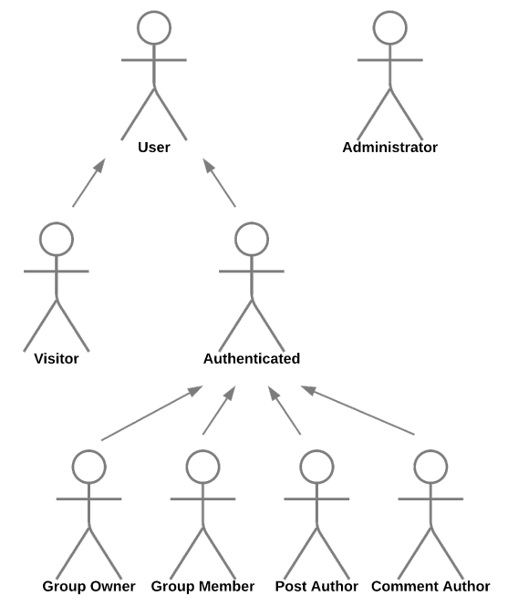

# 1 - Requirements Specification [ER]

É a documentação do sistema a desenvolver. Nesta etapa há análise dos requisitos e das necessidades dos clientes, da tecnologia a implementar e das suas dependências. Para identificar todos os parâmetros, é necessário recorrer aos seguintes tópicos:

- [Project Presentation](#11-project-presentation-a1)
- [Actors](#12-actors-a2)
- [User Stories](#13-user-stories-a2)
- [Suplementary Requirements](#14-suplementary-requirements-a2)
    - [Business Rules](#141---business-rules)
    - [Technical Requirements](#142---technical-requirements)
    - [Restrictions](#143---restrictions)

## 1.1 Project Presentation [A1]

Introduz o contexto e a motivação para o projecto. Descreve brevemente o sistema web a desenvolver, bem como os objectivos do projecto, uma listagem das principais funcionalidades que suportará e os grupos de acesso. Estes últimos são os utilizadores, administradores, que têm diferentes permissões dentro dos sistemas.

### 1.1.1 Exemplo

```note
The main goal of the OnlyFEUP project is the development of a web-based social network with the purpose of creating connections between students and staff, sharing resources about courses and subjects. This is a tool that can be used by anyone from FEUP. After signing up and verifying the user is related to the university (students/teachers), they can start using it for a better experience at FEUP.

A team of administrators is defined, which will be responsible for managing the system, ensuring it runs smoothly, removing illegal content and material in which they are not the author or have permission to share.

This application allows users to integrate into groups and follow students/teachers whom they find their work interesting, they can also create groups if none was found. Users will be able to more easily share resources with people who are actually interested (their followers).

Users are separated into groups with different permissions. These groups include the above-mentioned administrators, with access and modification privileges, student users and teacher (FEUP staff) users.

The platform will have an adaptive design, allowing users to have a pleasant browsing experience. The product will also provide easy navigation and an excellent overall user experience.

[...]
```
<p align="center">Retirado de OnlyFEUP A1</p>

## 1.2 Actors [A2]

São baseados nos requisitos funcionais. Cada grupo de acesso ou identidade externa ao serviço tem diferentes permissões e por isso são representados por diferentes atores, podendo haver generalizações. Os atores são sempre externos ao serviço.

<p align="center">
    
</p>
<p align="center">Figura 1: Exemplo de atores do sistema</p>

Os atores devem ser sempre descritos de acordo com uma tabela:

| Identifier    | Description                                                                                                                                                          |
|---------------|----------------------------------------------------------------------------------------------------------------------------------------------------------------------|
| User          | Generic user that has access to public information, such as collection's items                                                                                       |
| Visitor       | Unauthenticated user that can register itself (sign-up) or sign-in in the system                                                                                     |
| Reader        | Authenticated user that can consult information, insert works and items, manage list of interests, request the loan of items and comment the works of the collection |
| Owner         | Authenticated user that belongs to the same location as the creator of an item and can change the existing information or lend and record the return of items        |
| Administrator | Authenticated user that is responsible for the management of users and for some specific supervisory and moderation functions                                        |
| OAuth API     | External OAuth API that can be used to register or authenticate into the system.                                                                                     |

<p align="center">Tabela 1: Descrição dos atores do sistema</p>

### 1.2.1 Exemplo

<p align="center">
    
</p>

| Identifier | Description |
|------------|-------------|
| User | Generic user that has access to public information |
| Visitor | Unauthenticated user that can register itself (sign-up) or sign-in in the system and view the public feed |
| Authenticated | Authenticated users that can consult information, insert works, items and ideas, comment on another person’s work and manage and chat in your groups. |
| Group Owner | Users that created or have permissions to edit the group name, description, group’s visibility, add/remove participants, edit participants permissions (member to owner or vice-versa). |
| Group Member | Users that can participate, chat and socialize in a community/group but don't have the permissions of an owner |
| Post Author | Users that can edit or delete their own post |
| Comment Author | Users that can comment on someone’s or on their own posts |
| Administrator | Administrator have the power to remove posts (to remove offensive  posts) and block/unblock people |

<p align="center">Retirado de OnlyFEUP A2</p>

## 1.3 User Stories [A2]

É uma definição de alto nível que contém somente as informações necessárias para que o desenvolvedor estimar o esforço que o requisito deverá trazer à implementação e a prioridade deste no projecto a desenvolver. É uma breve descrição, sob o ponto de vista de cada Actor, do que este poderá fazer no sistema. <br>
As user stories devem seguir o template:

```gherkin
As a [user], I want [function], so that [value]
```

### 1.3.1 Exemplo

| Identifier | Name                      | Priority | Description                                                                                                                                                     |
|------------|---------------------------|----------|-----------------------------------------------------------------------------------------------------------------------------------------------------------------|
| US17       | Delete Account            | medium   | As an Authenticated User, I want to delete my account, so that I can stop thinking about FEUP.                                                                  |
| US59       | Change group privacy      | low      | As a Group Owner, I want to change the group privacy, so that I can choose if the group information is public or not and who can enter in the group.            |
| US84       | Special Search privileges | high     | As an Administrator, I want to search for profiles and groups even if they are private, so that I can investigate if there is something against the guidelines. |
| US90       | Delete groups             | low      | As an Administrator, I want to delete groups, so that I can remove content that does not follow the guidelines.                                                 |

<p align="center">Retirado de OnlyFEUP A2. Sim, 90 User Stories</p>

## 1.4 Suplementary Requirements [A2]

Secção que contém as regras do sistema, os requisitos técnicnicos e outros requisitos não funcionais do projecto.

### 1.4.1 - Business Rules

Geramente complementam os requisitos de uso ou interface do utilizador e explica o funcionamento da aplicação sob o ponto de vista prático.

```text
- Profiles can be public or private. Content of private profiles are only visible to followers or administrators.
- The date of each post is always less than or equal to the current date.
- Authenticated users can comment/like their own posts/comments.
- [...]
```
<p align="center">Retirado de OnlyFEUP A2</p>

### 1.4.2 - Technical Requirements

Avaliação sob o ponto de vista da disponibilidade, acessibilidade, usabilidade, performence, web application, portabilidade, base de dados, segurança, robustez, estalabilidade e ética. <br>
Os três principais requisitos técnicos devem ser destacados e justificados. 

```text
- The system should store data in a reliable and non-redundant database.
- The system must be prepared to handle errors and be able to continue working/boot itself up in case of a failure.
- The system must be prepared to deal with the growth in the number of users, and the number of posts and files to be stored.
- [...]
```
<p align="center">Retirado de OnlyFEUP A2</p>

### 1.4.3 - Restrictions

Limita o grau de liberdade na busca de uma solução para o projecto. É uma deadline que deve ser tida em mente para avaliar os requisitos a implementar de acordo com o esforço e prioridade.

```text
- The system should be ready to be used by the end of the semester
- The database should use PostgreSQL
```
<p align="center">Retirado de OnlyFEUP A2</p>

---

@ Fábio Sá <br>
@ Outubro de 2022 <br>
@ Revisão em Julho de 2023