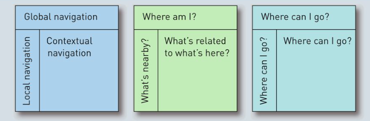
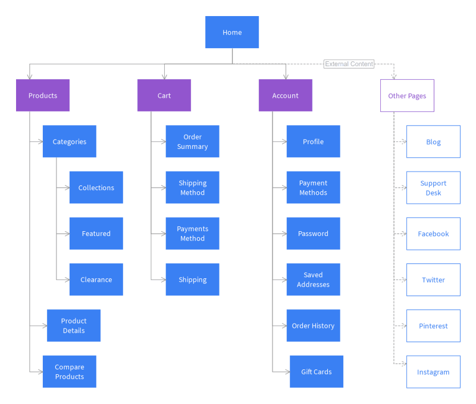
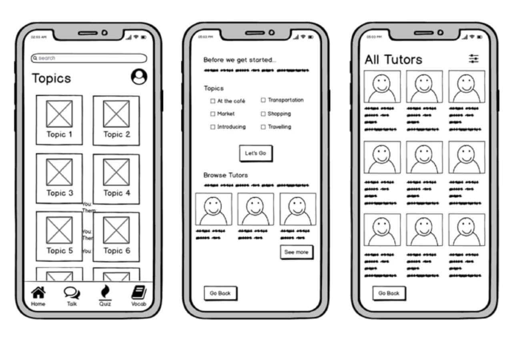
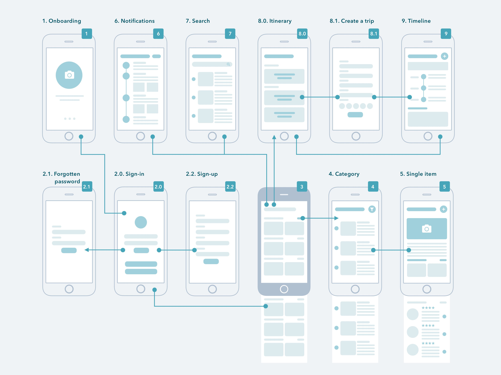

# 2 - Information Architecture

Estruturação da informação que cada vez é mais e mais dispersa em diversas plataformas com base em patterns, para tornar interações dentro do sistema mais claras para os desenvolvedores e próprios clientes.  
Requer noções de usabilidade, design, ciência da informação, user experience (UX) e é da responsabilidade desta área:

1. Conectar partes da informação entre os utilizadores interessados e o sistema usado;
2. Identificar conceitos necessários para melhor navegação e acessos;
3. Criar ferramentas para os interessados organizarem a informação;
4. Conectar vários espaços da informação, como  aplicações, plataformas e canais;

## 2.1 - Information Architecture Elements

### 2.1.1 - Organization Systems

A caracterização e organização da informação impacta o seu significado, embora seja complicado devido à ambiguidade. É importante para que seja mais fácil trabalhar com a informação e assim caracterizar os elementos em comum para agrupar itens.  
Podem ser de dois tipos:

#### A. Exact Organization Schemes

A informação está dividida em secções exatas e mutualmente exclusivas. Por exemplo ordem alfabética, por datas e por zonas geográficas.

#### B. Ambiguous Organization Schemes

Mais difícil de desenhar e manter pois é através da linguagem natural, dependendo da interpretação e conhecimentos prévios dos utilizadores. Por exemplo categorias de livros, áreas científicas, redes sociais, audiências em serviços académicos.

### 2.1.2 - Labeling Systems

Forma de representação de conceitos e ideias, que podem ser textuais (links, escolhas navegáveis) ou ícones (estes últimos são mais ambíguos). São desenhados com base na informação disponível no ambiente ou através de logs de pesquisa, a análise das keywords e linguagem usada pelos utilizadores.

### 2.1.3 - Navigation Systems

Serve para os utilizadores saberem onde estão e para onde poderão seguir e explorar, dando-lhes contexto e controlo sobre o sistema. Existem três tipos:

#### A. Global navigation systems

Existem em todas as páginas do sistema e são implementadas como a barra de nagetação e menus.

#### B. Local navigation systems

Complementa o tópico anterior e permite que o utilizador explore e navegue para a subsecção mais próxima.

#### C. Contextual navigation systems

Suporta a navegação com bae numa associação de conceitos que existem no conteúdo apresentado. Por exemplo, "see also" ou links relacionados com ítens de diferentes áreas.

    
    
Figura 1: Global, local and context 

#### D. Suplementary navigation systems

Externa à hierarquia básica do sistema e providencia formas complementares de chegar ao conteúdo desejado. Por exemplo, site indexes/ sitemaps, FAQs, tutoriais e a própria barra de pesquisas.

### 2.1.4 - Searching Systems

Avançado mecanismo de navegação que aparenta uma simples interface para mascarar o sistema complexo. Pode aplicar filtros à pesquisa inicial (*faceted search*). Exemplos: procura de restaurantes por pratos disponíveis, no mapa, através da localização.  
Boas práticas de pesquisa:

- Suporte ao autocomplete, filtros e operadores como AND OR;
- Providenciar contexto (nas pesquisar do google aparece o link e uma preview da página);
- Ordenação dos elementos que aparecem, pelo preço ou relevância;
- Destacar os termos usados na pesquisa;

## 2.2 - Information Architecture Process

Requer equipas multidisciplinares, como designers, software developers, UX engineering. É organizada em quatro atividades gerais:

1. **Research**, entender os utilizadores, o conteúdo e o contexto;
2. **Design**, especificação da arquitetura da informação, criando detalhados sitemaps por exemplo;
3. **Implement**, soluções para desenhar as especificações;
4. **Evaluate**, para melhorar o produto ao longo do seu ciclo de vida;

## 2.3 - Information Architecture Deliverables

É o resultado de todo o processo de pesquisa para melhorar a apresentação da informação. 

### 2.3.1 - Sitemaps [A3]

Representa a relação entre os elementos da informação, como páginas, e podem ser usadas também como navegação e labeling systems. Resultam muitas vezes de um processo de design top-down. Cada página deve ter um identificador, UIXX, e agrupadas em static, admin, user and item pages.

    
    
Figura 2: Sitemap

### 2.3.2 - Wireframes [A3]

Perspectiva funcional da página. Representa e categoriza a localização, as páginas com base na hierarquia e importância, e descreve o template a usar nas páginas sem ligar muito ao design em si. Para o trabalho, é necessário desenhar no mínimo duas páginas: a página inicial e a página de um produto singular. Não esquecer da legenda de cada parte. 

    
    
Figura 3: Wireframe

### 2.3.3 - Wireflows

Documenta o fluxo de informação através da interação com o utilizador. Muito útil quando o conteúdo das páginas muda dinamicamente. Não irá ser necessário implementar wireflows na entrega A3.

    
    
Figura 4: Wireflow

