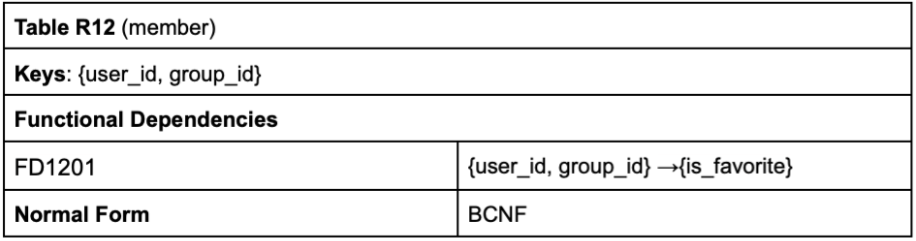

# Database specification [EBD]

## Conceptual data model [A4]

### Class Diagram

UML de diagrama de classes que contém os atributos, associações, multiplicidades e restrições da base de dados do sistema. Para isso:
1. Identificar identidades (pessoas, locais, eventos, conceitos, coisas);
2. Identificar relações entre as entidades;
3. Identificar os atributos;
4. Aplicação das convenções de nomes de acordo com o data modeling;


<p align="center">Retirado de OnlyFEUP A4</p>

O diagrama UML da **OnlyFEUP** é bastante complexo e conta com cerca de 14 classes, generalizações e generalizações de generalizações. As principais ideias foram:

- Blocked e Admin são generalizações de User, mas como há Users que nem estão bloqueados nem são administradores a generalização é **incompleta**. Como também é possível um administrador ser bloqueado, a generalização é **overlapping**;
- Requests, Follows e Messages são efetuados de utilizadores para utilizadores;
- Cada User pode ter vários Posts e cada Post pode ter vários Comments;
- Os Comments podem ter Comments e assim sucessivamente, formando uma cadeia de profundidade teoricamente infinita, pelo que é importante a existência do atributo `previous`, que aponta para o comentário anterior. Caso esse atributo seja NULL significa que o comentário é o primeiro da "thread" e só está ligado ao respectivo Post. Através de *queries* sucessivas é possível, dado qualquer comentário, reestabelecer a "Thread" até ao Post inicial. A profundidade de cada comentário pode influenciar o tamanho da letra, como por exemplo com a fórmula "\<h\<depth\>>" e a identação do respectivo bloco. É um comportamento a ser visto mais tarde.
- Existem 16 tipos de notificações, distribuídas em quatro grupos diferentes e programadas numa árvore de generalizações de 3 níveis. Existem triggers de fluxo ascendente e descendente que percorrem a árvore para garantir a integridade dos dados. É um comportamento a ser visto mais tarde.

### Additional Business Rules

Restrições do sistema que não podem ser expressadas através do diagrama UML anterior:

| Identifier | Description                                                                                                                                     |
|------------|-------------------------------------------------------------------------------------------------------------------------------------------------|
|    BR07    | A user can only like a post once or like posts from groups to which they belong or like comment in posts from public users or users they follow |
|    BR08    | A user can only like a comment once                                                                                                             |
|    BR13    | A group owner is also a member of your group                                                                                                    |
|    BR20    | When new user appears, he initially gets all kinds of notification                                                                              |

<p align="center">Retirado de OnlyFEUP A4</p>

## Relational schema, validation and schema refinement [A5]

Deve incluir atributos, tipos/domínios, chaves primárias e estrangeiras, e restrições: UNIQUE (UK), DEFAULT (DF), NOT NULL (NN), CHECK (CK). As chaves primárias são sublinhadas e as chaves estrangeiras apontam para a tabela de referência. Em PostgreSQL, a convenção é ser tudo em letras minúsculas e nomes de atributos/classes com underscore. <br>


<p align="center">Retirado de OnlyFEUP A5</p>

As dependências devem estar na BCNF, sem redundância e sem anomalias.


<p align="center">Retirado de OnlyFEUP A5</p>

**Nota**

Por cortesia da sintaxe do PostgreSQL alguns nomes de tabelas e atributos estão no plural para não colidir com as palavras reservadas da linguagem. São exemplos:
- users
- groups

### Mapeamento de generalizações

Principalmente quando as generalizações são completas e disjuntas, há três hipóteses para o mapeamento:

- **Superclasse**, onde a classe mais geral contém todos os atributos, alguns até podem ser nulos, e uma enumeração para diferenciar o tipo do objecto;
- **ER**, onde existe a caracterização de um objecto geral e cada uma das subdivisões. As classes filhas, que contém outros atributos, apontam para a classe que lhes deu origem com uma chave estrangeira;
- **Object Oriented**, onde apenas as classes filhas são caracterizadas e vários dos atributos são comuns às unidades;

#### Exemplo

Na OnlyFEUP usou-se o mapeamento ER nas generalizações por ser adequado às necessidades da aplicação. Se fosse usado o mapeamento de Superclasse no caso da generalização (User, Admin, Blocked) e dado que existem muitos mais Users, vários dos seus atributos ficariam NULL devido a Admin e Blocked de qualquer forma. Se fosse usado o mapeamento Object Oriented existiriam muitos atributos comuns. Com ER não há informação redundante.

Exemplo entre User, Admin e Blocked

```sql
CREATE TABLE users (
   id SERIAL PRIMARY KEY,
   username VARCHAR(256) UNIQUE NOT NULL,
   password VARCHAR(256) NOT NULL,
   email VARCHAR(256) UNIQUE NOT NULL,
   name VARCHAR(256) NOT NULL,
   description VARCHAR(512),
   is_public BOOLEAN NOT NULL DEFAULT TRUE,
   remember_token VARCHAR(256) DEFAULT NULL
);

CREATE TABLE admin (
   -- Primeira forma de referenciar o ID
   id INTEGER PRIMARY KEY REFERENCES users (id) ON UPDATE CASCADE
);

CREATE TABLE blocked (
   -- Segunda forma de referenciar o ID
   id INTEGER REFERENCES users (id) ON UPDATE CASCADE,
   PRIMARY kEY (id)
);
```

Exemplo entre Notificações. Para simplificar é só mostrada a parte da subárvore referente às notificações de comentários:

```sql
CREATE TABLE notification (
   id SERIAL PRIMARY KEY,
   date TIMESTAMP NOT NULL CHECK (date <= now()),
   notified_user INTEGER NOT NULL REFERENCES users (id) ON UPDATE CASCADE,
   emitter_user INTEGER NOT NULL REFERENCES users (id) ON UPDATE CASCADE,
   viewed BOOLEAN NOT NULL DEFAULT FALSE
);

CREATE TYPE comment_notification_types AS 
ENUM ('liked_comment', 'comment_post', 'reply_comment', 'comment_tagging');

CREATE TABLE comment_notification (
   id SERIAL PRIMARY KEY REFERENCES notification (id) ON UPDATE CASCADE,
   comment_id INTEGER NOT NULL REFERENCES comment (id) ON UPDATE CASCADE,
   notification_type comment_notification_types NOT NULL
);
```

## Indexes, triggers, transactions and database population [A6]

### Indexes

Usados nalguns atributos para que as pesquisas/relações mais comuns no sistema sejam mais rápidas. Podem ser dos tipos: 

- `B-Tree`, quando pode existir uma ordenação do atributo em questão;
- `Hash`, quando não pode existir uma ordenação do atributo. 
- `GiST` (Generalized Search Tree), usado para atributos de texto dinâmicos;
- `GIN` (Generalized Inverted Index), usado para atributos de texto estáticos ou que sofram updates com pouca frequência;

É errado propôr um index numa chave primária, é útil usá-las numa chave estrangeira que será muito usada no sistema para juntar tabelas ou em transformações de dados. <br> 
No caso da OnlyFEUP, como é uma rede social, criou-se indexes para:

- Dado um Post ou Comentário saber com eficiência o seu respectivo Owner, usando HASH:

```sql
CREATE INDEX owner_id_post ON post USING hash (owner_id);
CREATE INDEX owner_id_comment ON comment USING hash (owner_id);
```

- Dada uma notificação saber com eficiência os dois utilizadores em contacto: tanto o utilizador notificado como o utilizador que notificou. São ordenados através de BTrees e organizados em clusters, pois a tabela de Notificações numa rede social tende a ser grande:

```sql
CREATE INDEX notified_user_notification ON notification USING btree (notified_user);
CLUSTER notification USING notified_user_notification;

CREATE INDEX emitter_user_notification ON notification USING btree (emitter_user);
CLUSTER notification USING emitter_user_notification;
```

Curiosamente o PostgreSQL cria automaticamente um unique index quando uma restrição "unique" é usada ou quando se declara uma chave primária numa tabela.

#### Clustering

Usado para bases de dados grandes, onde os dados estão no disco e quando existem indexes para agrupar os mesmos. É uma one-time operation, logo as alterações efetuadas na tabela não serão clustered a menos que rode periodicamente.

#### Cardinality

Relação direta com os valores duplicados em colunas. As chaves primárias tem grande cardinalidade, os nomes (primeiro, último) têm média cardinalidade, enquanto os atributos booleanos têm baixa (só permite dois estados).

#### (Full) Text Search

Usar o operador `LIKE` não suporta:

- Singulares e plurais ao mesmo tempo;
- Dados não ordenados, apenas um conjunto de dados;
- Não permite pesquisa de várias palavras;
- Não tem suporte para indexes;

No sistema a desenvolver, convém ver projectar um documento onde a pesquisa em texto (parcial ou total) deve ser significativa. Na OnlyFEUP usaremos os posts e os comentários associados. 

##### tsvector

Um vector que faz store a lexemas distintos:

```sql
SELECT to_tsvector('english', 'The quick brown fox jumps over the lazy dog')
> 'brown':3 'dog':9 'fox':4 'jump':5 'lazi':8 'quick':2
```

##### tsquery

Uma estrutura otimizada para procurar em tsvectors

```sql
SELECT plainto_tsquery('portuguese','o velho barco');
> 'velh' & 'barc'
```

##### Weights

Dá para adicionar pesos às pesquisas. Por exemplo, um match num post será mais importante que um match num comentário. Os valores podem variar de 'A' a 'D' e declaram-se da seguinte forma:

```sql
SELECT
setweight(to_tsvector('english', 'The quick brown fox jumps over the lazy dog'), 'A') ||
setweight(to_tsvector('english', 'An English language pangram. A sentence that contains
all of the letters of the alphabet.'), 'B')
```

##### Queries

PostgreSQL permite fazer ranking de funções de pesquisa, de modo a permitir procurar:

- Termos mais comuns que aparecem no documento;
- Termos mais próximos entre si num mesmo documento;
- A importância dos termos dependendo do peso que se dá a cada parte do documento;

```sql
SELECT title FROM posts
WHERE search @@ plainto_tsquery('english', 'jumping dog')
ORDER BY ts_rank(search, plainto_tsquery('english', 'jumping dog')) DESC
```

Por questões de otimização, a base de dados do documento deverá conter uma coluna onde os FTS serão manipulados, contendo os tsvectors para cada linha. A cada nova inserção ou update, o tsvector deverá ser recalculado segundo um trigger.

```sql
CREATE FUNCTION post_search_update() RETURNS TRIGGER AS $$
BEGIN
    IF TG_OP = 'INSERT' THEN
        NEW.search = to_tsvector('english', NEW.title);
    END IF;
    IF TG_OP = 'UPDATE' THEN
        IF NEW.title <> OLD.title THEN
            NEW.search = to_tsvector('english', NEW.title);
        END IF;
    END IF;
    RETURN NEW;
END
$$ LANGUAGE 'plpgsql';
```

Por questões de otimização, também dá para criar indexes com as colunas pré-calculadas dos tsvectors. Designando a coluna como search, temos que:

```sql
CREATE INDEX search_idx ON posts USING GIN (search);
CREATE INDEX search_idx ON posts USING GIST (search);
```

A função GIN é usada para dados que mudam pouco, enquanto que GIST é para dados que são frequentemente updated. Em cada situação são mais rápidos.

#### User-Defined Functions

Funções pré-definidas dentro da base de dados que extendem a funcionalidade da mesma.

1. Vantagens:
    - Reduz o número de ligações entre a aplicação e o servidor da base de dados, já que os cálculos são efetuados dentro da BD;
    - Aumenta a performence, já que as funções são pré-compiladas;
    - Podem ser reusadas em várias aplicações

2. Desvantagens:
    - O desenvolvimento de software é mais lento, já que poucos têm competências a esse nível;
    - Mais difícil de manipular versões e mais difícil é fazer debug;
    - Menos portável, porque cada database management system tem a sua forma de fazer user-defined functions;

#### Triggers

Para manter a integridade da base de dados e fazer verificações/updates enquanto ocorre uma inserção, delete ou update numa coluna ou tabela. Exemplo usando a função anterior:

```sql
CREATE TRIGGER loan_item
    BEFORE INSERT OR UPDATE ON loan
    FOR EACH ROW
    EXECUTE PROCEDURE loan_item();
```

Exemplo completo implementado na OnlyFEUP para `pesquisas de utilizadores`:

- a pesquisa por nome tem mais impacto do que pesquisa por username;
- sempre que há um update ou insert na tabela, então há o cálculo ou recálculo dos vectores;
- os ts_vectors são acompanhados por um index do tipo GIN pois:
    - têm relação com atributos de texto (nome e username do utilizador)
    - espera-se que estes atributos tenham uma frequência baixa de updates

```sql
-- Add column to user to store computed ts_vectors.
ALTER TABLE users
ADD COLUMN tsvectors TSVECTOR;

-- Create a function to automatically update ts_vectors.
CREATE FUNCTION user_search_update() RETURNS TRIGGER AS $$
BEGIN
 IF TG_OP = 'INSERT' THEN
        NEW.tsvectors = (
         setweight(to_tsvector('simple', NEW.name), 'A') ||
         setweight(to_tsvector('simple', NEW.username), 'B')
        );
 END IF;
 IF TG_OP = 'UPDATE' THEN
         IF (NEW.name <> OLD.name OR NEW.username <> OLD.username) THEN
           NEW.tsvectors = (
             setweight(to_tsvector('simple', NEW.name), 'A') ||
             setweight(to_tsvector('simple', NEW.username), 'B')
           );
         END IF;
 END IF;
 RETURN NEW;
END $$
LANGUAGE plpgsql;

-- Create a trigger before insert or update on user
CREATE TRIGGER user_search_update
 BEFORE INSERT OR UPDATE ON users
 FOR EACH ROW
 EXECUTE PROCEDURE user_search_update();

-- Create a GIN index for ts_vectors
CREATE INDEX search_user ON users USING GIN (tsvectors);
```

#### Transactions

Para o projecto, é necessário fazer pelo menos uma transação relacionada à eliminação dos dados, que devem ser mantidos mas sem os dados pessoais do utilizador. Deve ser indicada uma justificação, o nível de isolamento e o código SQL para gerar a transação. Para as generalizações também é necessário haver transações, permite inserir dois tuplos numa operação atómica. Exemplo:

> Notification (id, date) <br>
> NewFriend (id -> Notification, ...) <br>
> NewLike (id -> Notification, ...) <br>

As transações são necessárias para:

- garantir uma leitura e escrita paralela (em operações nos bancos, por exemplo);
- prevenir que uma falha no sistema fique registada na base de dados (falta de inserts, deletes);
- garantir todas as propriedades ACID;

##### ACID

1. `Atomicity` - trata comandos como uma operação única;
2. `Consistency` - manipulação de bases de dados de forma consistente, excepto erros relacionados com a lógica da aplicação;
3. `Isolation` - garante que várias operações em simultâneo são tratadas como se fossem isoladas ou singulares;
4. `Durability` - a operação é preservada na base de dados;

### Problemas de concorrência

#### 1 - Dirty Reads

Quando uma transação lê dados que outra transação está a manipular e ainda não gravou (COMMIT;). São feitas leituras de dados não gravados.

#### 2 - Non-repeatable reads

Quando faz duas ou mais leituras do mesmo dado, pois no meio das leituras houve uma atualização do dado por parte de outra transação concorrente.

#### 3 - Phantom reads

Quando há novas linhas da tabela em manipulação. No caso houve novos inserts por uma transação concorrente.

#### 4 - Serialization anomaly

O resultado obtido de manipulação concorrente de transações depende da ordem de implementação.

### Transaction Isolation

Os vários níveis de isolamento permitem lidar com problemas de concorrência e não dar lock à base de dados desnecessariamente, o que podia provocar uma menor capacidade de operações concorrentes.

#### 1 - Read uncommitted

Permite a leitura de dados ainda não guardados, ou seja, permite **dirty reads**

#### 2 - Read committed

Por omissão, é este nível de isolamento que está no PostgreSQL. Garante a leitura de dados já guardados.

#### 3 - Repeatable read

Garante que se fizer duas ou mais leituras, os resultados serão os mesmos. Só permite leituras de dados entre transações que não alteram os dados.

#### 4 - Serializable

Nunca tem acesso a dados não guardados ou modificados após a transação começar a ocorrer. 