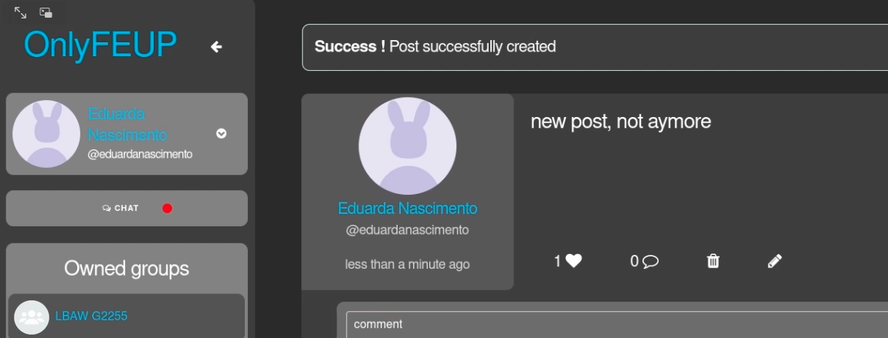

# Laravel

- [Model](#model)
    - [Setup](#setup)
    - [Relações entre Modelos](#relações)
- [Controller](#controller)
    - [Routes](#routes)
    - [Controller Methods](#controller-methods)
    - [Policies](#policies)
    - [Validation](#validation)
    - [Queries](#queries)
- [View](#view)
- [Integrations](#integrations)
- [Exemplos](#exemplos)
- [Inspire :)](#inspire)

## Model

### Setup

Todas as entidades da Base de Dados devem ter o correspondente Modelo em PHP dentro da pasta `app/Models`. Uma forma automática de criar os modelos é recorrer ao Artisan. O nome dos modelos é sempre singular:

```bash
$ php artisan make:model <MODEL_NAME>
```

Conteúdo de `app/Models/Post.php` após executar o comando com MODEL_NAME=Post:

```php
class Post extends Model
{
    public $timestamps  = false; // A
    protected $table = 'post';   // B

    protected $fillable = [
        'owner_id', 'group_id', 'content', 'date', 'is_public'  // C
    ];

    protected $primaryKey = ['attribute1', 'attribute2']; // D

    // Methods ...
}
```

Depois do ficheiro base criado recomenda-se:

- `A`: desativar os timestamps. É uma funcionalidade de Laravel não explorada no contexto de LBAW;
- `B`: garantir que o nome da tabela correspondente da base de dados é bem selecionado. Há casos onde o nome da tabela e o nome do modelo não podem ser iguais, por exemplo groups-Group, por "group" ser uma palavra reservada em SQL;
- `C`: garantir que todos os atributos da tabela são conhecidos. O ID pode ser ignorado;
- `D`: se a *primary key* da tabela for diferente de `id`, então convém indicar o atributo ou atributos pertencentes à chave. Se for singular basta uma string, se for composta é um array de strings;

### Relações

As relações entre entidades da Base de Dados também têm de estar nos modelos. Para isso criam-se os métodos adequados. Os seguintes exemplos são retirados da OnlyFEUP:

1. Um Post pertence a um único User. Para retornar esse User:

```php
public function owner() {
    return $this->belongsTo(User::class);
}
```

2. Um Post tem vários Comentários. Apenas retornamos os comentários que não têm antecessor, ou seja, apenas os comentários diretamente ligados ao post e que não pertencem a nenhuma thread. O detalhe de implementação das threads foi abordado [aqui](./3%20-%20Database%20speficiation.md).Para retorná-los:

```php
public function comments() {
    return $this->hasMany(Comment::class)
                ->where('previous', null)->get();
}
```

3. Um Post tem vários Likes. Para retornar o número de likes:

```php
public function likes() {
    return count($this->hasMany(PostLike::class)->get());
}
```

4. Um Post pode pertencer a um Grupo. O método seguinte retorna o grupo em questão ou NULL se o atributo `group_id` for nulo:

```php
public function group(){
    return $this->belongsTo(Group::class);
}
```

5. Um User pode ser Admin ou estar Bloqueado. As funções booleanas seguintes retornam esses estados:

```php
public function isAdmin() {
    return count($this->hasOne(Admin::class, 'id')->get());
}

public function isBlocked() {
    return count($this->hasOne(Blocked::class, 'id')->get());
}
```

6. Um User tem Followers, que também são Users:

```php
public function getFollowers() {
    return $this->belongsToMany(User::class, 'follows', 'followed_id', 'follower_id')
                ->orderBy('name', 'asc');
}
```

## View

//TODO

## Controller

### Routes

Em Laravel todos os pedidos ao servidor são mapeados em rotas disponíveis no ficheiro `routes/web.php`:

```php
// Static Pages
Route::controller(StaticPageController::class)->group(function () {
    Route::get('/about', 'about');   // visualização da página "about"
    Route::get('/help', 'help');     // visualização da página "help"
});

// Posts
Route::controller(PostController::class)->group(function () {
    Route::post('post/create', 'create'); // criação de um post
    Route::post('post/delete', 'delete'); // eliminação de um post
    Route::get('api/post', 'search');     // consulta da API para pesquisar posts
});

// Users
Route::controller(UserController::class)->group(function () {
    Route::get('user/{id}', 'show');     // visualização de um perfil de utilizador
});
```

As rotas podem ser organizadas segundo cada controlador como está no exemplo. A definição das rotas segue uma sintaxe rígida:

```
Route::<TYPE>(<PATH>, <METHOD>);
```

Onde:
- **TYPE** pode ser do tipo get(), post(), delete(), put();
- **PATH** é parte do URL do site que ativa o request, por exemplo "/post/create" mapeava "www.lbaw2255.fe.up.pt/post/create" na OnlyFEUP;
- **METHOD** o método implementado na classe do controlador que irá tratar do request;

Para visualização de páginas, como as páginas estáticas ou o perfil do utilizador, o controlador correspondente recebe um pedido "GET" e retorna uma página HTML. Nas ações relacionadas com a manipulação da base de dados normalmente usamos pedidos "POST", "PUT" ou "DELETE". 

#### Nota

Por vezes os browsers não detectam logo a criação ou alteração das rotas. Sempre que se suspeitar que as alterações não estão visíveis por conta da cache do projeto convém limpá-la com o seguinte comando do Artisan:

```bash
$ php artisan route:clear
```

### Controller Methods

Os controladores recebem os HTTP requests do servidor e são armazenados no diretório `app/Http/Controllers/`. Para cada Modelo criado existe um Controller. Para criá-los também podemos usar o Artisan:

```bash
$ php artisan make:controller <MODEL_NAME>Controller
```

A rota criada no exemplo anterior:

```php
Route::controller(PostController::class)->group(function () {
    Route::post('post/create', 'create'); // criação de um post
});
```

Tem o método create() implementado da seguinte forma no ficheiro `app/Http/Controllers/PostController.php`:

```php
class PostController extends Controller
{
    public function create(Request $request)
    {
        // A
        $this->authorize('create', Post::class);

        // B
        $post = new Post();
        $post->owner_id = Auth::user()->id;
        $post->group_id = $request->group_id;
        $post->content = $request->content;
        $post->date = date('Y-m-d H:i');
        $post->is_public = null !== $request->public;
        $post->save();

        // C
        return view('partials.post', ['post' => $post]);
    }

    // ...
}
```

Cada método pode ter três partes:
- A: Verifica se o utilizador tem permissões para realizar a ação. Ver [Policies](#policies); 
- B: Manipulação da base de dados. Neste caso cria um novo Post de acordo com os dados enviados através do Request, como por exemplo "group_id", "content" ou "public";
- C: Retorna uma View, colocando no segundo argumento o array que contém todos os elementos necessários à criação do HTML. Ver [View](#view);

Repare-se que o objecto Request contém todos os parâmetros do POST request. O método save() disponível no novo objecto guarda implicitamente os novos valores na base de dados.

### Policies

Uma forma acessível de verificar as permissões das ações. Por norma cada Model tem um Controller e uma Policy. Também dá para gerar o ficheiro correspondente usando o Artisan:

```
php artisan make:policy <MODEL_NAME>Policy --model=<MODEL_NAME>
```

Se não for indicado o modelo da policy (--model=<MODEL>) é necessário associá-los manualmente. Para isso, dentro do ficheiro `app/Providers/AuthServiceProvider.php`:

```php
class AuthServiceProvider extends ServiceProvider
{
    protected $policies = [
      Post::class => PostPolicy::class,
      //...
    ];
}
```

Os ficheiros das policies serão armazenados em `app/Policies/PostPolicy.php`. Exemplo do conteúdo:

```php
class PostPolicy
{
    use HandlesAuthorization;
    
    public function delete(User $user, Post $post) {
        return  ($user->id == Auth::user()->id) &&                 // I
                ($user->id == $post->owner_id ||                   // II
                $user->isAdmin() ||                                // III
                $post->group()->owner_id == Auth::user()->id);     // IV
    }
}
```

Cada método pode ter vários argumentos. A Policy de exemplo pode ser invocada com esta chamada no controller de Post:

```php
class PostController extends Controller
{
    public function delete(Request $request) {
        $post = Post::find($request->id);     // encontra o post a ser eliminado
        $this->authorize('delete', $post);    // chama o método "delete" de PostPolicy 
                                              // com o $post como argumento
        // ...
    }
    // ...
}
```

Repare-se que o utilizador (User $user) é um argumento que por default existe nas Policies. Depois podem existir outros objectos passados nos argumentos. Neste caso precisavamos do Post a eliminar pois só podemos eliminá-lo se:
- I: o utilizador que realiza a ação é o que está com login AND
- II: o utilizador que elimina o post é o dono do post OR
- III: o utilizador que elimina o post é um administrador OR
- IV: o utilizador que elimina o post é o dono do grupo onde o post está inserido

Se a Policy retornar True, então o controlador avançará para a ação de eliminação do Post pois o utilizador registado tem permissões para isso. Caso contrário o controlador irá lançar uma excepção (normalmente 403 - Forbidden). Há pelo menos duas formas de lidar com a situação:

1. Retornando uma View de erro. Por *default* é o que o Laravel faz: aponta para a View `resources/views/errors/<N>.blade.php`, onde N é o código de status da resposta HTTP, mesmo que não esteja explícito no código do controlador:

```php
public function delete(Request $request) {
    $post = Post::find($request->id);
    $this->authorize('delete', $post);
    $post->delete();
    return view('pages.home');
}
```

Dá para personalizar essas páginas de acordo com as necessidades da aplicação como um Laravel Blade comum. Também dá para criá-las automaticamente usando o comando:

```bash
$ php artisan view:make errors.<N>
```

2. Voltando à página anterior à ação, mas agora com uma mensagem de erro:

```php
public function delete(Request $request) {

    try {
        $post = Post::find($request->id);
        $this->authorize('delete', $post);
        $post->delete();
        return redirect()->back()->with('success', 'Post successfully deleted');
    } catch (Exception $exception) {
        return redirect()->back()->with('error', 'Cannot delete this post');
    }
}
```

A indicação de "success" ou "error" fica implicitamente guardada nos dados de sessão do utilizador. Pode ser mostrada caso exista da seguinte forma:

```html
@if (Session::has('success'))
    <div class="alert alert-success alert-dismissible" id="alert" role="alert">
        <h4><strong>Success!</strong>{{ session('success') }}</h4>
    </div>
@endif

@if (Session::has('error'))
    <div class="alert alert-danger alert-dismissible" id="alert" role="alert">
        <h4><strong>Error!</strong>{{ session('error') }}</h4>
    </div>
@endif
```

Foi esta a opção usada várias vezes na OnlyFEUP. É sempre boa ideia dar feedback aos utilizadores:



### Validation

Após verificar que a ação é permitida, há casos onde é preciso validar os dados antes de usá-los para manipular a base de dados. Por exemplo, 

Na OnlyFEUP houve uma preocupação constante com os utilizadores. Não seria simpático depois do preenchimento de um longo formulário que edita o perfil e só por causa de um pequeno erro ter de voltar a escrever tudo. Por esse motivo os dados são guardados entre redirects() para poupar tempo.


### Queries

// TODO

## Integrations

// TODO

## Exemplos

// TODO

## Inspire

Para o projecto de LBAW é necessário muita inspiração. Mas nisso o Artisan também pode ajudar:

```php
$ php artisan inspire
```

---

@ Fábio Sá <br>
@ Novembro de 2022 <br>
@ Revisão em Julho de 2023