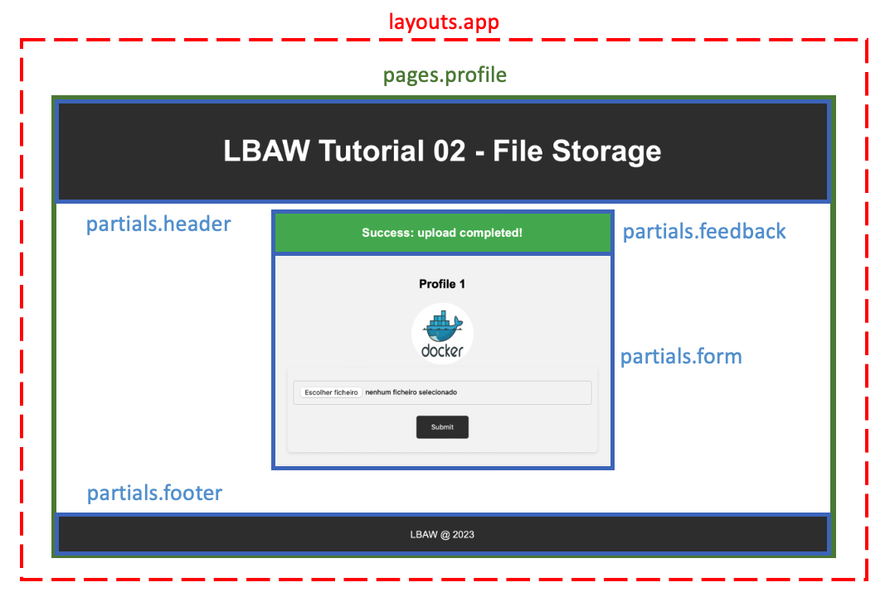
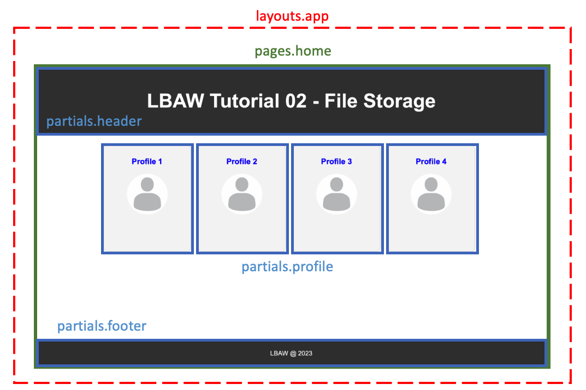

# Laravel

- [Model](#model)
    - [Setup](#setup)
    - [Relações entre Modelos](#relações)
- [Controller](#controller)
    - [Routes](#routes)
    - [Controller Methods](#controller-methods)
    - [Policies](#policies)
    - [Validation](#validation)
    - [Queries](#queries)
- [View](#view)
- [Integrations](#integrations)
- [Inspire :)](#inspire)

## Model

### Setup

Todas as entidades da Base de Dados devem ter o correspondente Modelo em PHP dentro da pasta `app/Models`. Uma forma automática de criar os modelos é recorrer ao Artisan. O nome dos modelos é sempre singular:

```bash
$ php artisan make:model <MODEL_NAME>
```

Conteúdo de `app/Models/Post.php` após executar o comando com MODEL_NAME=Post:

```php
class Post extends Model {

    public $timestamps  = false; // A
    protected $table = 'post';   // B

    protected $fillable = [
        'owner_id', 'group_id', 'content', 'date', 'is_public'  // C
    ];

    protected $primaryKey = ['attribute1', 'attribute2']; // D

    // Methods ...
}
```

Depois do ficheiro base criado recomenda-se:

- `A`: desativar os timestamps. É uma funcionalidade de Laravel não explorada no contexto de LBAW;
- `B`: garantir que o nome da tabela correspondente da base de dados é bem selecionado. Há casos onde o nome da tabela e o nome do modelo não podem ser iguais, por exemplo groups-Group, por "group" ser uma palavra reservada em SQL;
- `C`: garantir que todos os atributos da tabela são conhecidos. O ID pode ser ignorado;
- `D`: se a *primary key* da tabela for diferente de `id`, então convém indicar o atributo ou atributos pertencentes à chave. Se for singular basta uma string, se for composta é um array de strings;

### Relações

As relações entre entidades da Base de Dados também têm de estar nos modelos. Para isso criam-se os métodos adequados. Os seguintes exemplos são retirados da OnlyFEUP:

1. Um Post pertence a um único User. Para retornar esse User:

```php
public function owner() {
    return $this->belongsTo(User::class);
}
```

2. Um Post tem vários Comentários. Apenas retornamos os comentários que não têm antecessor, ou seja, apenas os comentários diretamente ligados ao post e que não pertencem a nenhuma thread. O detalhe de implementação das threads foi abordado [aqui](./3%20-%20Database%20speficiation.md).Para retorná-los:

```php
public function comments() {
    return $this->hasMany(Comment::class)
                ->where('previous', null)->get();
}
```

3. Um Post tem vários Likes. Para retornar o número de likes:

```php
public function likes() {
    return count($this->hasMany(PostLike::class)->get());
}
```

4. Um Post pode pertencer a um Grupo. O método seguinte retorna o grupo em questão ou NULL se o atributo `group_id` for nulo:

```php
public function group() {
    return $this->belongsTo(Group::class);
}
```

5. Um User pode ser Admin ou estar Bloqueado. As funções booleanas seguintes retornam esses estados:

```php
public function isAdmin() {
    return count($this->hasOne(Admin::class, 'id')->get());
}

public function isBlocked() {
    return count($this->hasOne(Blocked::class, 'id')->get());
}
```

6. Um User tem Followers, que também são Users:

```php
public function getFollowers() {
    return $this->belongsToMany(User::class, 'follows', 'followed_id', 'follower_id')
                ->orderBy('name', 'asc');
}
```

## View

O Laravel tem o mecanismo de templating `Blade`, que permite de criação de páginas e sucessivos componentes de visualização que podem ser reutilizados. Esses templates/views estão presentes no diretório `resources/views` e por norma podem ser de três tipos:

- `Layout`: garante a coesão em todo o projecto. Normalmente instancia todos os imports de CSS e JS, assim como os metadados das páginas;
- `Page`: estende as propriedades do layout e é constituída por uma gama de partials;
- `Partial`: um formulário, o header, o footer, tudo isto podem ser considerados partials;

Exemplos de estrutura:




No exemplo apresentado, uma forma de estruturar os templates pode ser esta:

```note
$ tree .
.
|____layouts
  |____app.blade.php
|____pages
  |____home.blade.php
  |____profile.blade.php
|____partials
  |____header.blade.php
  |____footer.blade.php
  |____feedback.blade.php
  |____form.blade.php
  |____profile.blade.php
```

`layouts/app.blade.php`:

```html
<!DOCTYPE html>
<html lang="{{ app()->getLocale() }}">
  <head>
    <title>{{ config('app.name', 'Laravel') }}</title>
    <meta charset="utf-8">
    <meta http-equiv="X-UA-Compatible" content="IE=edge">
    <meta name="viewport" content="width=device-width, initial-scale=1">

    <!-- CSRF Token -->
    <meta name="csrf-token" content="{{ csrf_token() }}">

    <!-- Styles -->
    <link href="{{ asset('css/style.css') }}" rel="stylesheet">
    <script type="text/javascript" src="{{ asset('js/app.js') }}" defer></script>
  </head>
  <body>
    @section('content') <!-- Definir a zona do conteúdo principal da página que usará o layout -->
    @show               <!-- Importante para renderizar o conteúdo -->
  </body>
</html>
```

`pages/home.blade.php`:

```html
@extends('layouts.app')                                 <!-- Estende o layout principal -->

@section('content')                                     <!-- Define o que é o `content` da página -->
    @include('partials.header')                         <!-- Renderiza o header -->
    <main>                                              <!-- A secção principal tem os profiles -->
        <section class="profiles"> 
        @for ($i = 1; $i <= 4; $i++)
            @include('partials.profile', ['id' => $i])  <!-- Renderiza cada profile -->
        @endfor
        </section>
    </main>
    @include('partials.footer')                         <!-- Renderiza o footer -->
@endsection
```

`pages/profile.blade.php`:

```html
@extends('layouts.app')                                 <!-- Estende o layout principal -->

@section('content')                                     <!-- Define o que é o `content` da página -->
    @include('partials.header')                         <!-- Renderiza o header -->
    <main>
        @include('partials.feedback')                   <!-- Renderiza o feedback -->
        <div class="content">                           <!-- A secção principal tem as características do profile -->
            <h3>Profile {{ $id }}</h3>
            
            @include('partials.form', ['id' => $id])   <!-- Renderiza o form, injecta o ID do profile -->
        </div>
    </main>
    @include('partials.footer')                         <!-- Renderiza o footer -->
@endsection
```

`partials/header.blade.php`:

```html
<header>
    <h1>LBAW Tutorial 02 - File Storage</h1>
</header>
```

`partials/footer.blade.php`:

```html
<footer>
    <p>LBAW @ 2023</p>
</footer>
```

`partials/profile.blade.php`:

```html
<a href="profiles/{{ $id }}"> <!-- Usa o ID injectado para criar o link dinamicamente... -->
    <article class="profile">
        <h3>Profile {{ $id }}</h3> <!-- ... e o próprio título -->
        
    </article>
</a>
```

`partials/feedback.blade.php`:

```html
<!-- Só escreve alguma coisa se ocorreu um erro ou um sucesso na ação anterior -->
@if(session('error'))
    <h3 class="error">{{ session('error') }}</h3>
@elseif(session('success'))
    <h3 class="success">{{ session('success') }}</h3>
@endif 
```

`partials/form.blade.php`:

```html
<form method="POST" action="/file/upload" enctype="multipart/form-data">

    <!-- Nunca esquecer de enviar também o token CSRF em qualquer formulário -->
    @csrf 
    <input name="file" type="file" required>

    <!-- Usa o ID injectado para injectar valores importantes para o controller -->
    <input name="id" type="number" value="{{ $id }}" hidden>
    <input name="type" type="text" value="profile" hidden>
    <button type="submit">Submit</button>
</form>
```

As vistas retornadas por controllers são na maioria das vezes páginas completas:

```php
return view('pages.profile', ['id' => $id]);    // route: /profile/{id}
return view('pages.home')                       // route: /home
```

Como visto nos templates anteriores, tudo que é incluído entre {{ }} é interpretado como PHP. Isto evita ataques do tipo `XSS` pois todas as strings que advêm do servidor são renderizadas como texto.

## Controller

### Routes

Em Laravel todos os pedidos ao servidor são mapeados em rotas disponíveis no ficheiro `routes/web.php`:

```php
// Static Pages
Route::controller(StaticPageController::class)->group(function () {
    Route::get('/about', 'about');   // visualização da página "about"
    Route::get('/help', 'help');     // visualização da página "help"
});

// Posts
Route::controller(PostController::class)->group(function () {
    Route::post('post/create', 'create'); // criação de um post
    Route::post('post/delete', 'delete'); // eliminação de um post
    Route::get('api/post', 'search');     // consulta da API para pesquisar posts
});

// Users
Route::controller(UserController::class)->group(function () {
    Route::get('user/{id}', 'show');     // visualização de um perfil de utilizador
});
```

As rotas podem ser organizadas segundo cada controlador como está no exemplo. A definição das rotas segue uma sintaxe rígida:

```php
Route::<TYPE>(<PATH>, <METHOD>);
```

Onde:

- **TYPE** pode ser do tipo get(), post(), delete(), put();
- **PATH** é parte do URL do site que ativa o request, por exemplo "/post/create" mapeava www.lbaw2255.lbaw.fe.up.pt/post/create na OnlyFEUP;
- **METHOD** o método implementado na classe do controlador que irá tratar do request;

Para visualização de páginas, como as páginas estáticas ou o perfil do utilizador, o controlador correspondente recebe um pedido "GET" e retorna uma página HTML. Nas ações relacionadas com a manipulação da base de dados normalmente usamos pedidos "POST", "PUT" ou "DELETE". 

#### Nota

Por vezes os browsers não detectam logo a criação ou alteração das rotas. Sempre que se suspeitar que as alterações não estão visíveis por conta da cache do projeto convém limpá-la com o seguinte comando do Artisan:

```bash
$ php artisan route:clear
$ php artisan route:cache
```

### Controller Methods

Os controladores recebem os HTTP requests do servidor e são armazenados no diretório `app/Http/Controllers`. Para cada Modelo criado existe um Controller. Para criá-los também podemos usar o Artisan:

```bash
$ php artisan make:controller <MODEL_NAME>Controller
```

A rota criada no exemplo anterior:

```php
Route::controller(PostController::class)->group(function () {
    Route::post('post/create', 'create'); // criação de um post
});
```

Tem o método create() implementado da seguinte forma no ficheiro `app/Http/Controllers/PostController.php`:

```php
class PostController extends Controller {

    public function create(Request $request) {

        // A
        $this->authorize('create', Post::class);

        // B
        $post = new Post();
        $post->owner_id = Auth::user()->id;
        $post->group_id = $request->group_id;
        $post->content = $request->content;
        $post->date = date('Y-m-d H:i');
        $post->is_public = null !== $request->public;
        $post->save();

        // C
        return view('pages.post', ['post' => $post]);
    }

    // ...
}
```

Cada método pode ter três partes:

- `A`: Verifica se o utilizador tem permissões para realizar a ação. Ver [Policies](#policies); 
- `B`: Manipulação da base de dados. Neste caso cria um novo Post de acordo com os dados enviados através do Request, como por exemplo "group_id", "content" ou "public";
- `C`: Retorna uma View, colocando no segundo argumento o array que contém todos os elementos necessários à criação do HTML, neste caso à página de um Post. Ver [View](#view);

Repare-se que o objecto Request contém todos os parâmetros do POST request. O método save() disponível no novo objecto guarda implicitamente os novos valores na base de dados.

### Policies

Uma forma acessível de verificar as permissões das ações. Por norma cada Model tem um Controller e uma Policy. Também dá para gerar o ficheiro correspondente usando o Artisan:

```
php artisan make:policy <MODEL_NAME>Policy --model=<MODEL_NAME>
```

Se não for indicado o modelo da policy (--model=<MODEL>) é necessário associá-los manualmente. Para isso, dentro do ficheiro `app/Providers/AuthServiceProvider.php`:

```php
class AuthServiceProvider extends ServiceProvider {

    protected $policies = [
      Post::class => PostPolicy::class,
      //...
    ];
}
```

Os ficheiros das policies serão armazenados em `app/Policies`. Exemplo do conteúdo de `app/Policies/PostPolicy.php`:

```php
class PostPolicy {

    use HandlesAuthorization;
    
    public function delete(User $user, Post $post) {
        return  ($user->id == Auth::user()->id) &&                 // I
                ($user->id == $post->owner_id ||                   // II
                $user->isAdmin() ||                                // III
                $post->group()->owner_id == Auth::user()->id);     // IV
    }
}
```

Cada método pode ter vários argumentos. A Policy de exemplo pode ser invocada com esta chamada no controller de Post:

```php
class PostController extends Controller {

    public function delete(Request $request) {
        $post = Post::find($request->id);     // encontra o post a ser eliminado
        $this->authorize('delete', $post);    // chama o método "delete" de PostPolicy 
                                              // com o $post como argumento
        // ...
    }
    // ...
}
```

Repare-se que o utilizador (User $user) é um argumento que por default existe nas Policies. Depois podem existir outros objectos passados nos argumentos. Neste caso precisavamos do Post a eliminar pois só podemos eliminá-lo se:

- `I`: o utilizador que realiza a ação é o que está com login AND
- `II`: o utilizador que elimina o post é o dono do post OR
- `III`: o utilizador que elimina o post é um administrador OR
- `IV`: o utilizador que elimina o post é o dono do grupo onde o post está inserido

Se a Policy retornar True, então o controlador avançará para a ação de eliminação do Post pois o utilizador registado tem permissões para isso. Caso contrário o controlador irá lançar uma excepção (normalmente 403 - Forbidden). Há pelo menos duas formas de lidar com a situação:

1. Retornando uma View de erro. Por *default* é o que o Laravel faz: aponta para a View `resources/views/errors/<N>.blade.php`, onde N é o código de status da resposta HTTP, mesmo que não esteja explícito no código do controlador:

```php
public function delete(Request $request) {
    $post = Post::find($request->id);
    $this->authorize('delete', $post);
    $post->delete();
    return view('pages.home');
}
```

Dá para personalizar essas páginas de acordo com as necessidades da aplicação como um Laravel Blade comum. Também dá para criá-las automaticamente usando o comando:

```bash
$ php artisan view:make errors.<N>
```

2. Voltando à página anterior à ação, mas agora com uma mensagem de erro:

```php
public function delete(Request $request) {
    try {
        $post = Post::find($request->id);
        $this->authorize('delete', $post);
        $post->delete();
        return redirect()->back()->with('success', 'Post successfully deleted');
    } catch (Exception $exception) {
        return redirect()->back()->with('error', 'Cannot delete this post');
    }
}
```

A indicação de "success" ou "error" fica implicitamente guardada nos dados de sessão do utilizador e é volátil pois só sobrevive durante uma chamada ao servidor. Ou seja, se for mostrada e dermos reload à página as variáveis desaparecerão. Pode ser mostrada caso exista da seguinte forma:

```html
@if (Session::has('success'))
    <div class="alert alert-success alert-dismissible" id="alert" role="alert">
        <h4><strong>Success!</strong>{{ session('success') }}</h4>
    </div>
@endif

@if (Session::has('error'))
    <div class="alert alert-danger alert-dismissible" id="alert" role="alert">
        <h4><strong>Error!</strong>{{ session('error') }}</h4>
    </div>
@endif
```

Foi esta a opção usada várias vezes na OnlyFEUP. É sempre boa ideia dar feedback aos utilizadores:


### Validation

Após verificar que a ação é permitida, há casos onde é preciso validar os dados antes de usá-los para manipular a base de dados. Por exemplo na OnlyFEUP o conteúdo de UserController para a edição de perfil, numa versão mais simplificada, era este:

```php
public function edit(Request $request) {

    // Verifica se pode
    $this->authorize('edit', User::class);
    $user = Auth::user();

    // Validação dos dados da request
    $request->validate([
        'name' => 'max:255',
        'username' => 'unique:users,username,'.$user->id.'|max:255',
        'email' => 'email|unique:users,email,'.$user->id.'|max:255',
        'description' => 'max:255'
    ]);

    // Guarda tudo na base de dados
    $user->name = $request->input('name');
    $user->username = $request->input('username');
    $user->email = $request->input('email');
    $user->description = $request->input('description');
    $user->save();

    // Retorna a mesma página, agora com os dados atualizados
    return redirect('user/'.$user->id);
}
```

Na OnlyFEUP houve uma preocupação constante com os utilizadores. Não seria simpático depois do preenchimento de um longo formulário que edita o perfil e só por causa de um pequeno erro ter de voltar a escrever tudo. 

Por isso utilizamos o validador automático do Laravel que permite bastante coisa automática. Caso algum parâmetro falhe, há sempre redirecionamento para a página anterior. De modo a não perder os valores de input, a variável `old` guarda os anteriores inputs do utilizador para poderem ser colocado em value. De forma semelhante, a variável `errors` contém as mensagens de erro para cada field. Assim, para cada parte do formulário, o HTML a gerar será do tipo:

```html
<!-- Field. Se houver valor anterior coloca-o para evitar escrever tudo de novo -->
<input type="text" name="name" value="{{ old('name') }}">

<!-- Mensagem de erro. Caso exista algum erro no request anterior, será aqui mostrado -->
@if ($errors->has('name'))
    <h5 class="error">
        {{ $errors->first('name') }}
    </h5>
@endif
```

Já há mensagens de erro pré-definidas para cada parâmetro ou falha. Podem ser encontradas em `/resources/lang/en/validation.php`. Há sempre a possibilidade de inserir mais.

### Queries

O Eloquent de Laravel já possui muitas funções que ajudam a fazer as pesquisas. Alguns exemplos da OnlyFEUP:

`Group.php` - Determinar se o grupo atual é um dos favoritos de $user

```php
public function isFavorite(User $user) {
    return Member::where([  'user_id' => $user->id,
                            'group_id' => $this->id,
                            'is_favorite' => true ])->exists(); // Existe a entrada na tabela Member
}
```

`Post.php` - Determinar os posts públicos para poderem ser mostrados na timeline mesmo que não haja login (posts que Visitors podem ver):

```php
public static function publicPosts() {
    return Post::select('post.*')                   // seleciona todos os atributos
                ->join('users', 'users.id', '=', 'post.owner_id')
                ->where('users.is_public', true)    // se o dono do post tiver conta pública
                ->where('post.is_public', true)     // se o post também for público
                ->orderBy('date', 'desc');          // queremos os posts mais recentes primeiro
}
```

`User.php` - Sempre que um utilizador vai para a página de mensagens e abre um chat com outro, tem de acontecer duas coisas:
- Retornar todas as mensagens por ordem ascendente;
- Update do estado de todas as mensagens para visualizada = true;

```php
public function messagesWith(User $user) {

    $messages =  Message::where(['receiver_id' => $user->id, 'emitter_id' => $this->id])
                    ->orWhere(
                        function($q) use($user){
                            $q->where([ 'emitter_id' => $user->id, 
                                        'receiver_id' => $this->id]);
                });
        
    Message::where(['emitter_id' => $user->id, 
                    'receiver_id' => $this->id])
            ->update(['viewed' => true]);
        
    return $messages->orderBy('date', 'asc')->get();
}
```

`User.php` - Retornar todos os posts que o utilizador atual pode ver:

```php
public function visiblePosts() {
    
    // Todos os seus posts
    $own = Post::select('*')->where('post.owner_id', '=', $this->id);

    // Todos os posts públicos && todos os posts de pessoas privadas mas que segue
    $noGroups = Post::select('post.*')
        ->fromRaw('post,follows')
        ->where('follows.follower_id', '=', $this->id)
        ->whereColumn('follows.followed_id', '=', 'post.owner_id')
        ->where('post.group_id', null);

    // Todos os posts dos grupos a que pertence
    $fromGroups = Post::select('post.*')
        ->fromRaw('post,member')
        ->where('member.user_id', $this->id)
        ->whereColumn('post.group_id','member.group_id');

    // Merge
    return $own->union($noGroups)
                ->union($fromGroups)
                ->orderBy('date','desc');
}
```

## Integrations

O Laravel proporciona possibilidade de integrar a aplicação com serviços externos (email, google, pusher) e internos (file system). Para esses exemplos existe um repositório oficial de LBAW:

- [Laravel Integrations](https://git.fe.up.pt/lbaw/laravel-integrations)

Note-se que tocam apenas em user stories de média e baixa prioridade. Por isso devem ser só explorados no módulo PA: A9 e A10.

## Inspire

Para o projecto de LBAW é necessário muita inspiração. Mas nisso o Artisan também pode ajudar:

```php
$ php artisan inspire
```

---

@ Fábio Sá <br>
@ Novembro de 2022 <br>
@ Revisão em Outubro de 2023