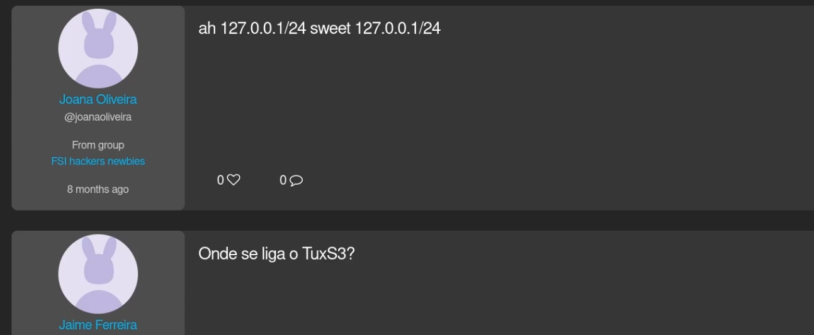

# Frontend

Mais importante do que o site ser bonito é que seja funcional e de fácil utilização. Este tópico cobre dois truques chave que podem ser usados para implementar outras funcionalidades do género:

- [Post Likes](#post-likes)
- [Search](#search)

## Post Likes



Uma forma *naive* de implementar um like num post é a seguinte:

`partials.post`:

```html
<article class="post" id="post{{ $post-> id }}">
    <h3 class="content">{{ $post->content }}</h3>
    <h4 class="qtd-likes">{{ $post->getLikes() }}</h4>
    <form action="post/like" method="POST">
        <input type="number" value="{{ $post->id }}" hidden>
        <button type="submit">Like!</button>
    </form>
</article>
```

`routes/web.php`:

```php
Route::post('post/like', [PostController::class, 'like']);
```

`PostController.php`:

```php
public function like (Request $request) {
      
    $post = Post::find($request->id);
    $this->authorize('like', Post::class);

    PostLike::insert([
        'user_id' => Auth::user()->id,
        'post_id' => $post->id,
    ]);

    return redirect()->back();
}
```

Qual é o problema? Ao dar like num post **a página dará reload** por conta da chamada ao servidor. Não é uma situação muito simpática dado que o utilizador pode já ter percorrido bastantes posts da timeline e acaba por ter de voltar ao início. Correção da situação usando pedidos AJAX:

`app.js`:

```js
function encodeForAjax(data) {
    if (data == null) return null;
    return Object.keys(data).map(function(k){
      return encodeURIComponent(k) + '=' + encodeURIComponent(data[k])
    }).join('&');
  }
  
function sendAjaxRequest(method, url, data) {
    let request = new XMLHttpRequest();
    request.open(method, url, true);
    request.setRequestHeader('X-CSRF-TOKEN', document.querySelector('meta[name="csrf-token"]').content);
    request.setRequestHeader('Content-Type', 'application/x-www-form-urlencoded');
    request.send(encodeForAjax(data));
}

function like(postId) {
    let post = document.querySelector('#post' + postId);
    let likeCounter = post.querySelector('.qtd-likes').innerText;
    let likeButton = post.querySelector('.button-like');

    // Update like counter
    post.querySelector('.qtd-likes').innerText = parseInt(likeCounter) + 1;

    // Send server request
    sendAjaxRequest('post', '../post/like', {id: postId});

    // Remove like button
    likeButton.remove();
}
```

`partials.post`

```html
<article class="post" id="post{{ $post-> id }}">
    <h3 class="content">{{ $post->content }}</h3>
    <h4 class="qtd-likes">{{ $post->getLikes() }}</h4>
    <button class="button-like" onclick="like({{ $post->id }})">Like!</button>
</article>
```

`routes/web.php`:

```php
Route::post('post/like', [PostController::class, 'like']);
```

`PostController.php`:

```php
public function like (Request $request) {
      
    $post = Post::find($request->id);
    $this->authorize('like', Post::class);

    PostLike::insert([
        'user_id' => Auth::user()->id,
        'post_id' => $post->id,
    ]);
}
```

Agora o javascript envia os valores necessários por AJAX e transforma o visual para o utilizador ter o merecido feedback. Enquanto isso, o servidor trata de atualizar a base de dados e não retorna uma nova view. Assim a aplicação não dá reload mas há atualização quer do frontend como do backend.

Note-se que faltam algumas verificações e validações importantes:

- Nem todos os utilizadores podem dar likes em posts;
- Para um utilizador que já deu like naquele post:
    - Não pode visualmente ter acesso ao botão de like;
    - O backend não pode deixar inserir um novo tuplo em PostLike sem verificar primeiro se já existe esse par;

No entanto esse não era o foco desta secção.

## Search

// TODO

---

@ Fábio Sá <br>
@ Novembro de 2022 <br>
@ Revisão em Outubro de 2023