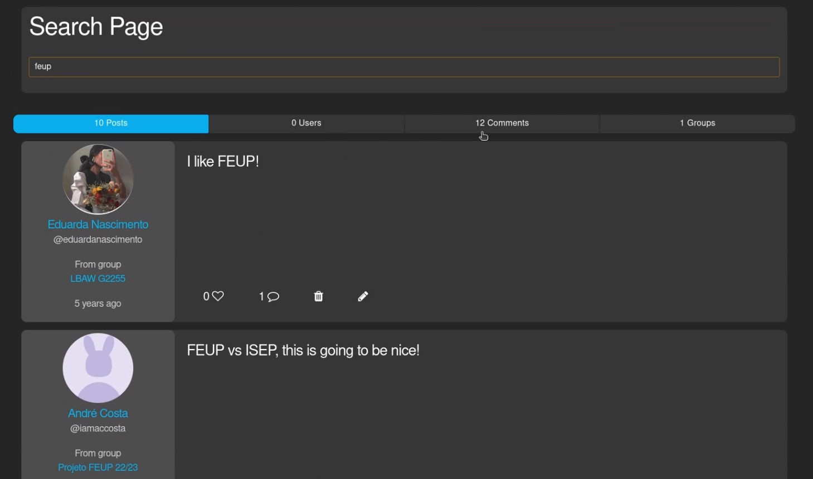

# Frontend

Mais importante do que o site ser bonito é que seja funcional e de fácil utilização. Este tópico cobre dois truques chave que podem ser usados para implementar outras funcionalidades do género:

- [Post Likes](#post-likes)
- [Search](#search)

## Post Likes


Uma forma *naive* de implementar um like num post é a seguinte:

`partials.post`:

```html
<article class="post" id="post{{ $post-> id }}">
    <h3 class="content">{{ $post->content }}</h3>
    <h4 class="qtd-likes">{{ $post->getLikes() }}</h4>
    <form action="post/like" method="POST">
        <input type="number" value="{{ $post->id }}" hidden>
        <button type="submit">Like!</button>
    </form>
</article>
```

`routes/web.php`:

```php
Route::post('post/like', [PostController::class, 'like']);
```

`PostController.php`:

```php
public function like (Request $request) {
      
    $post = Post::find($request->id);
    $this->authorize('like', Post::class);

    PostLike::insert([
        'user_id' => Auth::user()->id,
        'post_id' => $post->id,
    ]);

    return redirect()->back();
}
```

Qual é o problema? Ao dar like num post **a página dará reload** por conta da chamada ao servidor. Não é uma situação muito simpática dado que o utilizador pode já ter percorrido bastantes posts da timeline e acaba por ter de voltar ao início. Correção da situação usando pedidos AJAX:

`app.js`:

```js
function encodeForAjax(data) {
    if (data == null) return null;
    return Object.keys(data).map(function(k){
      return encodeURIComponent(k) + '=' + encodeURIComponent(data[k])
    }).join('&');
  }
  
function sendAjaxRequest(method, url, data) {
    let request = new XMLHttpRequest();
    request.open(method, url, true);
    request.setRequestHeader('X-CSRF-TOKEN', document.querySelector('meta[name="csrf-token"]').content);
    request.setRequestHeader('Content-Type', 'application/x-www-form-urlencoded');
    request.send(encodeForAjax(data));
}

function like(postId) {
    let post = document.querySelector('#post' + postId);
    let likeCounter = post.querySelector('.qtd-likes').innerText;
    let likeButton = post.querySelector('.button-like');

    // Update like counter
    post.querySelector('.qtd-likes').innerText = parseInt(likeCounter) + 1;

    // Send server request
    sendAjaxRequest('post', '../post/like', {id: postId});

    // Remove like button
    likeButton.remove();
}
```

`partials.post`

```html
<article class="post" id="post{{ $post-> id }}">
    <h3 class="content">{{ $post->content }}</h3>
    <h4 class="qtd-likes">{{ $post->getLikes() }}</h4>
    <button class="button-like" onclick="like({{ $post->id }})">Like!</button>
</article>
```

`routes/web.php`:

```php
Route::post('post/like', [PostController::class, 'like']);
```

`PostController.php`:

```php
public function like (Request $request) {
      
    $post = Post::find($request->id);
    $this->authorize('like', Post::class);

    PostLike::insert([
        'user_id' => Auth::user()->id,
        'post_id' => $post->id,
    ]);
}
```

Agora o javascript envia os valores necessários por AJAX e transforma o visual para o utilizador ter o merecido feedback. Enquanto isso, o servidor trata de atualizar a base de dados e não retorna uma nova view. Assim a aplicação não dá reload mas há atualização quer do frontend como do backend.

Note-se que faltam algumas verificações e validações importantes:

- Nem todos os utilizadores podem dar likes em posts;
- Para um utilizador que já deu like naquele post:
    - Não pode visualmente ter acesso ao botão de like;
    - O backend não pode deixar inserir um novo tuplo em PostLike sem verificar primeiro se já existe esse par;

No entanto esse não era o foco desta secção.

## Search

Na OnlyFEUP há uma barra de pesquisa única. Os conteúdos nas quatro secções são alterados dinamicamente durante a escrita, permitindo uma fluidez na pesquisa e sem necessidade de clicar para pesquisar ou até de dar reload à página para buscar novos itens:



Um HTML simples que possa gerar uma página semelhante é este:

```html
<header id="search-header">
    <h1>Search Page</h1><br>
    <input type="search" id="search" placeholder="Search...">
</header>

<nav id="searchpage-nav">
    <a id="postResults" href="#results-posts">0 Posts</a>
    <a id="userResults" href="#results-users">0 Users</a>
    <a id="commentResults" href="#results-comments">0 Comments</a>
    <a id="groupResults" href="#results-groups">0 Groups</a>
</nav>

<div class="tab-content">
    <section id="results-posts"></section>
    <section id="results-users"></section>
    <section id="results-comments"></section>
    <section id="results-groups" ></section>
</div>
```

Usamos a seguinte API:

```php
Route::get('api/user', [UserController::class, 'search']);
Route::get('api/post', [PostController::class, 'search']);
Route::get('api/group', [GroupController::class, 'search']);
Route::get('api/comment', [CommentController::class, 'search']);
```

Implementação interna de `UserController@search`:

```php
public function search(Request $request) {
        
    if (!Auth::check()) return null;
    $input = $request->get('search') ? $request->get('search').':*' : "*";
    $users = User::select('users.id', 'users.name', 'users.username', 'blocked.id AS blocked')
                ->leftJoin('blocked', 'users.id', '=', 'blocked.id')
                ->whereRaw("users.tsvectors @@ to_tsquery(?)", [$input])
                ->where('users.name', '<>', 'deleted')
                ->orderByRaw("ts_rank(users.tsvectors, to_tsquery(?)) ASC", [$input])
                ->get();

    return view('partials.searchUser', compact('users'))->render();
}
```

Ao mesmo tempo quisemos que a implementação fosse a **mais leve possível do lado do cliente**. De uma forma geral, uma API retorna os dados em ficheiro JSON mas neste caso isso seria ineficiente porque o frontend seria responsável por estruturar e gerar o HTML.

Por isso o HTML de cada secção teve de ser gerado pelo servidor e retornado pela própria API, usando views específicas. Exemplo de `partials.searchUser`:

```html
@forelse ($users as $user)
    <article class="search-page-card" id="user{{$user->id}}">
        media()}}" alt="user profile picture">
        <a href="../user/{{$user->id}}">{{ $user->name }}</a>
        <h3 class="search-user-card-username">&#64;{{$user->username}}</h3>
    </article>
@empty
<h2 class="no_results">
    No results found
</h2>
@endforelse
```

Note-se que caso não existam objectos também há HTML retornado mas com uma mensagem. É sempre importante dar feedback ao utilizador.

E agora só falta o javascript. Queríamos que que sempre que o utilizador fizesse input de algo na search bar, a função `search` fosse ativada e que invocasse as funções da API. No final é só injectar o HTML retornado pela API em cada secção:

```js
async function getAPIResult(type, search) {
    const query = '../api/' + type + '?search=' + search
    const response = await fetch(query)
    return response.text()
}

async function search(input) {
    document.querySelector('#results-posts').innerHTML = await getAPIResult('post', input);
    document.querySelector('#results-users').innerHTML = await getAPIResult('user', input)
    document.querySelector('#results-groups').innerHTML = await getAPIResult('group', input)
    document.querySelector('#results-comments').innerHTML = await getAPIResult('comment', input)
}

function init() {
    const search_bar = document.querySelector("#search")
    if (search_bar) {
        search_bar.addEventListener('input', async function() {
            search(this.value);
        })
    }
}

init()
```

Os valores totais presentes no cabeçalho de cada secção também são atualizados seguindo este método. Por motivos de simplificação foram retirados do exemplo.

---

@ Fábio Sá <br>
@ Novembro de 2022 <br>
@ Revisão em Outubro de 2023