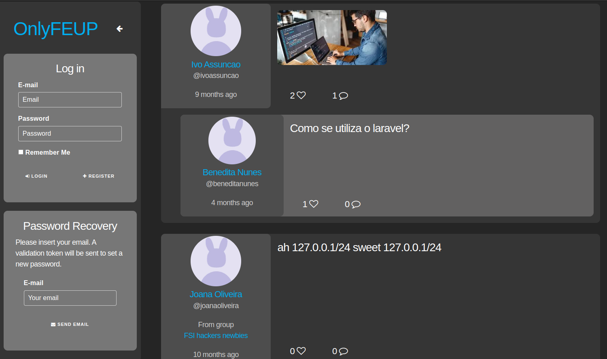
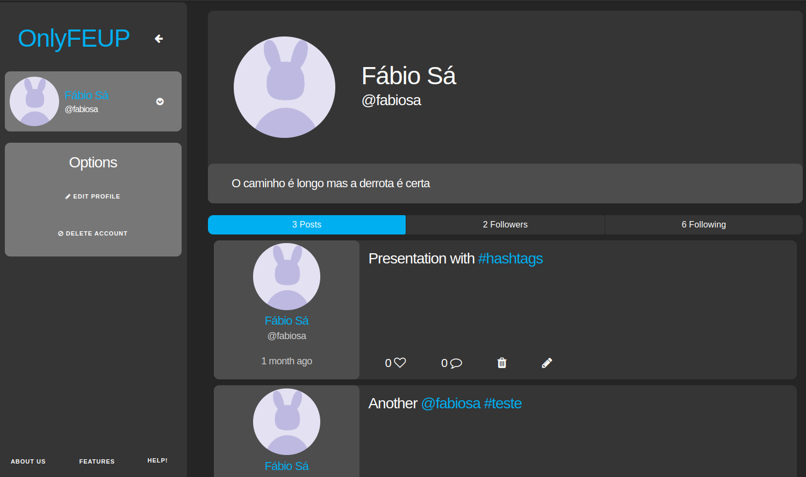
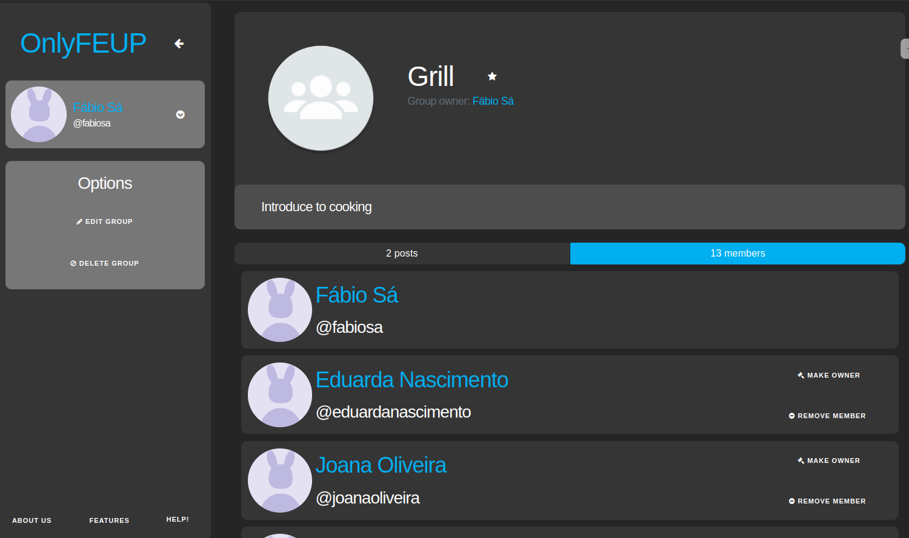
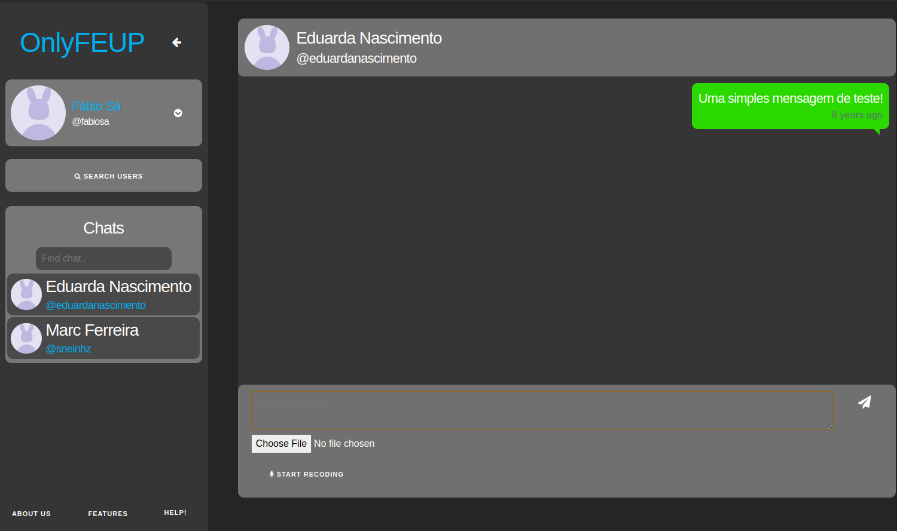
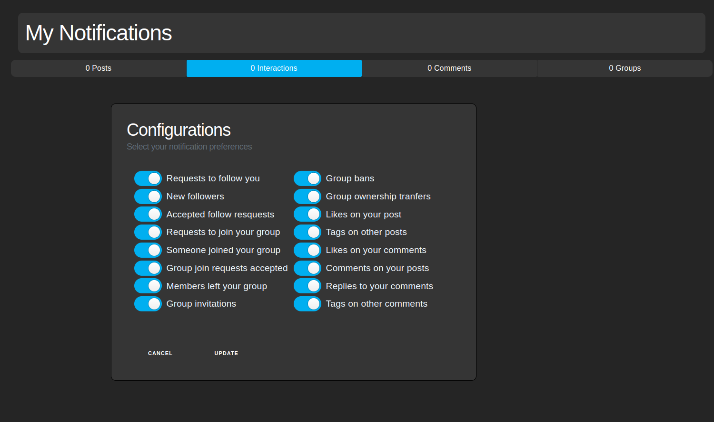

# OnlyFEUP - Social Network

The main goal of the OnlyFEUP project is the development of a web-based social network with the purpose of creating connections between students and staff, sharing resources about courses and subjects. This is a tool that can be used by anyone from FEUP. After signing up and verifying the user is related to the university (students/teachers), they can start using it for a better experience at FEUP.


<p align="center">Home Page</p>


<p align="center">Profile Page</p>


<p align="center">Group Page</p>


<p align="center">Chat Page</p>


<p align="center">Notification Page</p>

## Project Components

* [ER: Requirements Specification](/wiki/er.md)
* [EBD: Database Specification](/wiki/edb.md)
* [EAP: Architecture Specification and Prototypes](/wiki/eap.md)
* [PA: Product and Presentation](/wiki/pa.md)

## Checklists

*  [OnlyFEUP Artifacts Checklist](./docs/OnlyFEUP_Checklist.pdf)
*  [OnlyFEUP Accessibility Checklist](./docs/Accessibility%20Checklist.pdf)
*  [OnlyFEUP Usability Checklist](./docs/Usability%20Checklist.pdf)
*  [OnlyFEUP CSS Validation](./docs/CSS%20Validation.pdf)
*  [OnlyFEUP HTML Validation](./docs/HTML%20Validation.pdf)

## Product

The final version was available in `https://lbaw2255.lbaw.fe.up.pt/` and there is also a [video presentation](./docs/lbaw2255.mp4) and a [full documentation](./Report.pdf).

```code
docker run -it -p 8000:80 --name=lbaw2255 -e DB_DATABASE="lbaw2255" -e DB_SCHEMA="lbaw2255" -e DB_USERNAME="lbaw2255" -e DB_PASSWORD="reWisDQE" git.fe.up.pt:5050/lbaw/lbaw2223/lbaw2255
```

### Credentials

- eduardanascimento@gmail.com / eduardalbaw2255 (Administrator Account)
- laravel@hotmail.com / password (Normal Account)

## Team

* André Correia da Costa (up201905916@fe.up.pt)
* Fábio Araújo de Sá (up202007658@fe.up.pt)
* Lourenço Alexandre Correia Gonçalves (up202004816@fe.up.pt)
* Marcos William Ferreira Pinto (up201800177@fe.up.pt)

---

GROUP lbaw 2255, 25/09/2022 - 02/01/2023