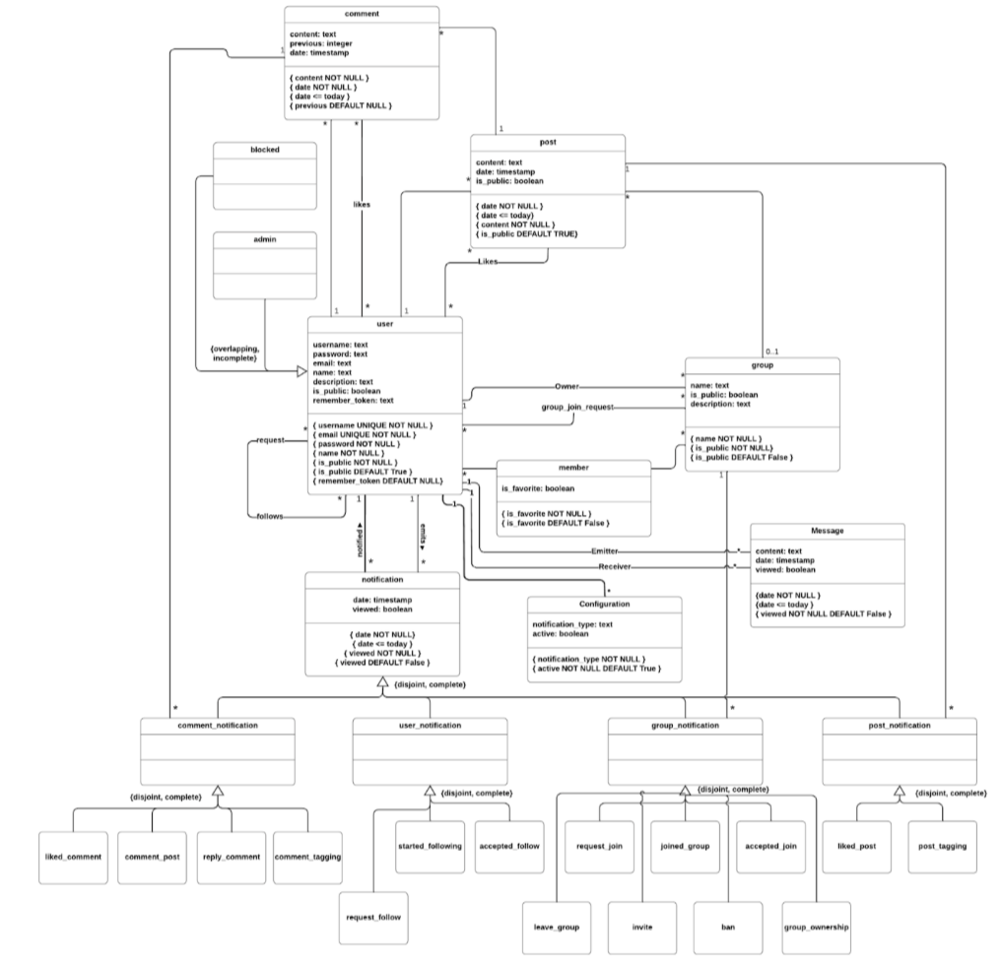

# EBD: Database Specification Component

## A4: Conceptual Data Model

<span dir="">This section contains the description of the entities and relationships that exist to the onlyFEUP project and its database specification.</span>

### 4.1 Class diagram

<span dir="">The UML diagram in Figure 6 presents the main organizational entities, the relationships between them, attributes and their domains, and the multiplicity of relationships for the OnlyFEUP platform.</span>

 
Figure 6: OnlyFEUP conceptual data model in UML

### 4.2 Additional Business Rules

<span dir="">Additional business rules or restrictions that cannot be conveyed in the UML class diagram of OnlyFEUP’s system.</span>

<table>
<tr>
<td>

**Identifier**
</td>
<td>

**Description**
</td>
</tr>
<tr>
<td>BR07</td>
<td>

<span dir="">A user can only like a post once or like posts from groups to which they belong or like comment in posts from public users or users they follow</span>
</td>
</tr>
<tr>
<td>BR08</td>
<td>

<span dir="">A user can only like a comment once</span>
</td>
</tr>
<tr>
<td>BR09</td>
<td>

<span dir="">A user can only post to a group that they belong to</span>
</td>
</tr>
<tr>
<td>BR10</td>
<td>

<span dir="">A user cannot follow themselves</span>
</td>
</tr>
<tr>
<td>BR11</td>
<td>

<span dir="">In post, media and content cant both be null</span>
</td>
</tr>
<tr>
<td>BR12</td>
<td>

<span dir="">A user can only comment on posts from public users, posts from users they follow or on posts from groups to which they belong</span>
</td>
</tr>
<tr>
<td>BR13</td>
<td>

<span dir="">A group owner is also a member of your group</span>
</td>
</tr>
<tr>
<td>BR14</td>
<td>

<span dir="">A user cannot request to follow a user that he/she already follow</span>
</td>
</tr>
<tr>
<td>BR15</td>
<td>

<span dir="">A user cannot request to follow themselves</span>
</td>
</tr>
<tr>
<td>BR16</td>
<td>

<span dir="">A user cannot request to join a group that he/she is already a part of</span>
</td>
</tr>
</table>

Table 13: Additional Business Rules

## A5: Relational Schema, validation and schema refinement

<span dir="">This section contains the relational schema obtained from the conceptual data model by analyzing it. It shows each relational schema, attributes, domains, primary keys, foreign keys and other integrity rules necessary such as unique, default, not null and check.</span>

### 5.1 Relational Schema

<table>
<tr>
<td>

**Relation reference**
</td>
<td>

**Relation Compact Notation**
</td>
</tr>
<tr>
<td>R01</td>
<td>

users(id **PK**, username **UK NN**, password **NN**, email **UK NN**, name **NN**, is_public **NN DF** true, remember_token **DF** null)
</td>
</tr>
<tr>
<td>R02</td>
<td>

admin(id->users **PK**)
</td>
</tr>
<tr>
<td>R03</td>
<td>

groups(id **PK**, owner_id->users **NN**, name **NN**, is_public **NN DF** false, description)
</td>
</tr>
<tr>
<td>R04</td>
<td>

post(id **PK**, owner_id->users **NN**, group_id->groups, content, date **NN CK** date <= today, previous **DF** null)
</td>
</tr>
<tr>
<td>R05</td>
<td>

comment(id **PK**, author_id->users **NN**, post_id->post **NN**, content, date **NN CK** date <= today, previous **DF** null)
</td>
</tr>
<tr>
<td>R06</td>
<td>

blocked(id->users **PK**)
</td>
</tr>
<tr>
<td>R07</td>
<td>

notification(id **PK**, date **NN CK** date <= today, notified_user->users **NN**, emitter_user->users **NN**, viewed **NN DF** false)
</td>
</tr>
<tr>
<td>R08</td>
<td>

comment_notification(id->notification **PK**, comment_id->comment)
</td>
</tr>
<tr>
<td>R09</td>
<td>

user_notification(id->notification **PK**, notification_type **NN CK** notification_type **IN** user_notification_types)
</td>
</tr>
<tr>
<td>R10</td>
<td>

group_notification(id->notification **PK**, group_id->groups **NN**, notification_type **NN CK** notification_type **IN** group_notification_types)
</td>
</tr>
<tr>
<td>R11</td>
<td>

post_notification(id->notification **PK**, post_id->post **NN**, notification_type **NN** **CK** notification_type **IN** post_notification_types)
</td>
</tr>
<tr>
<td>R12</td>
<td>

member(**user_id**->users, **group_id**->groups, is_favorite **NN DF** false)
</td>
</tr>
<tr>
<td>R13</td>
<td>

follow_request(**req_id**->users, **rcv_id**->users)
</td>
</tr>
<tr>
<td>R14</td>
<td>

follows(**follower_id**->users, **followed_id**->users)
</td>
</tr>
<tr>
<td>R15</td>
<td>

post_likes(**user_id**->users, **post_id**->post)
</td>
</tr>
<tr>
<td>R16</td>
<td>

comment_likes(**user_id**->users, **comment_id**->comment)
</td>
</tr>
<tr>
<td>R17</td>
<td>

group_join_request(**user_id**->users, **group_id**->groups)
</td>
</tr>
<tr>
<td>R18</td>
<td>

configuration(**user_id**->users, notification_type **NN**, active **NN DF** true)
</td>
</tr>
<tr>
<td>R19</td>
<td>

message(id **PK**, emitter_id->users, receiver_id->users, content **NN**, date **NN CK** date <= today, viewed **NN DF** false)
</td>
</tr>
</table>

Table 14: OnlyFEUP Relational Schema

Legend:

- UK = UNIQUE;
- NN = NOT NULL;
- DF = DEFAULT;
- CK = CHECK;

### 5.2 Domains

Specification of additional domains.

<table>
<tr>
<td>

**Domain Name**
</td>
<td>

**Domain Specification**
</td>
</tr>
<tr>
<td>

**today**
</td>
<td>DATE DEFAULT CURRENT_DATE</td>
</tr>
<tr>
<td>

**user_notification_types**
</td>
<td>ENUM (‘request_follow’, ‘started_following’, ‘accepted_follow’)</td>
</tr>
<tr>
<td>

**group_notification_types**
</td>
<td>ENUM (‘request_join’, ‘joined_group’, ‘accept_join’)</td>
</tr>
<tr>
<td>

**post_notification_types**
</td>
<td>ENUM (‘liked_post’, ‘comment_post’)</td>
</tr>
<tr>
<td>

**comment_notification_types**
</td>
<td>ENUM (‘liked_comment’, ‘comment_post’, ‘reply_comment’, ‘comment_tagging’)</td>
</tr>
</table>

<span dir="">Table 15: OnlyFEUP Domains</span>

### 5.3 Schema validation

All functional dependencies are identified and the normalization of all relation schemas is accomplished.

<table>
<tr>
<td>

**TABLE R01**
</td>
<td>

**users**
</td>
</tr>
<tr>
<td>

**Keys**
</td>
<td>{id}</td>
</tr>
<tr>
<td>

**Functional Dependencies:**
</td>
<td>

</td>
</tr>
<tr>
<td>FD0101</td>
<td>{id} → {username, password, email, name, is_public}</td>
</tr>
<tr>
<td>

**NORMAL FORM**
</td>
<td>BCNF</td>
</tr>
</table>

<span dir="">Table 16: user schema validation</span>

<table>
<tr>
<td>

**TABLE R02**
</td>
<td>

**admin**
</td>
</tr>
<tr>
<td>

**Keys**
</td>
<td>{id}</td>
</tr>
<tr>
<td>

**Functional Dependencies:**
</td>
<td>

_none_
</td>
</tr>
<tr>
<td>

**NORMAL FORM**
</td>
<td>BCNF</td>
</tr>
</table>

<span dir="">Table 17: admin schema validation</span>

<table>
<tr>
<td>

**TABLE R03**
</td>
<td>

**groups**
</td>
</tr>
<tr>
<td>

**Keys**
</td>
<td>{id}</td>
</tr>
<tr>
<td>

**Functional Dependencies:**
</td>
<td>

</td>
</tr>
<tr>
<td>FD0301</td>
<td>{id} → {owner_id, name, is_public, description}</td>
</tr>
<tr>
<td>

**NORMAL FORM**
</td>
<td>BCNF</td>
</tr>
</table>

<span dir="">Table 18: group schema validation</span>

<table>
<tr>
<td>

**TABLE R04**
</td>
<td>

**post**
</td>
</tr>
<tr>
<td>

**Keys**
</td>
<td>{id}</td>
</tr>
<tr>
<td>

**Functional Dependencies:**
</td>
<td>

</td>
</tr>
<tr>
<td>FD0401</td>
<td>{id} → {user_id, group_id, content, date}</td>
</tr>
<tr>
<td>

**NORMAL FORM**
</td>
<td>BCNF</td>
</tr>
</table>

<span dir="">Table 19: post schema validation</span>

<table>
<tr>
<td>

**TABLE R05**
</td>
<td>

**comment**
</td>
</tr>
<tr>
<td>

**Keys**
</td>
<td>{id}</td>
</tr>
<tr>
<td>

**Functional Dependencies:**
</td>
<td>

</td>
</tr>
<tr>
<td>FD0501</td>
<td>{id} → {author_id, post_id, content, date}</td>
</tr>
<tr>
<td>

**NORMAL FORM**
</td>
<td>BCNF</td>
</tr>
</table>

<span dir="">Table 20: comment schema validation</span>

<table>
<tr>
<td>

**TABLE R06**
</td>
<td>

**blocked**
</td>
</tr>
<tr>
<td>

**Keys**
</td>
<td>{id}</td>
</tr>
<tr>
<td>

**Functional Dependencies:**
</td>
<td>

_none_
</td>
</tr>
<tr>
<td>

**NORMAL FORM**
</td>
<td>BCNF</td>
</tr>
</table>

<span dir="">Table 21: media schema validation</span>

<table>
<tr>
<td>

**TABLE R07**
</td>
<td>

**notification**
</td>
</tr>
<tr>
<td>

**Keys**
</td>
<td>{id}</td>
</tr>
<tr>
<td>

**Functional Dependencies:**
</td>
<td>

</td>
</tr>
<tr>
<td>FD0701</td>
<td>{id} → {date, notified_user, emitter_user, viewed}</td>
</tr>
<tr>
<td>

**NORMAL FORM**
</td>
<td>BCNF</td>
</tr>
</table>

<span dir="">Table 22: notification schema validation</span>

<table>
<tr>
<td>

**TABLE R08**
</td>
<td>

**comment_notification**
</td>
</tr>
<tr>
<td>

**Keys**
</td>
<td>{id}</td>
</tr>
<tr>
<td>

**Functional Dependencies:**
</td>
<td>

</td>
</tr>
<tr>
<td>FD0801</td>
<td>{id} → {comment_id}</td>
</tr>
<tr>
<td>

**NORMAL FORM**
</td>
<td>BCNF</td>
</tr>
</table>

<span dir="">Table 23: comment_notification schema validation</span>

<table>
<tr>
<td>

**TABLE R09**
</td>
<td>

**user_notification**
</td>
</tr>
<tr>
<td>

**Keys**
</td>
<td>{id}</td>
</tr>
<tr>
<td>

**Functional Dependencies:**
</td>
<td>

</td>
</tr>
<tr>
<td>FD0901</td>
<td>{id} → {notification_type}</td>
</tr>
<tr>
<td>

**NORMAL FORM**
</td>
<td>BCNF</td>
</tr>
</table>

<span dir="">Table 24: user_notification schema validation</span>

<table>
<tr>
<td>

**TABLE R10**
</td>
<td>

**group_notification**
</td>
</tr>
<tr>
<td>

**Keys**
</td>
<td>{id}</td>
</tr>
<tr>
<td>

**Functional Dependencies:**
</td>
<td>

</td>
</tr>
<tr>
<td>FD1001</td>
<td>{id} → {group_id, notification_type}</td>
</tr>
<tr>
<td>

**NORMAL FORM**
</td>
<td>BCNF</td>
</tr>
</table>

<span dir="">Table 25: group_notification schema validation</span>

<table>
<tr>
<td>

**TABLE R11**
</td>
<td>

**post_notification**
</td>
</tr>
<tr>
<td>

**Keys**
</td>
<td>{id}</td>
</tr>
<tr>
<td>

**Functional Dependencies:**
</td>
<td>

</td>
</tr>
<tr>
<td>FD1101</td>
<td>{id} → {post_id, notification_type}</td>
</tr>
<tr>
<td>

**NORMAL FORM**
</td>
<td>BCNF</td>
</tr>
</table>

<span dir="">Table 26: post_notification schema validation</span>

<table>
<tr>
<td>

**TABLE R12**
</td>
<td>

**member**
</td>
</tr>
<tr>
<td>

**Keys**
</td>
<td>{user_id, group_id}</td>
</tr>
<tr>
<td>

**Functional Dependencies:**
</td>
<td>

</td>
</tr>
<tr>
<td>FD1201</td>
<td>{user_id, group_id} →{is_favorite}</td>
</tr>
<tr>
<td>

**NORMAL FORM**
</td>
<td>BCNF</td>
</tr>
</table>

<span dir="">Table 27: member schema validation</span>

<table>
<tr>
<td>

**TABLE R13**
</td>
<td>

**follow_request**
</td>
</tr>
<tr>
<td>

**Keys**
</td>
<td>{req_id, rcv_id}</td>
</tr>
<tr>
<td>

**Functional Dependencies:**
</td>
<td>

_none_
</td>
</tr>
<tr>
<td>

**NORMAL FORM**
</td>
<td>BCNF</td>
</tr>
</table>

<span dir="">Table 28: follow_request schema validation</span>

<table>
<tr>
<td>

**TABLE R14**
</td>
<td>

**follows**
</td>
</tr>
<tr>
<td>

**Keys**
</td>
<td>{follower_id, followed_id}</td>
</tr>
<tr>
<td>

**Functional Dependencies:**
</td>
<td>

_none_
</td>
</tr>
<tr>
<td>

**NORMAL FORM**
</td>
<td>BCNF</td>
</tr>
</table>

<span dir="">Table 29: follows schema validation</span>

<table>
<tr>
<td>

**TABLE R15**
</td>
<td>

**post_likes**
</td>
</tr>
<tr>
<td>

**Keys**
</td>
<td>{user_id, post_id}</td>
</tr>
<tr>
<td>

**Functional Dependencies:**
</td>
<td>

_none_
</td>
</tr>
<tr>
<td>

**NORMAL FORM**
</td>
<td>BCNF</td>
</tr>
</table>

<span dir="">Table 30: post_likes schema validation</span>

<table>
<tr>
<td>

**TABLE R16**
</td>
<td>

**post_likes**
</td>
</tr>
<tr>
<td>

**Keys**
</td>
<td>{user_id, post_id}</td>
</tr>
<tr>
<td>

**Functional Dependencies:**
</td>
<td>

_none_
</td>
</tr>
<tr>
<td>

**NORMAL FORM**
</td>
<td>BCNF</td>
</tr>
</table>

<span dir="">Table 31: comment_likes schema validation</span>

<table>
<tr>
<td>

**TABLE R17**
</td>
<td>

**group_join_request**
</td>
</tr>
<tr>
<td>

**Keys**
</td>
<td>{user_id, group_id}</td>
</tr>
<tr>
<td>

**Functional Dependencies:**
</td>
<td>

_none_
</td>
</tr>
<tr>
<td>

**NORMAL FORM**
</td>
<td>BCNF</td>
</tr>
</table>

Table 32: group_join_request schema validation

<table>
<tr>
<td>

**TABLE R18**
</td>
<td>

**configuration**
</td>
</tr>
<tr>
<td>

**Keys**
</td>
<td>{id}</td>
</tr>
<tr>
<td>

**Functional Dependencies:**
</td>
<td>

</td>
</tr>
<tr>
<td>FD1801</td>
<td>{id} -> {user_id, notification_type, active}</td>
</tr>
<tr>
<td>

**NORMAL FORM**
</td>
<td>BCNF</td>
</tr>
</table>

Table 33: configuration schema validation

<table>
<tr>
<td>

**TABLE R19**
</td>
<td>

**message**
</td>
</tr>
<tr>
<td>

**Keys**
</td>
<td>{id}</td>
</tr>
<tr>
<td>

**Functional Dependencies:**
</td>
<td>

</td>
</tr>
<tr>
<td>FD1901</td>
<td>{id} -> {emitter_user, receiver_user, content, date, viewed}</td>
</tr>
<tr>
<td>

**NORMAL FORM**
</td>
<td>BCNF</td>
</tr>
</table>

Table 34: message schema validation

Because all relations are in the Boyce–Codd Normal Form (BCNF), the relational schema is also in the BCNF and, therefore, the schema does not need to be further normalized.

## A6: Indexes, triggers, transactions and database population

<span dir="">The A6 artifact contains the postgres sql code. In other words, It contains the physical schema of the database and its population, the support of data integrity rules with triggers, the identification and characterisation of the indexes and the definition of the database user-defined functions.</span>

<span dir="">It also shows the transactions needed to ensure correctness of the data after accesses and/or changes to the database itself. Furthermore the isolation level is explained as required.</span>

### 1. Database Workload

<span dir="">In order to develop a database with good design, it is essential to comprehend the growth of a table and how many times it will be accessed. The table below shows said predictions:</span>

<table>
<tr>
<td>Identifier</td>
<td>Relation Name</td>
<td>Order of magnitude</td>
<td>Estimated growth</td>
</tr>
<tr>
<td>RS01</td>
<td>user</td>
<td>10 k</td>
<td>10</td>
</tr>
<tr>
<td>RS02</td>
<td>admin</td>
<td>1</td>
<td>1</td>
</tr>
<tr>
<td>RS03</td>
<td>group</td>
<td>1 k</td>
<td>10</td>
</tr>
<tr>
<td>

<div>RS04</div></td>
<td>post</td>
<td>10 k</td>
<td>1 k</td>
</tr>
<tr>
<td>RS05</td>
<td>comment</td>
<td>10 k</td>
<td>100</td>
</tr>
<tr>
<td>RS06</td>
<td>blocked</td>
<td>100</td>
<td>10</td>
</tr>
<tr>
<td>RS07</td>
<td>notification</td>
<td>1 k</td>
<td>1 k</td>
</tr>
<tr>
<td>RS08</td>
<td>comment_notification</td>
<td>100</td>
<td>100</td>
</tr>
<tr>
<td>RS09</td>
<td>user_notification</td>
<td>100</td>
<td>100</td>
</tr>
<tr>
<td>RS10</td>
<td>group_notification</td>
<td>100</td>
<td>100</td>
</tr>
<tr>
<td>RS11</td>
<td>post_notification</td>
<td>100</td>
<td>100</td>
</tr>
<tr>
<td>RS12</td>
<td>member</td>
<td>100</td>
<td>100</td>
</tr>
<tr>
<td>RS13</td>
<td>follow_request</td>
<td>10</td>
<td>10</td>
</tr>
<tr>
<td>RS14</td>
<td>follows</td>
<td>10</td>
<td>10</td>
</tr>
<tr>
<td>RS15</td>
<td>post_likes</td>
<td>1 k</td>
<td>1 k</td>
</tr>
<tr>
<td>RS16</td>
<td>comment_likes</td>
<td>1 k</td>
<td>1 k</td>
</tr>
<tr>
<td>RS17</td>
<td>group_join_request</td>
<td>10</td>
<td>10</td>
</tr>
<tr>
<td>RS18</td>
<td>configuration</td>
<td>10k</td>
<td>10</td>
</tr>
<tr>
<td>RS19</td>
<td>message</td>
<td>100k</td>
<td>1k</td>
</tr>
</table>

Table 35: OnlyFEUP workload

## 2. Proposed Indexes

<span dir="">We used Indexes to increase the database performance by letting It to find and retrieve specific rows in more rapidly ways. An index defined on a column that is part of a join condition can also significantly speed up queries with joins. Moreover, indexes can also benefit UPDATE and DELETE commands with search conditions.</span>

### 2.1. Performance indexes

<span dir="">Some queries would normally take a long time to execute. With performance indexes, we can improve the performance of SELECT queries at the expense of increased execution time for INSERT, UPDATE and DELETE operations. Despite this, some tables can benefit from the increased speed in searches. The following tables show the performance indexes used:</span>

<span dir="">Note that the first and second indexes relate to the same queries, the difference being that they relate to different columns in notification, as such they can be considered the same.</span>

<table>
<tr>
<td>Index</td>
<td>IDX01</td>
</tr>
<tr>
<td>Index relation</td>
<td>notification</td>
</tr>
<tr>
<td>Index attribute</td>
<td>notified_user</td>
</tr>
<tr>
<td>Index type</td>
<td>B-tree</td>
</tr>
<tr>
<td>Cardinality</td>
<td>Medium</td>
</tr>
<tr>
<td>Clustering</td>
<td>Yes</td>
</tr>
<tr>
<td>Justification</td>
<td>

<span dir="">Table ‘notification’ is very large. Several queries related to notifications in comments, posts and groups need to frequently find out the user notified. This is done by exact match, thus an hash type index would be best suited. However, since we also want to apply clustering based on this index, and clustering is not possible on hash type indexes, we opted for a b-tree index. Update frequency is low and cardinality is medium so it's a good candidate for clustering.</span>
</td>
</tr>
<tr>
<td>SQL code</td>
<td>

<span dir="">CREATE INDEX notified_user_notification ON notification USING btree (notified_user);</span>

<span dir="">CLUSTER notification USING notified_user_notification;</span>
</td>
</tr>
</table>

Table 36: Notified User Index

<table>
<tr>
<td>

<div>Index</div></td>
<td>

<div>IDX02</div></td>
</tr>
<tr>
<td>

<div>Index relation</div></td>
<td>

<div>notification</div></td>
</tr>
<tr>
<td>

<div>Index attributes</div></td>
<td>

<div>emitter_user</div></td>
</tr>
<tr>
<td>

<div>Index type</div></td>
<td>

<div>B-tree</div></td>
</tr>
<tr>
<td>

<div>Cardinality</div></td>
<td>

<div>Medium</div></td>
</tr>
<tr>
<td>

<div>Clustering</div></td>
<td>

<div>Yes</div></td>
</tr>
<tr>
<td>

<div>Justification</div></td>
<td>

<div>

<span dir="">Table ‘notification’ is very large. Several queries related to notifications in comments, posts and groups need to frequently find out who made a notification . This is done by exact match, thus an hash type index would be best suited. However, since we also want to apply clustering based on this index, and clustering is not possible on hash type indexes, we opted for a b-tree index. Update frequency is low and cardinality is medium so it's a good candidate for clustering.</span>

</div></td>
</tr>
<tr>
<td>

<div>SQL code</div></td>
<td>

<div>

<span dir="">CREATE INDEX emitter_user_notification ON notification USING btree (emitter_user);</span>

<span dir="">CLUSTER notification USING emitter_user_notification;</span>

</div></td>
</tr>
</table>

Table 37: Emitter User Index

<table>
<tr>
<td>

<div>

<div>Index</div>
</div></td>
<td>

<div>

<div>IDX03</div>
</div></td>
</tr>
<tr>
<td>

<div>

<div>Index relation</div>
</div></td>
<td>post</td>
</tr>
<tr>
<td>

<div>

<div>Index attributes</div>
</div></td>
<td>

<div>

<div>owner_id</div>
</div></td>
</tr>
<tr>
<td>

<div>

<div>Index type</div>
</div></td>
<td>Hash</td>
</tr>
<tr>
<td>

<div>

<div>Cardinality</div>
</div></td>
<td>

<div>

<div>Medium</div>
</div></td>
</tr>
<tr>
<td>

<div>

<div>Clustering</div>
</div></td>
<td>No</td>
</tr>
<tr>
<td>

<div>

<div>Justification</div>
</div></td>
<td>

<span dir="">In a social network, posts are essencial and therefore the table ‘post’ will be quite large. As such, for each post it is frequent and necessary to search for the user who made it. This is done by exact match in those ids. Update frequency is extremely low and cardinality is medium so it's a good candidate for hash tables.</span>
</td>
</tr>
<tr>
<td>

<div>

<div>SQL code</div>
</div></td>
<td>

<div>

<div>

<span dir="">CREATE INDEX owner_id_post ON post USING hash (owner_id);</span>

</div>
</div></td>
</tr>
</table>

Table 38: Post Owner Index

<table>
<tr>
<td>

<div>

<div>

<div>Index</div>
</div>
</div></td>
<td>

<div>

<div>

<div>IDX04</div>
</div>
</div></td>
</tr>
<tr>
<td>

<div>

<div>

<div>Index relation</div>
</div>
</div></td>
<td>comment</td>
</tr>
<tr>
<td>

<div>

<div>

<div>Index attributes</div>
</div>
</div></td>
<td>

<div>

<div>

<div>owner_id</div>
</div>
</div></td>
</tr>
<tr>
<td>

<div>

<div>

<div>Index type</div>
</div>
</div></td>
<td>

<div>Hash</div></td>
</tr>
<tr>
<td>

<div>

<div>

<div>Cardinality</div>
</div>
</div></td>
<td>

<div>

<div>

<div>Medium</div>
</div>
</div></td>
</tr>
<tr>
<td>

<div>

<div>

<div>Clustering</div>
</div>
</div></td>
<td>

<div>No</div></td>
</tr>
<tr>
<td>

<div>

<div>

<div>Justification</div>
</div>
</div></td>
<td>

<div>

<span dir="">In a social network, comments are essencial and therefore the table ‘comment’ will be quite large. As such, for each comment is frequent and necessary to search for the user who made it. This is done by exact match in those ids. Update frequency is extremely low and cardinality is medium so it's a good candidate for hash tables</span>

</div></td>
</tr>
<tr>
<td>

<div>

<div>

<div>SQL code</div>
</div>
</div></td>
<td>

<div>

<div>

<div>

<span dir="">CREATE INDEX owner_id_comment ON comment USING hash (owner_id);</span>

</div>
</div>
</div></td>
</tr>
</table>

Table 39: Comment FTS index

### 2.2. Full-text Search Indices

<span dir="">As required by the project’s specifications indexes for full-text search must be developed. Hence, to improve text search time, we created Full-Text Search (FTS) indexes on the tables and attributes we thought would be queried the most. Those indexes can be found in the following tables:</span>

<table>
<tr>
<td>

<div>

<div>

<div>

<div>Index</div>
</div>
</div>
</div></td>
<td>

<div>

<div>

<div>

<div>IDX05</div>
</div>
</div>
</div></td>
</tr>
<tr>
<td>

<div>

<div>

<div>

<div>Index relation</div>
</div>
</div>
</div></td>
<td>

<div>group</div></td>
</tr>
<tr>
<td>

<div>

<div>

<div>

<div>Index attributes</div>
</div>
</div>
</div></td>
<td>name, description</td>
</tr>
<tr>
<td>

<div>

<div>

<div>

<div>Index type</div>
</div>
</div>
</div></td>
<td>GIN</td>
</tr>
<tr>
<td>

<div>

<div>

<div>

<div>Clustering</div>
</div>
</div>
</div></td>
<td>

<div>

<div>No</div>
</div></td>
</tr>
<tr>
<td>

<div>

<div>

<div>

<div>Justification</div>
</div>
</div>
</div></td>
<td>

<span dir="">To provide full-text search features to look for groups based on matching names or descriptions. The index type is GIN because the indexed fields are not expected to change often.</span>
</td>
</tr>
<tr>
<td>

<div>

<div>

<div>

<div>SQL code</div>
</div>
</div>
</div></td>
<td>

<div>

<div>

<div>

<div>

<span dir="">-- Add column to group to store computed ts_vectors.</span>

<span dir="">ALTER TABLE groupADD</span>

<span dir="">COLUMN tsvectors TSVECTOR;</span>

<span dir="">-- Create a function to automatically update ts_vectors.</span>

<span dir="">CREATE FUNCTION group_search_update() RETURNS TRIGGER AS $$</span>

<span dir="">BEGIN</span>

<span dir=""> IF TG_OP = 'INSERT' THEN</span>

<span dir="">        NEW.tsvectors = (</span>

<span dir="">         setweight(to_tsvector('portuguese', NEW.name), 'A') ||</span>

<span dir="">         setweight(to_tsvector('portuguese', NEW.description), 'B')</span>

<span dir="">        );</span>

<span dir=""> END IF;</span>

<span dir=""> IF TG_OP = 'UPDATE' THEN</span>

<span dir="">         IF (NEW.name <> OLD.name OR NEW.description <> OLD.description) THEN</span>

<span dir="">           NEW.tsvectors = (</span>

<span dir="">             setweight(to_tsvector('portuguese', NEW.name), 'A') ||</span>

<span dir="">             setweight(to_tsvector('portuguese', NEW.description), 'B')</span>

<span dir="">           );</span>

<span dir="">         END IF;</span>

<span dir=""> END IF;</span>

<span dir=""> RETURN NEW;</span>

<span dir="">END $$</span>

<span dir="">LANGUAGE plpgsql;</span>

<span dir="">-- Create a trigger before insert or update on group.</span>

<span dir="">CREATE TRIGGER group_search_update</span>

<span dir=""> BEFORE INSERT OR UPDATE ON group</span>

<span dir=""> FOR EACH ROW</span>

<span dir=""> EXECUTE PROCEDURE group_search_update();</span>

<span dir="">-- Create a GIN index for ts_vectors.</span>

<span dir="">CREATE INDEX search_group ON group USING GIN (tsvectors);</span>

</div>
</div>
</div>
</div></td>
</tr>
</table>

Table 40:Group FTS index

<table>
<tr>
<td>

<div>

<div>

<div>

<div>

<div>Index</div>
</div>
</div>
</div>
</div></td>
<td>

<div>

<div>

<div>

<div>

<div>IDX06</div>
</div>
</div>
</div>
</div></td>
</tr>
<tr>
<td>

<div>

<div>

<div>

<div>

<div>Index relation</div>
</div>
</div>
</div>
</div></td>
<td>user</td>
</tr>
<tr>
<td>

<div>

<div>

<div>

<div>

<div>Index attributes</div>
</div>
</div>
</div>
</div></td>
<td>

<div>name, username</div></td>
</tr>
<tr>
<td>

<div>

<div>

<div>

<div>

<div>Index type</div>
</div>
</div>
</div>
</div></td>
<td>

<div>GIN</div></td>
</tr>
<tr>
<td>

<div>

<div>

<div>

<div>

<div>Clustering</div>
</div>
</div>
</div>
</div></td>
<td>

<div>

<div>

<div>No</div>
</div>
</div></td>
</tr>
<tr>
<td>

<div>

<div>

<div>

<div>

<div>Justification</div>
</div>
</div>
</div>
</div></td>
<td>

<span dir="">To provide full-text search features to look for users based on matching names or usernames. The index type is GIN because the indexed fields are not expected to change often.</span>
</td>
</tr>
<tr>
<td>

<div>

<div>

<div>

<div>

<div>SQL code</div>
</div>
</div>
</div>
</div></td>
<td>

<span dir="">-- Add column to user to store computed ts_vectors.</span>

<span dir="">ALTER TABLE users</span>

<span dir="">ADD COLUMN tsvectors TSVECTOR;</span>

<span dir="">-- Create a function to automatically update ts_vectors.</span>

<span dir="">CREATE FUNCTION user_search_update() RETURNS TRIGGER AS $$</span>

<span dir="">BEGIN</span>

<span dir=""> IF TG_OP = 'INSERT' THEN</span>

<span dir="">        NEW.tsvectors = (</span>

<span dir="">         setweight(to_tsvector('portuguese', NEW.name), 'A') ||</span>

<span dir="">         setweight(to_tsvector('portuguese', NEW.username), 'B')</span>

<span dir="">        );</span>

<span dir=""> END IF;</span>

<span dir=""> IF TG_OP = 'UPDATE' THEN</span>

<span dir="">         IF (NEW.name <> OLD.name OR NEW.username <> OLD.username) THEN</span>

<span dir="">           NEW.tsvectors = (</span>

<span dir="">             setweight(to_tsvector('portuguese', NEW.name), 'A') ||</span>

<span dir="">             setweight(to_tsvector('portuguese', NEW.username), 'B')</span>

<span dir="">           );</span>

<span dir="">          END IF;</span>

<span dir=""> END IF;</span>

<span dir=""> RETURN NEW;</span>

<span dir="">END $$</span>

<span dir="">LANGUAGE plpgsql;</span>

<span dir="">-- Create a trigger before insert or update on user</span>

<span dir="">CREATE TRIGGER user_search_update</span>

<span dir=""> BEFORE INSERT OR UPDATE ON users</span>

<span dir=""> FOR EACH ROW</span>

<span dir=""> EXECUTE PROCEDURE user_search_update();</span>

<span dir="">-- Create a GIN index for ts_vectors.</span>

<span dir="">CREATE INDEX search_user ON users USING GIN (tsvectors);</span>
</td>
</tr>
</table>

Table 41: User FTS index

<table>
<tr>
<td>

<div>

<div>

<div>

<div>

<div>

<div>Index</div>
</div>
</div>
</div>
</div>
</div></td>
<td>

<div>

<div>

<div>

<div>

<div>

<div>IDX07</div>
</div>
</div>
</div>
</div>
</div></td>
</tr>
<tr>
<td>

<div>

<div>

<div>

<div>

<div>

<div>Index relation</div>
</div>
</div>
</div>
</div>
</div></td>
<td>post</td>
</tr>
<tr>
<td>

<div>

<div>

<div>

<div>

<div>

<div>Index attributes</div>
</div>
</div>
</div>
</div>
</div></td>
<td>content</td>
</tr>
<tr>
<td>

<div>

<div>

<div>

<div>

<div>

<div>Index type</div>
</div>
</div>
</div>
</div>
</div></td>
<td>

<div>

<div>GIN</div>
</div></td>
</tr>
<tr>
<td>

<div>

<div>

<div>

<div>

<div>

<div>Clustering</div>
</div>
</div>
</div>
</div>
</div></td>
<td>

<div>

<div>

<div>

<div>No</div>
</div>
</div>
</div></td>
</tr>
<tr>
<td>

<div>

<div>

<div>

<div>

<div>

<div>Justification</div>
</div>
</div>
</div>
</div>
</div></td>
<td>

<div>

<span dir="">To provide full-text search features to look for posts based on matching content. The index type is GIN because the indexed fields are not expected to change often.</span>

</div></td>
</tr>
<tr>
<td>

<div>

<div>

<div>

<div>

<div>

<div>SQL code</div>
</div>
</div>
</div>
</div>
</div></td>
<td>

<div>

<span dir="">-- Add column to post to store computed ts_vectors.</span>

<span dir="">ALTER TABLE post</span>

<span dir="">ADD COLUMN tsvectors TSVECTOR;</span>

<span dir="">-- Create a function to automatically update ts_vectors.</span>

<span dir="">CREATE FUNCTION post_search_update() RETURNS TRIGGER AS $$</span>

<span dir="">BEGIN</span>

<span dir="">  IF TG_OP = 'INSERT' THEN</span>

<span dir="">        NEW.tsvectors = to_tsvector('portuguese', NEW.content);</span>

<span dir="">  END IF;</span>

<span dir="">  IF TG_OP = 'UPDATE' THEN</span>

<span dir="">      IF (NEW.content <> OLD.content) THEN</span>

<span dir="">           NEW.tsvectors = to_tsvector('portuguese', NEW.content);</span>

<span dir="">      END IF;</span>

<span dir=""> END IF;</span>

<span dir="">   RETURN NEW;</span>

<span dir="">END $$</span>

<span dir="">LANGUAGE plpgsql;</span>

<span dir="">-- Create a trigger before insert or update on post</span>

<span dir="">CREATE TRIGGER post_search_update</span>

<span dir=""> BEFORE INSERT OR UPDATE ON post</span>

<span dir=""> FOR EACH ROW</span>

<span dir=""> EXECUTE PROCEDURE post_search_update();</span>

<span dir="">-- Create a GIN index for ts_vectors.</span>

<span dir="">CREATE INDEX search_post ON post USING GIN (tsvectors);</span>

</div></td>
</tr>
</table>

Table 42: Post FTS index

<table>
<tr>
<td>

<div>

<div>

<div>

<div>

<div>

<div>

<div>Index</div>
</div>
</div>
</div>
</div>
</div>
</div></td>
<td>

<div>

<div>

<div>

<div>

<div>

<div>

<div>IDX08</div>
</div>
</div>
</div>
</div>
</div>
</div></td>
</tr>
<tr>
<td>

<div>

<div>

<div>

<div>

<div>

<div>

<div>Index relation</div>
</div>
</div>
</div>
</div>
</div>
</div></td>
<td>comment</td>
</tr>
<tr>
<td>

<div>

<div>

<div>

<div>

<div>

<div>

<div>Index attributes</div>
</div>
</div>
</div>
</div>
</div>
</div></td>
<td>

<div>content</div></td>
</tr>
<tr>
<td>

<div>

<div>

<div>

<div>

<div>

<div>

<div>Index type</div>
</div>
</div>
</div>
</div>
</div>
</div></td>
<td>

<div>

<div>

<div>GIN</div>
</div>
</div></td>
</tr>
<tr>
<td>

<div>

<div>

<div>

<div>

<div>

<div>

<div>Clustering</div>
</div>
</div>
</div>
</div>
</div>
</div></td>
<td>

<div>

<div>

<div>

<div>

<div>No</div>
</div>
</div>
</div>
</div></td>
</tr>
<tr>
<td>

<div>

<div>

<div>

<div>

<div>

<div>

<div>Justification</div>
</div>
</div>
</div>
</div>
</div>
</div></td>
<td>

<span dir="">To provide full-text search features to look for comments based on matching content. The index type is GIN because the indexed fields are not expected to change often.</span>
</td>
</tr>
<tr>
<td>

<div>

<div>

<div>

<div>

<div>

<div>

<div>SQL code</div>
</div>
</div>
</div>
</div>
</div>
</div></td>
<td>

<span dir="">-- Add column to comment to store computed ts_vectors.</span>

<span dir="">ALTER TABLE comment</span>

<span dir="">ADD COLUMN tsvectors TSVECTOR;</span>

<span dir="">-- Create a function to automatically update ts_vectors.</span>

<span dir="">CREATE FUNCTION comment_search_update() RETURNS TRIGGER AS $$</span>

<span dir="">BEGIN</span>

<span dir="">  IF TG_OP = 'INSERT' THEN</span>

<span dir="">        NEW.tsvectors = to_tsvector('portuguese', NEW.content);</span>

<span dir="">  END IF;</span>

<span dir="">  IF TG_OP = 'UPDATE' THEN</span>

<span dir="">      IF (NEW.content <> OLD.content) THEN</span>

<span dir="">           NEW.tsvectors = to_tsvector('portuguese', NEW.content);</span>

<span dir="">      END IF;</span>

<span dir=""> END IF;</span>

<span dir="">   RETURN NEW;</span>

<span dir="">END $$</span>

<span dir="">LANGUAGE plpgsql;</span>

<span dir="">-- Create a trigger before insert or update on comments</span>

<span dir="">CREATE TRIGGER comment_search_update</span>

<span dir=""> BEFORE INSERT OR UPDATE ON comment</span>

<span dir=""> FOR EACH ROW</span>

<span dir=""> EXECUTE PROCEDURE comment_search_update();</span>

<span dir="">-- Create a GIN index for ts_vectors.</span>

<span dir="">CREATE INDEX search_comment ON comment USING GIN (tsvectors);</span>
</td>
</tr>
</table>

Table 43: Comment FTS index

## 3. Triggers

To enforce integrity rules that cannot be achieved in a simpler way, the necessary triggers are identified and described by presenting the event, the condition, and the activation code. Triggers are also used to keep full-text indexes updated.

<table>
<tr>
<td>Trigger</td>
<td>TRIGGER01</td>
</tr>
<tr>
<td>Description</td>
<td>

<span dir="">A user can only like a post once, or like posts from groups to which they belong or like comments in posts from public users or users they follow (business rule BR07).</span>
</td>
</tr>
<tr>
<td>SQL code</td>
<td>

<span dir="">CREATE FUNCTION verify_post_likes() RETURNS TRIGGER AS</span>

<span dir="">$BODY$</span>

<span dir="">BEGIN</span>

<span dir="">   IF EXISTS (SELECT \* FROM post_likes WHERE NEW.user_id = user_id AND NEW.post_id = post_id) THEN</span>

<span dir="">      RAISE EXCEPTION 'A user can only like a post once';</span>

<span dir="">   END IF;</span>

<span dir="">   IF EXISTS (SELECT \* FROM post WHERE NEW.post_id = post.id AND post.group_id IS NOT NULL)</span>

<span dir="">      AND NOT EXISTS (SELECT \* FROM post,member WHERE NEW.post_id = post.id AND post.group_id = member.group_id AND NEW.user_id = member.user_id) THEN</span>

<span dir="">      RAISE EXCEPTION 'A user can only like posts from groups to which they belong';</span>

<span dir="">   END IF;</span>

<span dir="">   IF EXISTS (SELECT \* FROM users,post WHERE NEW.post_id = post.id AND post.owner_id = users.id AND NOT users.is_public AND post.group_id IS NULL)</span>

<span dir="">      AND NOT EXISTS (SELECT \* FROM post,follows WHERE NEW.post_id = post.id AND NEW.user_id = follows.follower_id AND follows.followed_id = post.owner_id) THEN</span>

<span dir="">      RAISE EXCEPTION 'A user can only like comment posts from public users or users they follow';</span>

<span dir="">   END IF;</span>

<span dir="">   RETURN NEW;</span>

<span dir="">END</span>

<span dir="">$BODY$</span>

<span dir="">LANGUAGE plpgsql;</span>

<span dir="">CREATE TRIGGER verify_post_likes</span>

<span dir="">   BEFORE INSERT OR UPDATE ON post_likes</span>

<span dir="">   FOR EACH ROW</span>

<span dir="">   EXECUTE PROCEDURE verify_post_likes();</span>
</td>
</tr>
</table>

Table 44: Verify post likes trigger

<table>
<tr>
<td>

<div>Trigger</div></td>
<td>

<div>TRIGGER02</div></td>
</tr>
<tr>
<td>

<div>Description</div></td>
<td>

<span dir="">A user can only like a comment once (business rule BR08).</span>
</td>
</tr>
<tr>
<td>

<div>SQL code</div></td>
<td>

<span dir="">CREATE FUNCTION verify_comment_likes() RETURNS TRIGGER AS</span>

<span dir="">$BODY$</span>

<span dir="">BEGIN</span>

<span dir="">        IF EXISTS (SELECT \* FROM comment_likes WHERE NEW.user_id = user_id AND NEW.post_id = post_id) THEN</span>

<span dir="">           RAISE EXCEPTION 'A user can only like a comment once';</span>

<span dir="">        END IF;</span>

<span dir="">        RETURN NEW;</span>

<span dir="">END</span>

<span dir="">$BODY$</span>

<span dir="">LANGUAGE plpgsql;</span>

<span dir="">CREATE TRIGGER verify_comment_likes</span>

<span dir="">        BEFORE INSERT OR UPDATE ON comment_likes</span>

<span dir="">        FOR EACH ROW</span>

<span dir="">        EXECUTE PROCEDURE verify_comment_likes();</span>
</td>
</tr>
</table>

Table 45: Verify comment likes trigger

<table>
<tr>
<td>

<div>

<div>Trigger</div>
</div></td>
<td>

<div>

<div>TRIGGER03</div>
</div></td>
</tr>
<tr>
<td>

<div>

<div>Description</div>
</div></td>
<td>

<span dir="">A user can only post to a group that they belong to (business rule BR09).</span>
</td>
</tr>
<tr>
<td>

<div>

<div>SQL code</div>
</div></td>
<td>

<div>

<span dir="">CREATE FUNCTION verify_group_post() RETURNS TRIGGER AS</span>

<span dir="">$BODY$</span>

<span dir="">BEGIN</span>

<span dir="">  IF NOT EXISTS (SELECT \* FROM member WHERE NEW.owner_id = user_id AND NEW.group_id = group_id)</span>

<span dir="">     AND NEW.group_id IS NOT NULL THEN</span>

<span dir="">        RAISE EXCEPTION 'A user can only post to a group that they belong to';</span>

<span dir="">  END IF;</span>

<span dir="">  RETURN NEW;</span>

<span dir="">END</span>

<span dir="">$BODY$</span>

<span dir="">LANGUAGE plpgsql;</span>

<span dir="">CREATE TRIGGER verify_group_post</span>

<span dir="">  BEFORE INSERT OR UPDATE ON post</span>

<span dir="">  FOR EACH ROW</span>

<span dir="">  EXECUTE PROCEDURE verify_group_post();</span>

</div></td>
</tr>
</table>

Table 46: Verify group post trigger

<table>
<tr>
<td>

<div>

<div>Trigger</div>
</div></td>
<td>

<div>

<div>TRIGGER04</div>
</div></td>
</tr>
<tr>
<td>

<div>

<div>Description</div>
</div></td>
<td>

<span dir="">A user cannot follow themselves (business rule BR10).</span>
</td>
</tr>
<tr>
<td>

<div>

<div>SQL code</div>
</div></td>
<td>

<div>

<span dir="">CREATE FUNCTION verify_self_follow() RETURNS TRIGGER AS</span>

<span dir="">$BODY$</span>

<span dir="">BEGIN</span>

<span dir="">  IF NEW.follower_id = NEW.followed_id THEN</span>

<span dir="">        RAISE EXCEPTION 'A user can not follow itself';</span>

<span dir="">  END IF;</span>

<span dir="">  RETURN NEW;</span>

<span dir="">END</span>

<span dir="">$BODY$</span>

<span dir="">LANGUAGE plpgsql;</span>

<span dir="">CREATE TRIGGER verify_self_follow</span>

<span dir="">  BEFORE INSERT OR UPDATE ON follows</span>

<span dir="">  FOR EACH ROW</span>

<span dir="">  EXECUTE PROCEDURE verify_self_follow();</span>

</div></td>
</tr>
</table>

Table 47: Verify self follow trigger

<table>
<tr>
<td>

<div>

<div>Trigger</div>
</div></td>
<td>

<div>

<div>TRIGGER05</div>
</div></td>
</tr>
<tr>
<td>

<div>

<div>Description</div>
</div></td>
<td>

<span dir="">A user can only comment on posts from public users, posts from users they follow or on posts from groups to which they belong (business rule BR12).</span>
</td>
</tr>
<tr>
<td>

<div>

<div>SQL code</div>
</div></td>
<td>

<div>

<span dir="">CREATE FUNCTION verify_comment() RETURNS TRIGGER AS</span>

<span dir="">$BODY$</span>

<span dir="">BEGIN</span>

<span dir="">   IF EXISTS (SELECT \* FROM post WHERE NEW.post_id = post.id AND post.group_id IS NOT NULL)</span>

<span dir="">  AND NOT EXISTS (SELECT \* FROM post,member WHERE NEW.post_id = post.id AND post.group_id = member.group_id AND NEW.owner_id = member.user_id) THEN</span>

<span dir="">  RAISE EXCEPTION 'A user can only comment on posts from groups to which they belong';</span>

<span dir="">  END IF;</span>

<span dir="">   IF EXISTS (SELECT \* FROM users,post WHERE NEW.post_id = post.id AND post.owner_id = users.id AND NOT users.is_public AND post.group_id IS NULL)</span>

<span dir="">  AND NOT EXISTS (SELECT \* FROM post,follows WHERE NEW.post_id = post.id AND NEW.owner_id = follows.follower_id AND follows.followed_id = post.owner_id) THEN</span>

<span dir="">  RAISE EXCEPTION 'A user can only comment posts from public users or users they follow';</span>

<span dir="">  END IF;</span>

<span dir="">  RETURN NEW;</span>

<span dir="">END</span>

<span dir="">$BODY$</span>

<span dir="">LANGUAGE plpgsql;</span>

<span dir="">CREATE TRIGGER verify_comment</span>

<span dir="">  BEFORE INSERT OR UPDATE ON comment</span>

<span dir="">  FOR EACH ROW</span>

<span dir="">  EXECUTE PROCEDURE verify_comment();</span>

</div></td>
</tr>
</table>

Table 48: Verify comment trigger

<table>
<tr>
<td>

<div>

<div>Trigger</div>
</div></td>
<td>

<div>

<div>TRIGGER06</div>
</div></td>
</tr>
<tr>
<td>

<div>

<div>Description</div>
</div></td>
<td>

<span dir="">A group owner is also a member of your group (business rule BR13).</span>
</td>
</tr>
<tr>
<td>

<div>

<div>SQL code</div>
</div></td>
<td>

<div>

<span dir="">CREATE FUNCTION group_owner() RETURNS TRIGGER AS</span>

<span dir="">$BODY$</span>

<span dir="">BEGIN</span>

<span dir="">   INSERT INTO member (user_id, group_id, is_favorite)</span>

<span dir="">   VALUES (NEW.owner_id, NEW.id, True);</span>

<span dir="">   RETURN NEW;</span>

<span dir="">END</span>

<span dir="">$BODY$</span>

<span dir="">LANGUAGE plpgsql;</span>

<span dir="">CREATE TRIGGER group_owner</span>

<span dir="">   BEFORE INSERT OR UPDATE ON groups</span>

<span dir="">   FOR EACH ROW</span>

<span dir="">   EXECUTE PROCEDURE group_owner();</span>

</div></td>
</tr>
</table>

Table 49: Group owner trigger

<table>
<tr>
<td>

<div>

<div>Trigger</div>
</div></td>
<td>

<div>

<div>TRIGGER07</div>
</div></td>
</tr>
<tr>
<td>

<div>

<div>Description</div>
</div></td>
<td>

<span dir="">A user cannot request to follow a user that he/she already follow (business rule BR14).</span>
</td>
</tr>
<tr>
<td>

<div>

<div>SQL code</div>
</div></td>
<td>

<div>

<span dir="">CREATE FUNCTION check_follow_request() RETURNS TRIGGER AS</span>

<span dir="">$BODY$</span>

<span dir="">BEGIN</span>

<span dir="">  IF EXISTS</span>

<span dir="">     (SELECT \* FROM follows WHERE NEW.req_id = follower_id AND NEW.rcv_id = followed_id)</span>

<span dir="">     THEN RAISE EXCEPTION 'Can not make a follow request to someone you already follow';</span>

<span dir="">  END IF;</span>

<span dir="">  RETURN NEW;</span>

<span dir="">END</span>

<span dir="">$BODY$</span>

<span dir="">LANGUAGE plpgsql;</span>

<span dir="">CREATE TRIGGER check_follow_request</span>

<span dir="">  BEFORE INSERT ON follow_request</span>

<span dir="">  FOR EACH ROW</span>

<span dir="">  EXECUTE PROCEDURE check_follow_request();</span>

</div></td>
</tr>
</table>

Table 50: Follow request trigger

<table>
<tr>
<td>

<div>

<div>Trigger</div>
</div></td>
<td>

<div>

<div>TRIGGER08</div>
</div></td>
</tr>
<tr>
<td>

<div>

<div>Description</div>
</div></td>
<td>

<div>

<span dir="">A user cannot request to follow themselves (business rule BR15).</span>

</div></td>
</tr>
<tr>
<td>

<div>

<div>SQL code</div>
</div></td>
<td>

<span dir="">CREATE FUNCTION verify_self_follow_req() RETURNS TRIGGER AS</span>

<span dir="">$BODY$</span>

<span dir="">BEGIN</span>

<span dir="">  IF NEW.req_id = NEW.rcv_id THEN</span>

<span dir="">        RAISE EXCEPTION 'A user can not request to follow themselves';</span>

<span dir="">  END IF;</span>

<span dir="">  RETURN NEW;</span>

<span dir="">END</span>

<span dir="">$BODY$</span>

<span dir="">LANGUAGE plpgsql;</span>

<span dir="">CREATE TRIGGER verify_self_follow_req</span>

<span dir="">  BEFORE INSERT OR UPDATE ON follow_request</span>

<span dir="">  FOR EACH ROW</span>

<span dir="">  EXECUTE PROCEDURE verify_self_follow_req();</span>
</td>
</tr>
</table>

Table 51: Self follow request trigger

<table>
<tr>
<td>

<div>

<div>Trigger</div>
</div></td>
<td>

<div>

<div>TRIGGER09</div>
</div></td>
</tr>
<tr>
<td>

<div>

<div>Description</div>
</div></td>
<td>

<div>

<span dir="">A user cannot request to join a group that he/she is already a part of (business rule BR16)</span>.

</div></td>
</tr>
<tr>
<td>

<div>

<div>SQL code</div>
</div></td>
<td>

<span dir="">CREATE FUNCTION check_group_join_req() RETURNS TRIGGER AS</span>

<span dir="">$BODY$</span>

<span dir="">BEGIN</span>

<span dir="">  IF EXISTS</span>

<span dir="">     (SELECT \* FROM member WHERE NEW.user_id = user_id AND NEW.group_id = group_id)</span>

<span dir="">     THEN RAISE EXCEPTION 'Can not request to join a group you are already a part of';</span>

<span dir="">  END IF;</span>

<span dir="">  RETURN NEW;</span>

<span dir="">END</span>

<span dir="">$BODY$</span>

<span dir="">LANGUAGE plpgsql;</span>

<span dir="">CREATE TRIGGER check_group_join_req</span>

<span dir="">  BEFORE INSERT ON group_join_request</span>

<span dir="">  FOR EACH ROW</span>

<span dir="">  EXECUTE PROCEDURE check_group_join_req();</span>
</td>
</tr>
</table>

Table 52: Request join trigger

<table>
<tr>
<td>

<div>

<div>Trigger</div>
</div></td>
<td>

<div>

<div>TRIGGER10</div>
</div></td>
</tr>
<tr>
<td>

<div>

<div>Description</div>
</div></td>
<td>

<div>

<span dir="">When deleting a post it also deletes its comments, subcomments, likes and notifications (business rule BR17).</span>.

</div></td>
</tr>
<tr>
<td>

<div>

<div>SQL code</div>
</div></td>
<td>

<span dir="">CREATE FUNCTION delete_post_action() RETURNS TRIGGER AS</span>

<span dir="">$BODY$</span>

<span dir="">BEGIN</span>

<span dir="">  DELETE FROM post_likes WHERE OLD.id = post_likes.post_id;</span>

<span dir="">  DELETE FROM post_notification WHERE OLD.id = post_notification.post_id;</span>

<span dir="">  DELETE FROM comment WHERE OLD.id = comment.post_id;</span>

<span dir="">  RETURN OLD;</span>

<span dir="">  END</span>

<span dir="">$BODY$</span>

<span dir="">LANGUAGE plpgsql;</span>

<span dir="">CREATE TRIGGER delete_post_action</span>

<span dir="">  BEFORE INSERT ON post</span>

<span dir="">  FOR EACH ROW</span>

<span dir="">  EXECUTE PROCEDURE delete_post_action();</span>
</td>
</tr>
</table>

Table 53: Delete post data trigger

<table>
<tr>
<td>

<div>

<div>Trigger</div>
</div></td>
<td>

<div>

<div>TRIGGER11</div>
</div></td>
</tr>
<tr>
<td>

<div>

<div>Description</div>
</div></td>
<td>

<div>

<span dir="">When deleting a comment it also deletes its likes, subcomments and notifications (business rule BR18).</span>.

</div></td>
</tr>
<tr>
<td>

<div>

<div>SQL code</div>
</div></td>
<td>

<span dir="">CREATE FUNCTION delete_comment_action() RETURNS TRIGGER AS</span>

<span dir="">$BODY$</span>

<span dir="">BEGIN</span>

<span dir="">  DELETE FROM comment_likes WHERE OLD.id = comment_likes.comment_id;</span>

<span dir="">  DELETE FROM comment_notification WHERE OLD.id = comment_notification.comment_id;</span>

<span dir="">   DELETE FROM comment WHERE OLD.id = comment.previous;</span>

<span dir="">  RETURN OLD;</span>

<span dir="">  END</span>

<span dir="">$BODY$</span>

<span dir="">LANGUAGE plpgsql;</span>

<span dir="">CREATE TRIGGER delete_comment_action</span>

<span dir="">  BEFORE INSERT ON comment</span>

<span dir="">  FOR EACH ROW</span>

<span dir="">  EXECUTE PROCEDURE delete_comment_action();</span>
</td>
</tr>
</table>

Table 54: Delete comment data trigger

<table>
<tr>
<td>

<div>

<div>Trigger</div>
</div></td>
<td>

<div>

<div>TRIGGER12</div>
</div></td>
</tr>
<tr>
<td>

<div>

<div>Description</div>
</div></td>
<td>

<div>

<span dir="">When deleting a group it also deletes its posts, members, likes, comments, subcomments, notifications and group_notifications (business rule BR19). </span>.

</div></td>
</tr>
<tr>
<td>

<div>

<div>SQL code</div>
</div></td>
<td>

<span dir="">CREATE FUNCTION delete_group_action() RETURNS TRIGGER AS</span>

<span dir="">$BODY$</span>

<span dir="">BEGIN</span>

<span dir="">  DELETE FROM post WHERE OLD.id = post.group_id;</span>

<span dir="">  DELETE FROM member WHERE OLD.id = member.group_id;</span>

<span dir="">   DELETE FROM group_join_request WHERE OLD.id = group_join_request.group_id;</span>

<span dir="">   DELETE FROM group_notification WHERE OLD.id = group_notification.group_id;</span>

<span dir="">  RETURN OLD;</span>

<span dir="">  END</span>

<span dir="">$BODY$</span>

<span dir="">LANGUAGE plpgsql;</span>

<span dir="">CREATE TRIGGER delete_group_action</span>

<span dir="">  BEFORE INSERT ON groups</span>

<span dir="">  FOR EACH ROW</span>

<span dir="">  EXECUTE PROCEDURE delete_group_action();</span>
</td>
</tr>
</table>

Table 55: Delete group data trigger

<table>
<tr>
<td>

<div>

<div>Trigger</div>
</div></td>
<td>

<div>

<div>TRIGGER13</div>
</div></td>
</tr>
<tr>
<td>

<div>

<div>Description</div>
</div></td>
<td>

<div>

<span dir="">After deleting a subnotification, delete main notification table entry</span>.

</div></td>
</tr>
<tr>
<td>

<div>

<div>SQL code</div>
</div></td>
<td>

<span dir="">CREATE FUNCTION delete_mainnotification_action() RETURNS TRIGGER AS</span>

<span dir="">$BODY$</span>

<span dir="">BEGIN</span>

<span dir="">  DELETE FROM notification WHERE OLD.id = notification.id;</span>

<span dir="">END</span>

<span dir="">$BODY$</span>

<span dir="">LANGUAGE plpgsql;</span>

<span dir="">CREATE TRIGGER delete_main_post_notification_action</span>

<span dir="">  AFTER DELETE ON post_notification</span>

<span dir="">FOR EACH ROW</span>

<span dir="">EXECUTE PROCEDURE delete_mainnotification_action();</span>

<span dir="">CREATE TRIGGER delete_main_comment_notification_action</span>

<span dir="">  AFTER DELETE ON comment_notification</span>

<span dir="">FOR EACH ROW</span>

<span dir="">EXECUTE PROCEDURE delete_mainnotification_action();</span>

<span dir="">CREATE TRIGGER delete_main_group_notification_action</span>

<span dir="">  AFTER DELETE ON group_notification</span>

<span dir="">FOR EACH ROW</span>

<span dir="">EXECUTE PROCEDURE delete_mainnotification_action();</span>

<span dir="">CREATE TRIGGER delete_main_user_notification_action</span>

<span dir="">  AFTER DELETE ON user_notification</span>

<span dir="">FOR EACH ROW</span>

<span dir="">EXECUTE PROCEDURE delete_mainnotification_action();</span>
</td>
</tr>
</table>

Table 56: Delete notifications trigger

<table>
<tr>
<td>

<div>

<div>Trigger</div>
</div></td>
<td>

<div>

<div>TRIGGER14</div>
</div></td>
</tr>
<tr>
<td>

<div>

<div>Description</div>
</div></td>
<td>

<div>

<span dir="">When a new user appears, he initially gets all kinds of notification (business rule BR20).</span>.

</div></td>
</tr>
<tr>
<td>

<div>

<div>SQL code</div>
</div></td>
<td>

<span dir="">CREATE FUNCTION configuration_action() RETURNS TRIGGER AS</span>

<span dir="">$BODY$</span>

<span dir="">BEGIN</span>

<span dir="">  INSERT INTO configuration (user_id, notification_type) VALUES</span>

<span dir="">(NEW.id, 'request_follow'),</span>

<span dir="">(NEW.id, 'started_following'),</span>

<span dir="">(NEW.id, 'accepted_follow'),</span>

<span dir="">(NEW.id, 'requested_join'),</span>

<span dir="">  (NEW.id, 'joined_group'),</span>

<span dir="">(NEW.id, 'accepted_join'),</span>

<span dir="">(NEW.id, 'leave_group'),</span>

<span dir="">(NEW.id, 'invite'),</span>

<span dir="">  (NEW.id, 'ban'),</span>

<span dir="">(NEW.id, 'group_ownership'),</span>

<span dir="">(NEW.id, 'liked_post'),</span>

<span dir="">(NEW.id, 'post_tagging'),</span>

<span dir="">  (NEW.id, 'liked_comment'),</span>

<span dir="">(NEW.id, 'comment_post'),</span>

<span dir="">(NEW.id, 'reply_comment'),</span>

<span dir="">(NEW.id, 'comment_tagging');</span>

<span dir=""> RETURN NEW;</span>

<span dir="">END</span>

<span dir="">$BODY$</span>

<span dir="">LANGUAGE plpgsql;</span>

<span dir="">CREATE TRIGGER configuration_action</span>

<span dir="">AFTER INSERT ON users</span>

<span dir="">FOR EACH ROW</span>

<span dir="">EXECUTE PROCEDURE configuration_action();</span>
</td>
</tr>
</table>

Table 57: User configurations trigger

## 4. Transactions

<span dir="">The transactions below are used to assure the integrity of data when more than one operation is performed and necessary.</span> <span dir="">All transactions below are written in PHP language:</span>

<table>
  <tr>
   <td><strong>Transaction</strong>
   </td>
   <td>TRAN01
   </td>
  </tr>
  <tr>
   <td><strong>Description</strong>
   </td>
   <td>New comment notification
   </td>
  </tr>
  <tr>
   <td><strong>Justification</strong>
   </td>
   <td>The isolation level is Repeatable Read, because, otherwise, an update of the notification table could happen, due to an insert in the table post_notification committed by a concurrent transaction, and as a result, inconsistent data would be stored.
   </td>
  </tr>
  <tr>
   <td><strong>Isolation level</strong>
   </td>
   <td>REPEATABLE READ
   </td>
  </tr>
  <tr>
   <td colspan="2" >      
    
    Notification::insert([
      'emitter_user' => Auth::user()->id,
      'notified_user' => $post->owner_id,
      'date' => date('Y-m-d H:i'),
      'viewed' => false,
    ]);


    $newNotification = Notification::select('notification.id')
                          ->where('emitter_user', Auth::user()->id)
                          ->where('notified_user', $post->owner_id)->get()  ->last();

    CommentNotification::insert([
          'id' => $newNotification->id,
          'comment_id' => $comment->id,
          'notification_type' => 'comment_post'
    ]);

    $previous = Comment::find($comment->previous);

    if (!$previous || $previous->owner_id == Auth::user()->id) 
      return redirect()->back()->with('success', 'Comment successfully created');

    Notification::insert([

      'emitter_user' => Auth::user()->id,

      'notified_user' => $previous->owner_id,

      'date' => date('Y-m-d H:i'),

      'viewed' => false,

    ]);


    $newNotification = Notification::select('notification.id')
                          ->where('emitter_user', Auth::user()->id)
                          ->where('notified_user', $previous->owner_id)->get  ()->last();

    CommentNotification::insert([
          'id' => $newNotification->id,
          'comment_id' => $comment->id,
          'notification_type' => 'reply_comment'
        ]);
   </td>
  </tr>
</table>


Table 58: New comment notification transaction


<table>
  <tr>
   <td><strong>Transaction</strong>
   </td>
   <td>TRAN02
   </td>
  </tr>
  <tr>
   <td><strong>Description</strong>
   </td>
   <td>New comment like notification
   </td>
  </tr>
  <tr>
   <td><strong>Justification</strong>
   </td>
   <td>The isolation level is Repeatable Read, because, otherwise, an update of the notification table could happen, due to an insert in the table comment_notification and comment_like tables committed by a concurrent transaction, and as a result, inconsistent data would be stored.
   </td>
  </tr>
  <tr>
   <td><strong>Isolation level</strong>
   </td>
   <td>REPEATABLE READ
   </td>
  </tr>
  <tr>
   <td colspan="2" >

    If (CommentLike::where([
     'user_id' => Auth::user()->id,
     'comment_id' => $comment->id,
    ])->exists()) return;

    

    CommentLike::insert([

      'user_id' => Auth::user()->id,

      'comment_id' => $comment->id,

    ]);

    if (Auth::user()->id == $comment->owner_id) return;

    DB::beginTransaction();

    

    Notification::insert([

      'emitter_user' => Auth::user()->id,

      'notified_user' => $comment->owner_id,

      'date' => date('Y-m-d H:i'),

      'viewed' => false,

    ]);

    

    $newNotification = Notification::select('notification.id')

                          ->where('emitter_user', Auth::user()->id)

                          ->where('notified_user', $comment->owner_id)->get()->last();


    CommentNotification::insert([

          'id' => $newNotification->id,

          'comment_id' => $comment->id,

          'notification_type' => 'liked_comment'

        ]);
    
   </td>
  </tr>
</table>


Table 59: New comment like notification transaction


<table>
  <tr>
   <td><strong>Transaction</strong>
   </td>
   <td>TRAN03
   </td>
  </tr>
  <tr>
   <td><strong>Description</strong>
   </td>
   <td>Remove comment like notification
   </td>
  </tr>
  <tr>
   <td><strong>Justification</strong>
   </td>
   <td>The isolation level is Repeatable Read, because, otherwise, an update of the notification table could happen, due to an delete in the table comment_notification committed by a concurrent transaction, and as a result, inconsistent data would be stored.
   </td>
  </tr>
  <tr>
   <td><strong>Isolation level</strong>
   </td>
   <td>REPEATABLE READ
   </td>
  </tr>
  <tr>
   <td colspan="2" >
   
    DB::beginTransaction();

    CommentLike::where([
      'user_id' => Auth::user()->id,
      'comment_id' => $comment->id,
    ])->delete();

    $oldNotification = Notification::leftJoin('comment_notification', 'notification.id', '=', 'comment_notification.id')
                                    ->select('notification.id')
                                    ->where('notification.emitter_user', Auth::user()->id)
                                    ->where('notification.notified_user', $comment->owner_id)
                                    ->where('comment_notification.comment_id', $comment->id)
                                    ->where('comment_notification.notification_type', 'liked_comment')
                                    ->get()->last();

    if ($oldNotification) {
      CommentNotification::where('id', $oldNotification->id)->delete();
      Notification::where('id', $oldNotification->id)->delete();  
    }
    
    DB::commit();
   </td>
  </tr>
</table>


Table 60: Remove comment like notification transaction


<table>
  <tr>
   <td><strong>Transaction</strong>
   </td>
   <td>TRAN04
   </td>
  </tr>
  <tr>
   <td><strong>Description</strong>
   </td>
   <td>Remove member from group notification
   </td>
  </tr>
  <tr>
   <td><strong>Justification</strong>
   </td>
   <td>The isolation level is Repeatable Read, because, otherwise, an delete of the notification table or member table could happen, due to an delete in the table group_notification committed by a concurrent transaction, and as a result, inconsistent data would be stored.
   </td>
  </tr>
  <tr>
   <td><strong>Isolation level</strong>
   </td>
   <td>REPEATABLE READ
   </td>
  </tr>
  <tr>
   <td colspan="2" >        
    
    DB::beginTransaction();

    Member::where('group_id', $group->id)
        ->where('user_id', $member->id)
        ->delete();

    Notification::insert([
        'emitter_user' => $group->owner_id,
        'notified_user' => $member->id,
        'date' => date('Y-m-d H:i'),
        'viewed' => false,
    ]); 

    $newNotification = Notification::select('notification.id')
                                    ->where('emitter_user', $group->owner_id)
                                    ->where('notified_user', $member->id)->get()->last();

    GroupNotification::insert([
        'id' => $newNotification->id,
        'group_id' => $group->id,
        'notification_type' => 'ban',
    ]);

    DB::commit();
   </td>
  </tr>
</table>


Table 61: Remove member from group notification transaction


<table>
  <tr>
   <td><strong>Transaction</strong>
   </td>
   <td>TRAN05
   </td>
  </tr>
  <tr>
   <td><strong>Description</strong>
   </td>
   <td>Join group notification
   </td>
  </tr>
  <tr>
   <td><strong>Justification</strong>
   </td>
   <td>The isolation level is Repeatable Read, because, otherwise, an insert of the group_notification table could happen, due to an insert in the table member committed by a concurrent transaction, and as a result, inconsistent data would be stored.
   </td>
  </tr>
  <tr>
   <td><strong>Isolation level</strong>
   </td>
   <td>REPEATABLE READ
   </td>
  </tr>
  <tr>
   <td colspan="2" >       
      
    DB::beginTransaction();

    Member::insert([
       'user_id' => Auth::user()->id,
       'group_id' => $group->id,
       'is_favorite' => false
    ]);

    Notification::insert([
       'emitter_user' => Auth::user()->id,
       'notified_user' => $group->owner_id,
       'date' => date('Y-m-d H:i'),
       'viewed' => false,
    ]); 

    $newNotification = Notification::select('notification.id')
                               ->where('emitter_user', Auth::user()->id)
                               ->where('notified_user', $group->owner_id)->get()->last();

    GroupNotification::insert([
       'id' => $newNotification->id,
       'group_id' => $group->id,
       'notification_type' => 'joined_group',
    ]);

    DB::commit();
   </td>
  </tr>
</table>


Table 62: Join group notification transaction


<table>
  <tr>
   <td><strong>Transaction</strong>
   </td>
   <td>TRAN06
   </td>
  </tr>
  <tr>
   <td><strong>Description</strong>
   </td>
   <td>Leave group notification
   </td>
  </tr>
  <tr>
   <td><strong>Justification</strong>
   </td>
   <td>The isolation level is Repeatable Read, because, otherwise, an delete/insert of the notification or group_notification tables could happen, due to an insert in the table group_notification committed by a concurrent transaction, and as a result, inconsistent data would be stored.
   </td>
  </tr>
  <tr>
   <td><strong>Isolation level</strong>
   </td>
   <td>REPEATABLE READ
   </td>
  </tr>
  <tr>
   <td colspan="2" >      
    DB::beginTransaction();

    Member::where('group_id', $group->id)
          ->where('user_id', Auth::user()->id)->delete();

    $oldNotification = Notification::leftJoin('group_notification',  'notification.id', '=', 'group_notification.id')
          ->select('notification.id')
          ->where('notification.emitter_user', Auth::user()->id)
          ->where('notification.notified_user', $group->owner_id)
          ->where('group_notification.notification_type', 'joined_group')
          ->get()->last();

    if ($oldNotification) {
        GroupNotification::where('id', $oldNotification->id)->delete();
        Notification::where('id', $oldNotification->id)->delete();
    }

    Notification::insert([
        'emitter_user' => Auth::user()->id,
        'notified_user' => $group->owner_id,
        'date' => date('Y-m-d H:i'),
        'viewed' => false,
    ]); 

    $newNotification = Notification::select('notification.id')
                                ->where('emitter_user', Auth::user()->id)
                                ->where('notified_user',   $group->owner_id->get()->last();

    GroupNotification::insert([
        'id' => $newNotification->id,
        'group_id' => $group->id,
        'notification_type' => 'leave_group',
    ]);

    DB::commit();
   </td>
  </tr>
</table>


Table 63: Leave group notification transaction

<table>
  <tr>
   <td><strong>Transaction</strong>
   </td>
   <td>TRAN07
   </td>
  </tr>
  <tr>
   <td><strong>Description</strong>
   </td>
   <td>Do join request notification
   </td>
  </tr>
  <tr>
   <td><strong>Justification</strong>
   </td>
   <td>The isolation level is Repeatable Read, because, otherwise, an update of the notification table could happen, due to an insert in the table group_notification or group_join_request table committed by a concurrent transaction, and as a result, inconsistent data would be stored.
   </td>
  </tr>
  <tr>
   <td><strong>Isolation level</strong>
   </td>
   <td>REPEATABLE READ
   </td>
  </tr>
  <tr>
   <td colspan="2" >        
   
    DB::beginTransaction();

    GroupJoinRequest::insert([
        'user_id' => Auth::user()->id,
        'group_id' => $group->id
    ]);

    Notification::insert([
        'emitter_user' => Auth::user()->id,
        'notified_user' => $group->owner_id,
        'date' => date('Y-m-d H:i'),
        'viewed' => false,
    ]);

    $newNotification = Notification::select('notification.id')
                ->where('emitter_user', Auth::user()->id)
                ->where('notified_user', $group->owner_id)->get()->last();

    GroupNotification::insert([
        'id' => $newNotification->id,
        'group_id' => $group->id,
        'notification_type' => 'requested_join',
    ]);

    DB::commit();
   </td>
  </tr>
</table>


Table 64:Do join request notification transaction

<table>
  <tr>
   <td><strong>Transaction</strong>
   </td>
   <td>TRAN08
   </td>
  </tr>
  <tr>
   <td><strong>Description</strong>
   </td>
   <td>Cancel join request
   </td>
  </tr>
  <tr>
   <td><strong>Justification</strong>
   </td>
   <td>The isolation level is Repeatable Read, because, otherwise, an update of the notification table could happen, due to an delete in the table group_notification committed by a concurrent transaction, and as a result, inconsistent data would be stored.
   </td>
  </tr>
  <tr>
   <td><strong>Isolation level</strong>
   </td>
   <td>REPEATABLE READ
   </td>
  </tr>
  <tr>
   <td colspan="2" >        
   
    DB::beginTransaction();

    GroupJoinRequest::where([
        'user_id' => Auth::user()->id,
        'group_id' => $group->id
    ])->delete();

    $oldNotification = Notification::leftJoin('group_notification', 'notification.id', '=', 'group_notification.id')
          ->select('notification.id')
          ->where('notification.emitter_user', Auth::user()->id)
          ->where('notification.notified_user', $group->owner_id)
          ->where('group_notification.notification_type', 'requested_join')
          ->get()->last();

    GroupNotification::where('id', $oldNotification->id)->delete();

    Notification::where('id', $oldNotification->id)->delete();

    DB::commit();
   </td>
  </tr>
</table>


Table 65: Cancel join request transaction


<table>
  <tr>
   <td><strong>Transaction</strong>
   </td>
   <td>TRAN09
   </td>
  </tr>
  <tr>
   <td><strong>Description</strong>
   </td>
   <td>Accept join request
   </td>
  </tr>
  <tr>
   <td><strong>Justification</strong>
   </td>
   <td>The isolation level is Repeatable Read, because, otherwise, an update of the notification table could happen, due to an insert in the table group_notification committed by a concurrent transaction, and as a result, inconsistent data would be stored.
   </td>
  </tr>
  <tr>
   <td><strong>Isolation level</strong>
   </td>
   <td>REPEATABLE READ
   </td>
  </tr>
  <tr>
   <td colspan="2" >        
   
    DB::beginTransaction();

    GroupJoinRequest::where([
        'user_id' => $request->user_id,
        'group_id' => $group->id
    ])->delete();

    $oldNotification = Notification::leftJoin('group_notification', 'notification.id', '=', 'group_notification.id')
          ->select('notification.id')
          ->where('notification.emitter_user', $request->user_id)
          ->where('notification.notified_user', Auth::user()->id)
          ->where('group_notification.notification_type', 'requested_join')
          ->get()->last();

    GroupNotification::where('group_notification.id', $oldNotification->id)
            ->update(['group_notification.notification_type' => 'joined_group']);

    Notification::insert([
        'emitter_user' => Auth::user()->id,
        'notified_user' => $request->user_id,
        'date' => date('Y-m-d H:i'),
        'viewed' => false,
    ]);

    $newNotification = Notification::select('notification.id')
            ->where('emitter_user', Auth::user()->id)
            ->where('notified_user', $request->user_id)->get()->last();

    GroupNotification::insert([
        'id' => $newNotification->id,
        'group_id' => $group->id,
        'notification_type' => 'accepted_join',
    ]);

    Member::insert([
        'group_id' => $group->id,
        'user_id' => $request->user_id,
    ]);

    DB::commit();
   </td>
  </tr>
</table>

Table 66: Accept join request transaction

<table>
  <tr>
   <td><strong>Transaction</strong>
   </td>
   <td>TRAN10
   </td>
  </tr>
  <tr>
   <td><strong>Description</strong>
   </td>
   <td>Reject Join Request Notification
   </td>
  </tr>
  <tr>
   <td><strong>Justification</strong>
   </td>
   <td>The isolation level is Repeatable Read, because, otherwise, an update of the notification table could happen, due to an delete in the table group_notification committed by a concurrent transaction, and as a result, inconsistent data would be stored.
   </td>
  </tr>
  <tr>
   <td><strong>Isolation level</strong>
   </td>
   <td>REPEATABLE READ
   </td>
  </tr>
  <tr>
   <td colspan="2" >        
   
    DB::beginTransaction();

    GroupJoinRequest::where([

        'user_id' => $request->user_id,

        'group_id' => $group->id

    ])->delete();

    $oldNotification = Notification::leftJoin('group_notification', 'notification.id', '=', 'group_notification.id')
        ->select('notification.id')
        ->where('notification.emitter_user', $request->user_id)
        ->where('notification.notified_user', $group->owner_id)
        ->where('group_notification.notification_type', 'requested_join')
        ->get()->last();

    if ($oldNotification) {
        GroupNotification::where('id', $oldNotification->id)->delete();
        Notification::where('id', $oldNotification->id)->delete();
    }

    DB::commit();
   </td>
  </tr>
</table>


Table 67: Reject Join Request Notification transaction


<table>
  <tr>
   <td><strong>Transaction</strong>
   </td>
   <td>TRAN11
   </td>
  </tr>
  <tr>
   <td><strong>Description</strong>
   </td>
   <td>Invite notification
   </td>
  </tr>
  <tr>
   <td><strong>Justification</strong>
   </td>
   <td>The isolation level is Repeatable Read, because, otherwise, an update of the notification table could happen, due to an insert in the table group_notification committed by a concurrent transaction, and as a result, inconsistent data would be stored.
   </td>
  </tr>
  <tr>
   <td><strong>Isolation level</strong>
   </td>
   <td>REPEATABLE READ
   </td>
  </tr>
  <tr>
   <td colspan="2" >        
   
    DB::beginTransaction();

    Notification::insert([
        'emitter_user' => $group->owner_id,
        'notified_user' => $request->user_id,
        'date' => date('Y-m-d H:i'),
        'viewed' => false,
    ]);

    $newNotification = Notification::select('notification.id')
                ->where('emitter_user', $group->owner_id)
                ->where('notified_user', $request->user_id)->get()->last();

    GroupNotification::insert([
        'id' => $newNotification->id,
        'group_id' => $group->id,
        'notification_type' => 'invite',
    ]);

    DB::commit();
   </td>
  </tr>
</table>


Table 68: Invite notification transaction


<table>
  <tr>
   <td><strong>Transaction</strong>
   </td>
   <td>TRAN12
   </td>
  </tr>
  <tr>
   <td><strong>Description</strong>
   </td>
   <td>Cancel Invite Notification
   </td>
  </tr>
  <tr>
   <td><strong>Justification</strong>
   </td>
   <td>The isolation level is Repeatable Read, because, otherwise, delete of the notification table could happen, due to an delete in the table group_notification committed by a concurrent transaction, and as a result, inconsistent data would be stored.
   </td>
  </tr>
  <tr>
   <td><strong>Isolation level</strong>
   </td>
   <td>REPEATABLE READ
   </td>
  </tr>
  <tr>
   <td colspan="2" >        
   
    DB::beginTransaction();

    $oldNotification = Notification::leftJoin('group_notification', 'notification.id', '=', 'group_notification.id')
            ->select('notification.id')
            ->where('notification.emitter_user', $group->owner_id)
            ->where('notification.notified_user', $request->user_id)
            ->where('group_notification.notification_type', 'invite')
            ->get()->last();

    if ($oldNotification)  {
        GroupNotification::where('id', $oldNotification->id)->delete();
        Notification::where('id', $oldNotification->id)->delete();
    }

    DB::commit();
   </td>
  </tr>
</table>


Table 69: Cancel Invite Notification transaction


<table>
  <tr>
   <td><strong>Transaction</strong>
   </td>
   <td>TRAN13
   </td>
  </tr>
  <tr>
   <td><strong>Description</strong>
   </td>
   <td>Reject Invite Request
   </td>
  </tr>
  <tr>
   <td><strong>Justification</strong>
   </td>
   <td>The isolation level is Repeatable Read, because, otherwise, an update of the notification table could happen, due to an delete in the table group_notification committed by a concurrent transaction, and as a result, inconsistent data would be stored.
   </td>
  </tr>
  <tr>
   <td><strong>Isolation level</strong>
   </td>
   <td>REPEATABLE READ
   </td>
  </tr>
  <tr>
   <td colspan="2" >        
   
    DB::beginTransaction();
    
    $oldNotification = Notification::leftJoin('group_notification', 'notification.id', '=', 'group_notification.id')
                ->select('notification.id')
                ->where('notification.emitter_user', $group->owner_id)
                ->where('notification.notified_user', Auth::user()->id)
                ->where('group_notification.notification_type', 'invite')
                ->get()->last();

    if ($oldNotification) {
        GroupNotification::where('id', $oldNotification->id)->delete();
        Notification::where('id', $oldNotification->id)->delete();
    }

    DB::commit();
   </td>
  </tr>
</table>


Table 70: Reject Invite Request transaction


<table>
  <tr>
   <td><strong>Transaction</strong>
   </td>
   <td>TRAN14
   </td>
  </tr>
  <tr>
   <td><strong>Description</strong>
   </td>
   <td>Accept Invite
   </td>
  </tr>
  <tr>
   <td><strong>Justification</strong>
   </td>
   <td>The isolation level is Repeatable Read, because, otherwise, an update of the notification table could happen, due to an insert in the table member or group_notification committed by a concurrent transaction, and as a result, inconsistent data would be stored.
   </td>
  </tr>
  <tr>
   <td><strong>Isolation level</strong>
   </td>
   <td>REPEATABLE READ
   </td>
  </tr>
  <tr>
   <td colspan="2" >       
   
    DB::beginTransaction();

    $oldNotification = Notification::leftJoin('group_notification', 'notification.id', '=', 'group_notification.id')
          ->select('notification.id')
          ->where('notification.emitter_user', $group->owner_id)
          ->where('notification.notified_user', Auth::user()->id)
          ->where('group_notification.notification_type', 'invite')
          ->get()->last();

    GroupNotification::where('id', $oldNotification->id)->delete();

    Notification::where('id', $oldNotification->id)->delete();

    Member::insert([
        'group_id' => $group->id,
        'user_id' => Auth::user()->id
    ]);

    Notification::insert([
        'emitter_user' => Auth::user()->id,
        'notified_user' => $group->owner_id,
        'date' => date('Y-m-d H:i'),
        'viewed' => false,
    ]);

    $newNotification = Notification::select('notification.id')
            ->where('emitter_user', Auth::user()->id)
            ->where('notified_user', $group->owner_id)->get()->last();

    GroupNotification::insert([
        'id' => $newNotification->id,
        'group_id' => $group->id,
        'notification_type' => 'joined_group',
    ]);

     DB::commit();
   </td>
  </tr>
</table>


Table 71: Accept Invite transaction


<table>
  <tr>
   <td><strong>Transaction</strong>
   </td>
   <td>TRAN15
   </td>
  </tr>
  <tr>
   <td><strong>Description</strong>
   </td>
   <td>Give ownership notification
   </td>
  </tr>
  <tr>
   <td><strong>Justification</strong>
   </td>
   <td>The isolation level is Repeatable Read, because, otherwise, an update of the notification table and member table could happen, due to an insert in the table group_notification committed by a concurrent transaction, and as a result, inconsistent data would be stored.
   </td>
  </tr>
  <tr>
   <td><strong>Isolation level</strong>
   </td>
   <td>REPEATABLE READ
   </td>
  </tr>
  <tr>
   <td colspan="2" >
   
    DB::beginTransaction();

    $group->owner_id = $request->input('member_id');

    $group->save();

    Notification::insert([
        'emitter_user' => Auth::user()->id,
        'notified_user' => $request->member_id,
        'date' => date('Y-m-d H:i'),
        'viewed' => false,
    ]);

    $newNotification = Notification::select('notification.id')
            ->where('emitter_user', Auth::user()->id)
            ->where('notified_user', $request->member_id)->get()->last();

    GroupNotification::insert([
        'id' => $newNotification->id,
        'group_id' => $group->id,
        'notification_type' => 'group_ownership',
    ]);

    DB::commit();
   </td>
  </tr>
</table>


Table 72: Give ownership notification transaction


<table>
  <tr>
   <td><strong>Transaction</strong>
   </td>
   <td>TRAN16
   </td>
  </tr>
  <tr>
   <td><strong>Description</strong>
   </td>
   <td>Like post notification
   </td>
  </tr>
  <tr>
   <td><strong>Justification</strong>
   </td>
   <td>The isolation level is Repeatable Read, because, otherwise, an update of the notification table could happen, due to an insert in the table post_notification committed by a concurrent transaction, and as a result, inconsistent data would be stored.
   </td>
  </tr>
  <tr>
   <td><strong>Isolation level</strong>
   </td>
   <td>REPEATABLE READ
   </td>
  </tr>
  <tr>
   <td colspan="2" >
   
    If   (PostLike::where([
     'user_id' => Auth::user()->id,
     'post_id' => $post->id,
    ])->exists()) return;

    PostLike::insert([
      'user_id' => Auth::user()->id,
      'post_id' => $post->id,
    ]);

    if (Auth::user()->id == $post->owner_id) return;

    DB::beginTransaction();

    Notification::insert([
      'emitter_user' => Auth::user()->id,
      'notified_user' => $post->owner_id,
      'date' => date('Y-m-d H:i'),
      'viewed' => false,
    ]);

    $newNotification = Notification::select('notification.id')
                          ->where('emitter_user', Auth::user()->id)
                          ->where('notified_user', $post->owner_id)->get() ->last();

    PostNotification::insert([
          'id' => $newNotification->id,
          'post_id' => $post->id,
          'notification_type' => 'liked_post'
    ]);

    DB::commit();
   </td>
  </tr>
</table>


Table 73: Like post notification transaction


<table>
  <tr>
   <td><strong>Transaction</strong>
   </td>
   <td>TRAN17
   </td>
  </tr>
  <tr>
   <td><strong>Description</strong>
   </td>
   <td>Unlike post notification
   </td>
  </tr>
  <tr>
   <td><strong>Justification</strong>
   </td>
   <td>The isolation level is Repeatable Read, because, otherwise, an update of the notification table could happen, due to an insert in the table post_notification committed by a concurrent transaction, and as a result, inconsistent data would be stored.
   </td>
  </tr>
  <tr>
   <td><strong>Isolation level</strong>
   </td>
   <td>REPEATABLE READ
   </td>
  </tr>
  <tr>
   <td colspan="2" >      
   
    DB::beginTransaction();

    PostLike::where([
      'user_id' => Auth::user()->id,
      'post_id' => $post->id,
    ])->delete();

    $oldNotification = Notification::leftJoin('post_notification',  'notification.id', '=', 'post_notification.id')
                        ->select('notification.id')
                        ->where('notification.emitter_usAuth::user()->id)
                        ->where('notificnotified_user',   $post->owner_id)
                        ->where('post_notification.post_$post->id)
                        ->where('post_notificanotification_type', 'liked_post')
                        ->get()->last();

    if ($oldNotification) {
      PostNotification::where('id', $oldNotification->id)->delete();
      Notification::where('id', $oldNotification->id)->delete();  
    }

    DB::commit();
   </td>
  </tr>
</table>


Table 74: Unlike post notification transaction


<table>
  <tr>
   <td><strong>Transaction</strong>
   </td>
   <td>TRAN18
   </td>
  </tr>
  <tr>
   <td><strong>Description</strong>
   </td>
   <td>Delete user
   </td>
  </tr>
  <tr>
   <td><strong>Justification</strong>
   </td>
   <td>The isolation level is Repeatable Read, because, otherwise, an update of the notification table could happen, due to an delete in many tables committed by a concurrent transaction, and as a result, inconsistent data would be stored.
   </td>
  </tr>
  <tr>
   <td><strong>Isolation level</strong>
   </td>
   <td>REPEATABLE READ
   </td>
  </tr>
  <tr>
   <td colspan="2" >       
   
    DB::beginTransaction();

    // Update user information

    $user->name = "deleted";
    $user->username = "deleted" . $id;
    $user->password = "deleted" . $id;
    $user->email = "deleted" . $id;
    $user->description = "";
    $user->is_public = false;

    // Block user

    Blocked::insert(['id' => $id]);

    // Delete user photo

    ImageController::delete($id, 'profile');

    // Delete follows

    Follow::where('followed_id', $id)->orWhere('follower_id', $id)->delet();

    RequestFollow::where('rcv_id', $id)->delete();

    // Delete Notifications

    Notification::where('notified_user', $id)->delete();

    // Delete Configurations

    Configuration::where('user_id', $id)->delete();

    // Delete groups (and members, photos, posts, comments, subcomments,invites)

    $groups = Group::where('owner_id', $id)->get();

    foreach ($groups as $group) {
        $group->delete();
        ImageController::delete($group->id, 'groups');
    }

    $user->save();

    DB::commit();
   </td>
  </tr>
</table>


Table 75: Delete user transaction


<table>
  <tr>
   <td><strong>Transaction</strong>
   </td>
   <td>TRAN19
   </td>
  </tr>
  <tr>
   <td><strong>Description</strong>
   </td>
   <td>Follow notification
   </td>
  </tr>
  <tr>
   <td><strong>Justification</strong>
   </td>
   <td>The isolation level is Repeatable Read, because, otherwise, an update of the notification table could happen, due to an insert in the table user_notification committed by a concurrent transaction, and as a result, inconsistent data would be stored.
   </td>
  </tr>
  <tr>
   <td><strong>Isolation level</strong>
   </td>
   <td>REPEATABLE READ
   </td>
  </tr>
  <tr>
   <td colspan="2" >
   
    DB::beginTransaction();

    Follow::insert([
        'follower_id' => Auth::user()->id,
        'followed_id' => $request->id,
    ]);

    Notification::insert([
        'emitter_user' => Auth::user()->id,
        'notified_user' => $request->id,
        'date' => date('Y-m-d H:i'),
        'viewed' => false,
    ]);

    $newNotification = Notification::select('notification.id')
                                ->where('emitter_user', Auth::user()->id)
                                ->where('notified_user', $request->id)->get()->last();

    UserNotification::insert([
        'id' => $newNotification->id,
        'notification_type' => 'started_following',
    ]);

    DB::commit();
   </td>
  </tr>
</table>


Table 76: Follow notification transaction


<table>
  <tr>
   <td><strong>Transaction</strong>
   </td>
   <td>TRAN20
   </td>
  </tr>
  <tr>
   <td><strong>Description</strong>
   </td>
   <td>Unfollow notification
   </td>
  </tr>
  <tr>
   <td><strong>Justification</strong>
   </td>
   <td>The isolation level is Repeatable Read, because, otherwise, an update of the notification table could happen, due to an insert in the table user_notification committed by a concurrent transaction, and as a result, inconsistent data would be stored.
   </td>
  </tr>
  <tr>
   <td><strong>Isolation level</strong>
   </td>
   <td>REPEATABLE READ
   </td>
  </tr>
  <tr>
   <td colspan="2" >        
   
    DB::beginTransaction();

    Follow::where('followed_id', $request->id)
          ->where('follower_id', Auth::user()->id)->delete();

    $oldNotification = Notification::join('user_notification', 'notification.id', '=', 'user_notification.id')
                        ->select('notification.id')
                        ->where('notification.emitter_user', Auth::user()->id)
                        ->where('notification.notified_user', $request->id)
                        ->where('user_notification.notification_type', 'started_following')
                         ->get()->last();

    if ($oldNotification) {
        UserNotification::where('id', $oldNotification->id)->delete();
        Notification::where('id', $oldNotification->id)->delete();
    }

    DB::commit();
   </td>
  </tr>
</table>


Table 77: Unfollow notification transaction


<table>
  <tr>
   <td><strong>Transaction</strong>
   </td>
   <td>TRAN21
   </td>
  </tr>
  <tr>
   <td><strong>Description</strong>
   </td>
   <td>Do follow request notification
   </td>
  </tr>
  <tr>
   <td><strong>Justification</strong>
   </td>
   <td>The isolation level is Repeatable Read, because, otherwise, an update of the notification table could happen, due to an insert in the table user_notification committed by a concurrent transaction, and as a result, inconsistent data would be stored.
   </td>
  </tr>
  <tr>
   <td><strong>Isolation level</strong>
   </td>
   <td>REPEATABLE READ
   </td>
  </tr>
  <tr>
   <td colspan="2" >       
   
    DB::beginTransaction();

    RequestFollow::insert([
        'req_id' => Auth::user()->id,
        'rcv_id' => $request->id,
    ]);

    Notification::insert([
        'emitter_user' => Auth::user()->id,
        'notified_user' => $request->id,
        'date' => date('Y-m-d H:i'),
        'viewed' => false,
    ]);

    $newNotification = Notification::select('notification.id')
                                ->where('emitter_user', Auth::user()->id)
                                ->where('notified_user', $request->id)->get()->last();

    UserNotification::insert([
        'id' => $newNotification->id,
        'notification_type' => 'request_follow',
    ]);

    DB::commit();
   </td>
  </tr>
</table>


Table 78: Do follow request notification transaction


<table>
  <tr>
   <td><strong>Transaction</strong>
   </td>
   <td>TRAN22
   </td>
  </tr>
  <tr>
   <td><strong>Description</strong>
   </td>
   <td>Cancel follow request notification
   </td>
  </tr>
  <tr>
   <td><strong>Justification</strong>
   </td>
   <td>The isolation level is Repeatable Read, because, otherwise, an update of the notification table could happen, due to an insert in the table user_notification committed by a concurrent transaction, and as a result, inconsistent data would be stored.
   </td>
  </tr>
  <tr>
   <td><strong>Isolation level</strong>
   </td>
   <td>REPEATABLE READ
   </td>
  </tr>
  <tr>
   <td colspan="2" >        
   
    DB::beginTransaction();

    RequestFollow::where('req_id', Auth::user()->id)
                    ->where('rcv_id', $request->id)->delete();

    $oldNotification = Notification::join('user_notification', 'notification.id', '=', 'user_notification.id')
                            ->select('notification.id')
                            ->where('notification.emitter_user', Auth::user()->id)
                            ->where('notification.notified_user', $request->id)
                            ->where('user_notification.notification_type', 'request_follow')
                            ->get()->last();

    UserNotification::where('id', $oldNotification->id)->delete();

    DB::commit();
   </td>
  </tr>
</table>


Table 79: Cancel follow request notification transaction


<table>
  <tr>
   <td><strong>Transaction</strong>
   </td>
   <td>TRAN23
   </td>
  </tr>
  <tr>
   <td><strong>Description</strong>
   </td>
   <td>Accept follow request notification
   </td>
  </tr>
  <tr>
   <td><strong>Justification</strong>
   </td>
   <td>The isolation level is Repeatable Read, because, otherwise, an update of the notification table could happen, due to an insert in the table user_notification committed by a concurrent transaction, and as a result, inconsistent data would be stored.
   </td>
  </tr>
  <tr>
   <td><strong>Isolation level</strong>
   </td>
   <td>REPEATABLE READ
   </td>
  </tr>
  <tr>
   <td colspan="2" >       
   
    DB::beginTransaction();

    RequestFollow::where('req_id', Auth::user()->id)
                    ->where('rcv_id', $request->id)->delete();

    Follow::insert([
        'follower_id' => $request->id,
        'followed_id' => Auth::user()->id,
    ]);
       

    $oldNotification = Notification::join('user_notification', 'notification.id', '=', 'user_notification.id')
                            ->select('notification.id')
                            ->where('notification.emitter_user', $request->id)
                            ->where('notification.notified_user', Auth::user()->id)
                            ->where('user_notification.notification_type', 'request_follow')
                            ->get()->last();

    UserNotification::where('user_notification.id', $oldNotification->id)
                    ->update(['user_notification.notification_type' => 'started_following']);

    Notification::insert([
        'emitter_user' => Auth::user()->id,
        'notified_user' => $request->id,
        'date' => date('Y-m-d H:i'),
        'viewed' => false,
    ]);

    $newNotification = Notification::select('notification.id')
                        ->where('emitter_user', Auth::user()->id)
                        ->where('notified_user', $request->id)->get()->last();

    UserNotification::insert([
        'id' => $newNotification->id,
        'notification_type' => 'accepted_follow',
    ]);

    DB::commit();
   </td>
  </tr>
</table>


Table 80: Accept follow request notification transaction


<table>
  <tr>
   <td><strong>Transaction</strong>
   </td>
   <td>TRAN24
   </td>
  </tr>
  <tr>
   <td><strong>Description</strong>
   </td>
   <td>Reject Follow Request
   </td>
  </tr>
  <tr>
   <td><strong>Justification</strong>
   </td>
   <td>The isolation level is Repeatable Read, because, otherwise, an update of the notification table could happen, due to an insert in the table user_notification committed by a concurrent transaction, and as a result, inconsistent data would be stored.
   </td>
  </tr>
  <tr>
   <td><strong>Isolation level</strong>
   </td>
   <td>REPEATABLE READ
   </td>
  </tr>
  <tr>
   <td colspan="2" >        
   
    DB::beginTransaction();

    RequestFollow::where('req_id', $request->id)
                    ->where('rcv_id', Auth::user()->id)->delete();

    $oldNotification = Notification::join('user_notification', 'notification.id', '=', 'user_notification.id')
                            ->select('notification.id')
                            ->where('notification.emitter_user', $request->id)
                            ->where('notification.notified_user', Auth::user()->id)
                            ->where('user_notification.notification_type', 'request_follow')
                            ->get()->last();

    UserNotification::where('id', $oldNotification->id)->delete();

    DB::commit();
   </td>
  </tr>
</table>


Table 81: Reject Follow Request transaction


<table>
  <tr>
   <td><strong>Transaction</strong>
   </td>
   <td>TRAN25
   </td>
  </tr>
  <tr>
   <td><strong>Description</strong>
   </td>
   <td>Delete main notification
   </td>
  </tr>
  <tr>
   <td><strong>Justification</strong>
   </td>
   <td>The isolation level is Repeatable Read, because, otherwise, an update or insert of the notification table could happen, due to a delete in the main table notification or others generalization committed by a concurrent transaction, and as a result, inconsistent data would be stored.
   </td>
  </tr>
  <tr>
   <td><strong>Isolation level</strong>
   </td>
   <td>REPEATABLE READ
   </td>
  </tr>
  <tr>
   <td colspan="2" >        
   
    DB::beginTransaction();

    CommentNotification::where('id', $request->id)->delete();

    UserNotification::where('id', $request->id)->delete();

    GroupNotification::where('id', $request->id)->delete();

    PostNotification::where('id', $request->id)->delete();

    Notification::where('id', $request->id)->delete();

    DB::commit();
   </td>
  </tr>
</table>


Table 83: Delete main notification transaction

### 5. Database Schema

OnlyFEUP Database Schema is available in Annexes and in the main code[ repository](https://git.fe.up.pt/lbaw/lbaw2223/lbaw2255/-/tree/main/resources/sql).


### 6. Database Population

OnlyFEUP Database Population is available in Annexes and in the main code[ repository](https://git.fe.up.pt/lbaw/lbaw2223/lbaw2255/-/tree/main/resources/sql).

```sql
create schema if not exists lbaw2255;

SET DateStyle TO European;

-----------------------------------------
-- Drop old schema
-----------------------------------------

DROP TABLE IF EXISTS group_join_request CASCADE;
DROP TABLE IF EXISTS comment_notification CASCADE;
DROP TABLE IF EXISTS user_notification CASCADE;
DROP TABLE IF EXISTS group_notification CASCADE;
DROP TABLE IF EXISTS post_notification CASCADE;
DROP TABLE IF EXISTS member CASCADE;
DROP TABLE IF EXISTS blocked CASCADE;
DROP TABLE IF EXISTS follow_request CASCADE;
DROP TABLE IF EXISTS follows CASCADE;
DROP TABLE IF EXISTS post_likes CASCADE;
DROP TABLE IF EXISTS comment_likes CASCADE;
DROP TABLE IF EXISTS admin CASCADE;
DROP TABLE IF EXISTS notification CASCADE;
DROP TABLE IF EXISTS comment CASCADE;
DROP TABLE IF EXISTS post CASCADE;
DROP TABLE IF EXISTS groups CASCADE;
DROP TABLE IF EXISTS users CASCADE;
DROP TABLE IF EXISTS configuration CASCADE;
DROP TABLE IF EXISTS message CASCADE;

DROP TYPE IF EXISTS user_notification_types;
DROP TYPE IF EXISTS group_notification_types;
DROP TYPE IF EXISTS post_notification_types;
DROP TYPE IF EXISTS comment_notification_types;

DROP FUNCTION IF EXISTS group_search_update CASCADE;
DROP FUNCTION IF EXISTS user_search_update CASCADE;
DROP FUNCTION IF EXISTS comment_search_update CASCADE;
DROP FUNCTION IF EXISTS post_search_update CASCADE;
DROP FUNCTION IF EXISTS verify_post_likes CASCADE;
DROP FUNCTION IF EXISTS verify_comment_likes CASCADE;
DROP FUNCTION IF EXISTS verify_group_post CASCADE;
DROP FUNCTION IF EXISTS verify_comment CASCADE;
DROP FUNCTION IF EXISTS group_owner CASCADE;
DROP FUNCTION IF EXISTS check_follow_request CASCADE;
DROP FUNCTION IF EXISTS verify_self_follow_req CASCADE;
DROP FUNCTION IF EXISTS check_group_join_req CASCADE;
DROP FUNCTION IF EXISTS verify_self_follow CASCADE;
DROP FUNCTION IF EXISTS delete_post_action CASCADE;
DROP FUNCTION IF EXISTS delete_comment_action CASCADE;
DROP FUNCTION IF EXISTS delete_group_action CASCADE;
DROP FUNCTION IF EXISTS delete_user_action CASCADE;
DROP FUNCTION IF EXISTS delete_mainnotification_action CASCADE;
DROP FUNCTION IF EXISTS configuration_action CASCADE;

-----------------------------------------
-- Types
-----------------------------------------

CREATE TYPE user_notification_types AS ENUM ('request_follow', 'started_following', 'accepted_follow');
CREATE TYPE group_notification_types AS ENUM ('requested_join', 'joined_group', 'accepted_join', 'leave_group', 'invite', 'ban', 'group_ownership');
CREATE TYPE post_notification_types AS ENUM ('liked_post', 'post_tagging');
CREATE TYPE comment_notification_types AS ENUM ('liked_comment', 'comment_post', 'reply_comment', 'comment_tagging');

-----------------------------------------
-- Tables
-----------------------------------------

CREATE TABLE users (
   id SERIAL PRIMARY KEY,
   username VARCHAR(256) UNIQUE NOT NULL,
   password VARCHAR(256) NOT NULL,
   email VARCHAR(256) UNIQUE NOT NULL,
   name VARCHAR(256) NOT NULL,
   description VARCHAR(512),
   is_public BOOLEAN NOT NULL DEFAULT TRUE,
   remember_token VARCHAR(256) DEFAULT NULL
);

CREATE TABLE admin (
   id INTEGER PRIMARY KEY REFERENCES users (id) ON UPDATE CASCADE
);

CREATE TABLE groups (
   id SERIAL PRIMARY KEY,
   owner_id INTEGER NOT NULL REFERENCES users (id) ON UPDATE CASCADE,
   name VARCHAR(256) UNIQUE NOT NULL,
   description VARCHAR(256),
   is_public BOOLEAN NOT NULL DEFAULT FALSE
);

CREATE TABLE post (
   id SERIAL PRIMARY KEY,
   owner_id INTEGER NOT NULL REFERENCES users (id) ON UPDATE CASCADE,
   group_id INTEGER REFERENCES groups (id) ON UPDATE CASCADE,
   is_public BOOLEAN NOT NULL DEFAULT TRUE,
   content VARCHAR(256),
   date TIMESTAMP NOT NULL CHECK (date <= now())
);

CREATE TABLE comment (
   id SERIAL PRIMARY KEY,
   owner_id INTEGER NOT NULL REFERENCES users (id) ON UPDATE CASCADE,
   post_id INTEGER NOT NULL REFERENCES post (id) ON UPDATE CASCADE,
   previous INTEGER DEFAULT NULL REFERENCES comment (id) ON UPDATE CASCADE,
   content VARCHAR(256) NOT NULL,
   date TIMESTAMP NOT NULL CHECK (date <= now())
);

CREATE TABLE notification (
   id SERIAL PRIMARY KEY,
   date TIMESTAMP NOT NULL CHECK (date <= now()),
   notified_user INTEGER NOT NULL REFERENCES users (id) ON UPDATE CASCADE,
   emitter_user INTEGER NOT NULL REFERENCES users (id) ON UPDATE CASCADE,
   viewed BOOLEAN NOT NULL DEFAULT FALSE
);

CREATE TABLE comment_notification (
   id SERIAL PRIMARY KEY REFERENCES notification (id) ON UPDATE CASCADE,
   comment_id INTEGER NOT NULL REFERENCES comment (id) ON UPDATE CASCADE,
   notification_type comment_notification_types NOT NULL
);

CREATE TABLE user_notification (
   id INTEGER PRIMARY KEY REFERENCES notification (id) ON UPDATE CASCADE,
   notification_type user_notification_types NOT NULL
);

CREATE TABLE group_notification (
   id INTEGER PRIMARY KEY REFERENCES notification (id) ON UPDATE CASCADE,
   group_id INTEGER NOT NULL REFERENCES groups (id) ON UPDATE CASCADE,
   notification_type group_notification_types NOT NULL
);

CREATE TABLE post_notification (
   id INTEGER PRIMARY KEY REFERENCES notification (id) ON UPDATE CASCADE,
   post_id INTEGER NOT NULL REFERENCES post (id) ON UPDATE CASCADE,
   notification_type post_notification_types NOT NULL
);

CREATE TABLE member (
   user_id INTEGER REFERENCES users (id) ON UPDATE CASCADE,
   group_id INTEGER REFERENCES groups (id) ON UPDATE CASCADE,
   is_favorite BOOLEAN NOT NULL DEFAULT FALSE,
   PRIMARY KEY (user_id, group_id)
);

CREATE TABLE follow_request (
   req_id INTEGER REFERENCES users (id) ON UPDATE CASCADE,
   rcv_id INTEGER REFERENCES users (id) ON UPDATE CASCADE,
   PRIMARY KEY (req_id, rcv_id)
);

CREATE TABLE follows (
   follower_id INTEGER REFERENCES users (id) ON UPDATE CASCADE,
   followed_id INTEGER REFERENCES users (id) ON UPDATE CASCADE,
   PRIMARY KEY (follower_id, followed_id)
);

CREATE TABLE group_join_request (
   user_id INTEGER REFERENCES users (id) ON UPDATE CASCADE,
   group_id INTEGER REFERENCES groups (id) ON UPDATE CASCADE,
   PRIMARY KEY (user_id, group_id)
);

CREATE TABLE post_likes (
   user_id INTEGER REFERENCES users (id) ON UPDATE CASCADE,
   post_id INTEGER REFERENCES post (id) ON UPDATE CASCADE,
   PRIMARY KEY (user_id, post_id)
);

CREATE TABLE comment_likes (
   user_id INTEGER REFERENCES users (id) ON UPDATE CASCADE,
   comment_id INTEGER REFERENCES comment (id) ON UPDATE CASCADE,
   PRIMARY KEY (user_id, comment_id)
);

CREATE TABLE blocked (
   id INTEGER REFERENCES users (id) ON UPDATE CASCADE,
   PRIMARY kEY (id)
);

CREATE TABLE configuration (
   user_id INTEGER REFERENCES users (id) ON UPDATE CASCADE,
   notification_type VARCHAR(20) NOT NULL,
   active BOOLEAN NOT NULL DEFAULT TRUE
);

CREATE TABLE message (
   id SERIAL PRIMARY KEY,
   emitter_id INTEGER REFERENCES users (id) ON UPDATE CASCADE,
   receiver_id INTEGER REFERENCES users (id) ON UPDATE CASCADE,
   content VARCHAR(256) NOT NULL,
   date TIMESTAMP NOT NULL CHECK (date <= now()),
   viewed BOOLEAN NOT NULL DEFAULT FALSE
);

-----------------------------------------
-- INDEXES
-----------------------------------------

CREATE INDEX notified_user_notification ON notification USING btree (notified_user);
CLUSTER notification USING notified_user_notification;

CREATE INDEX emitter_user_notification ON notification USING btree (emitter_user);
CLUSTER notification USING emitter_user_notification;

CREATE INDEX owner_id_post ON post USING hash (owner_id);

CREATE INDEX owner_id_comment ON comment USING hash (owner_id);

-----------------------------------------
-- FTS INDEXES
-----------------------------------------

-- Add column to group to store computed ts_vectors.
ALTER TABLE groups
ADD COLUMN tsvectors TSVECTOR;

-- Create a function to automatically update ts_vectors.
CREATE FUNCTION group_search_update() RETURNS TRIGGER AS $$
BEGIN
 IF TG_OP = 'INSERT' THEN
        NEW.tsvectors = (
         setweight(to_tsvector('simple', NEW.name), 'A') ||
         setweight(to_tsvector('simple', NEW.description), 'B')
        );
 END IF;
 IF TG_OP = 'UPDATE' THEN
         IF (NEW.name <> OLD.name OR NEW.description <> OLD.description) THEN
           NEW.tsvectors = (
             setweight(to_tsvector('simple', NEW.name), 'A') ||
             setweight(to_tsvector('simple', NEW.description), 'B')
           );
         END IF;
 END IF;
 RETURN NEW;
END $$
LANGUAGE plpgsql;

-- Create a trigger before insert or update on group
CREATE TRIGGER group_search_update
 BEFORE INSERT OR UPDATE ON groups
 FOR EACH ROW
 EXECUTE PROCEDURE group_search_update();

-- Create a GIN index for ts_vectors.
CREATE INDEX search_group ON groups USING GIN (tsvectors);

-- Add column to user to store computed ts_vectors.
ALTER TABLE users
ADD COLUMN tsvectors TSVECTOR;

-- Create a function to automatically update ts_vectors.
CREATE FUNCTION user_search_update() RETURNS TRIGGER AS $$
BEGIN
 IF TG_OP = 'INSERT' THEN
        NEW.tsvectors = (
         setweight(to_tsvector('simple', NEW.name), 'A') ||
         setweight(to_tsvector('simple', NEW.username), 'B')
        );
 END IF;
 IF TG_OP = 'UPDATE' THEN
         IF (NEW.name <> OLD.name OR NEW.username <> OLD.username) THEN
           NEW.tsvectors = (
             setweight(to_tsvector('simple', NEW.name), 'A') ||
             setweight(to_tsvector('simple', NEW.username), 'B')
           );
         END IF;
 END IF;
 RETURN NEW;
END $$
LANGUAGE plpgsql;

-- Create a trigger before insert or update on user
CREATE TRIGGER user_search_update
 BEFORE INSERT OR UPDATE ON users
 FOR EACH ROW
 EXECUTE PROCEDURE user_search_update();

-- Create a GIN index for ts_vectors.
CREATE INDEX search_user ON users USING GIN (tsvectors);

-- Add column to post to store computed ts_vectors.
ALTER TABLE post
ADD COLUMN tsvectors TSVECTOR;

-- Create a function to automatically update ts_vectors.
CREATE FUNCTION post_search_update() RETURNS TRIGGER AS $$
BEGIN
  IF TG_OP = 'INSERT' THEN
        NEW.tsvectors = to_tsvector('simple', NEW.content);
  END IF;
  IF TG_OP = 'UPDATE' THEN
      IF (NEW.content <> OLD.content) THEN
           NEW.tsvectors = to_tsvector('simple', NEW.content);
      END IF;
 END IF;
   RETURN NEW;
END $$
LANGUAGE plpgsql;

-- Create a trigger before insert or update on post
CREATE TRIGGER post_search_update
 BEFORE INSERT OR UPDATE ON post
 FOR EACH ROW
 EXECUTE PROCEDURE post_search_update();

-- Create a GIN index for ts_vectors.
CREATE INDEX search_post ON post USING GIN (tsvectors);

-- Add column to comment to store computed ts_vectors.
ALTER TABLE comment
ADD COLUMN tsvectors TSVECTOR;

-- Create a function to automatically update ts_vectors.
CREATE FUNCTION comment_search_update() RETURNS TRIGGER AS $$
BEGIN
  IF TG_OP = 'INSERT' THEN
        NEW.tsvectors = to_tsvector('simple', NEW.content);
  END IF;
  IF TG_OP = 'UPDATE' THEN
      IF (NEW.content <> OLD.content) THEN
           NEW.tsvectors = to_tsvector('simple', NEW.content);
      END IF;
 END IF;
   RETURN NEW;
END $$
LANGUAGE plpgsql;

-- Create a trigger before insert or update on comments
CREATE TRIGGER comment_search_update
 BEFORE INSERT OR UPDATE ON comment
 FOR EACH ROW
 EXECUTE PROCEDURE comment_search_update();

-- Create a GIN index for ts_vectors.
CREATE INDEX search_comment ON comment USING GIN (tsvectors);

-----------------------------------------
-- TRIGGERS
-----------------------------------------

-- TRIGGER01
-- A user can only like a post once, or like posts from groups to which they belong or like comment in posts from public users or users they follow (business rule BR07)

CREATE FUNCTION verify_post_likes() RETURNS TRIGGER AS
$BODY$
BEGIN
   IF EXISTS (SELECT * FROM post_likes WHERE NEW.user_id = user_id AND NEW.post_id = post_id) THEN
      RAISE EXCEPTION 'A user can only like a post once';
   END IF;
   IF EXISTS (SELECT * FROM post WHERE NEW.post_id = post.id AND post.group_id IS NOT NULL)
      AND NOT EXISTS (SELECT * FROM post,member WHERE NEW.post_id = post.id AND post.group_id = member.group_id
                  AND NEW.user_id = member.user_id) THEN
      RAISE EXCEPTION 'A user can only like posts from groups to which they belong';
   END IF;
   IF EXISTS (SELECT * FROM users,post WHERE NEW.post_id = post.id AND post.owner_id = users.id AND NOT users.is_public AND post.group_id IS NULL AND NEW.user_id <> post.owner_id)
      AND NOT EXISTS (SELECT * FROM post,follows WHERE NEW.post_id = post.id AND NEW.user_id = follows.follower_id AND follows.followed_id = post.owner_id) THEN
      RAISE EXCEPTION 'A user can only like posts from public users or users they follow';
   END IF;
   RETURN NEW;
END
$BODY$
LANGUAGE plpgsql;

CREATE TRIGGER verify_post_likes
   BEFORE INSERT OR UPDATE ON post_likes
   FOR EACH ROW
   EXECUTE PROCEDURE verify_post_likes();

-- TRIGGER02
-- A user can only like a comment once (business rule BR08)

CREATE FUNCTION verify_comment_likes() RETURNS TRIGGER AS
$BODY$
BEGIN
   IF EXISTS
      (SELECT * FROM comment_likes WHERE NEW.user_id = user_id AND NEW.comment_id = comment_id)
      THEN RAISE EXCEPTION 'A user can only like a comment once';
   END IF;

   IF EXISTS
      (SELECT * FROM post,comment WHERE NEW.comment_id = comment.id AND comment.post_id = post.id AND post.group_id IS NOT NULL)
   AND NOT EXISTS
      (SELECT * FROM post,member,comment WHERE NEW.comment_id = comment.id AND comment.post_id = post.id AND post.group_id = member.group_id AND NEW.user_id = member.user_id)
   THEN RAISE EXCEPTION 'Can not like a comment of a post of a group you do not belong to';
   END IF;

   IF EXISTS
      (SELECT * FROM users,post,comment WHERE NEW.comment_id = comment.id AND comment.post_id = post.id AND post.owner_id = users.id AND NOT users.is_public AND post.group_id IS NULL AND comment.owner_id <> post.owner_id)
   AND NOT EXISTS
      (SELECT * FROM post,follows,comment WHERE NEW.comment_id = comment.id AND comment.post_id = post.id AND NEW.user_id = follows.follower_id AND follows.followed_id = post.owner_id)
   THEN RAISE EXCEPTION 'Can not like comments in posts from private users you do not follow';
   END IF;

   RETURN NEW;
END
$BODY$
LANGUAGE plpgsql;

CREATE TRIGGER verify_comment_likes
   BEFORE INSERT OR UPDATE ON comment_likes
   FOR EACH ROW
   EXECUTE PROCEDURE verify_comment_likes();

-- TRIGGER03
-- A user can only post to a group that they belong to (business rule BR09)

CREATE FUNCTION verify_group_post() RETURNS TRIGGER AS
$BODY$
BEGIN
   IF NOT EXISTS (SELECT * FROM member WHERE NEW.owner_id = user_id AND NEW.group_id = group_id)
      AND NEW.group_id IS NOT NULL THEN
         RAISE EXCEPTION 'A user can only post to a group that they belong to';
   END IF;
   RETURN NEW;
END
$BODY$
LANGUAGE plpgsql;

CREATE TRIGGER verify_group_post
   BEFORE INSERT OR UPDATE ON post
   FOR EACH ROW
   EXECUTE PROCEDURE verify_group_post();

-- TRIGGER04
-- A user cannot follow themselves (business rule BR10)

CREATE FUNCTION verify_self_follow() RETURNS TRIGGER AS
$BODY$
BEGIN
   IF NEW.follower_id = NEW.followed_id THEN
         RAISE EXCEPTION 'A user can not follow themselves';
   END IF;
   RETURN NEW;
END
$BODY$
LANGUAGE plpgsql;

CREATE TRIGGER verify_self_follow
   BEFORE INSERT OR UPDATE ON follows
   FOR EACH ROW
   EXECUTE PROCEDURE verify_self_follow();

-- TRIGGER05
-- A user can only comment on posts from public users, posts from users they follow or on posts from groups to which they belong (business rule BR12)

CREATE FUNCTION verify_comment() RETURNS TRIGGER AS
$BODY$
BEGIN
   IF EXISTS (SELECT * FROM post WHERE NEW.post_id = post.id AND post.group_id IS NOT NULL)
      AND NOT EXISTS (SELECT * FROM post,member WHERE NEW.post_id = post.id AND post.group_id = member.group_id
                  AND NEW.owner_id = member.user_id) THEN
      RAISE EXCEPTION 'A user can only comment on posts from groups to which they belong';
   END IF;
   IF EXISTS (SELECT * FROM users,post WHERE NEW.post_id = post.id AND post.owner_id = users.id AND NOT users.is_public AND post.group_id IS NULL AND NEW.owner_id <> post.owner_id)
      AND NOT EXISTS (SELECT * FROM post,follows WHERE NEW.post_id = post.id AND NEW.owner_id = follows.follower_id AND follows.followed_id = post.owner_id)
      THEN RAISE EXCEPTION 'A user can only comment posts from public users or users they follow';
   END IF;
   RETURN NEW;
END
$BODY$
LANGUAGE plpgsql;

CREATE TRIGGER verify_comment
   BEFORE INSERT OR UPDATE ON comment
   FOR EACH ROW
   EXECUTE PROCEDURE verify_comment();

-- TRIGGER06
-- A group owner is also a member of your group (business rule BR13)

CREATE FUNCTION group_owner() RETURNS TRIGGER AS
$BODY$
BEGIN
   INSERT INTO member (user_id, group_id, is_favorite) VALUES (NEW.owner_id, NEW.id, True);
   RETURN NEW;
END
$BODY$
LANGUAGE plpgsql;

CREATE TRIGGER group_owner
   AFTER INSERT ON groups
   FOR EACH ROW
   EXECUTE PROCEDURE group_owner();

-- TRIGGER07
-- A user cannot request to follow a user that he/she already follow (business rule BR14)

CREATE FUNCTION check_follow_request() RETURNS TRIGGER AS
$BODY$
BEGIN
   IF EXISTS
      (SELECT * FROM follows WHERE NEW.req_id = follower_id AND NEW.rcv_id = followed_id)
      THEN RAISE EXCEPTION 'Can not make a follow request to someone you already follow';
   END IF;
   RETURN NEW;
END
$BODY$
LANGUAGE plpgsql;

CREATE TRIGGER check_follow_request
   BEFORE INSERT ON follow_request
   FOR EACH ROW
   EXECUTE PROCEDURE check_follow_request();

-- TRIGGER08
-- A user cannot request to follow themselves (business rule BR15)

CREATE FUNCTION verify_self_follow_req() RETURNS TRIGGER AS
$BODY$
BEGIN
   IF NEW.req_id = NEW.rcv_id THEN
         RAISE EXCEPTION 'A user can not request to follow themselves';
   END IF;
   RETURN NEW;
END
$BODY$
LANGUAGE plpgsql;

CREATE TRIGGER verify_self_follow_req
   BEFORE INSERT OR UPDATE ON follow_request
   FOR EACH ROW
   EXECUTE PROCEDURE verify_self_follow_req();

-- TRIGGER09
-- A user cannot request to join a group that he/she is already a part of (business rule BR16)

CREATE FUNCTION check_group_join_req() RETURNS TRIGGER AS
$BODY$
BEGIN
   IF EXISTS
      (SELECT * FROM member WHERE NEW.user_id = user_id AND NEW.group_id = group_id)
      THEN RAISE EXCEPTION 'Can not request to join a group you are already a part of';
   END IF;
   RETURN NEW;
END
$BODY$
LANGUAGE plpgsql;

CREATE TRIGGER check_group_join_req
   BEFORE INSERT ON group_join_request
   FOR EACH ROW
   EXECUTE PROCEDURE check_group_join_req();

-- TRIGGER10
-- When deleting a post it also deletes its comments, subcomments, likes and notifications (business rule BR17)

CREATE FUNCTION delete_post_action() RETURNS TRIGGER AS
$BODY$
BEGIN
   DELETE FROM post_likes WHERE OLD.id = post_likes.post_id;
   DELETE FROM post_notification WHERE OLD.id = post_notification.post_id;
   DELETE FROM comment WHERE OLD.id = comment.post_id;
   RETURN OLD;
END
$BODY$
LANGUAGE plpgsql;

CREATE TRIGGER delete_post_action
   BEFORE DELETE ON post
   FOR EACH ROW
   EXECUTE PROCEDURE delete_post_action();

-- TRIGGER11
-- When deleting a comment it also deletes its likes, subcomments and notifications (business rule BR18)

CREATE FUNCTION delete_comment_action() RETURNS TRIGGER AS
$BODY$
BEGIN
   DELETE FROM comment_likes WHERE OLD.id = comment_likes.comment_id;
   DELETE FROM comment_notification WHERE OLD.id = comment_notification.comment_id;
   DELETE FROM comment WHERE OLD.id = comment.previous;
   RETURN OLD;
END
$BODY$
LANGUAGE plpgsql;

CREATE TRIGGER delete_comment_action
   BEFORE DELETE ON comment
   FOR EACH ROW
   EXECUTE PROCEDURE delete_comment_action();

-- TRIGGER12
-- When deleting a group it also deletes its posts, members, likes, comments, subcomments, notifications and group_notifications  (business rule BR19)

CREATE FUNCTION delete_group_action() RETURNS TRIGGER AS
$BODY$
BEGIN
   DELETE FROM post WHERE OLD.id = post.group_id;
   DELETE FROM member WHERE OLD.id = member.group_id;
   DELETE FROM group_join_request WHERE OLD.id = group_join_request.group_id;
   DELETE FROM group_notification WHERE OLD.id = group_notification.group_id;
   RETURN OLD;
END
$BODY$
LANGUAGE plpgsql;

CREATE TRIGGER delete_group_action
   BEFORE DELETE ON groups
   FOR EACH ROW
   EXECUTE PROCEDURE delete_group_action();

-- TRIGGER13
-- After deleting a subnotification, delete main notification table entry

CREATE FUNCTION delete_mainnotification_action() RETURNS TRIGGER AS
$BODY$
BEGIN
   DELETE FROM notification WHERE OLD.id = notification.id;
   RETURN OLD;
END
$BODY$
LANGUAGE plpgsql;

CREATE TRIGGER delete_main_post_notification_action
   AFTER DELETE ON post_notification
   FOR EACH ROW
   EXECUTE PROCEDURE delete_mainnotification_action();

CREATE TRIGGER delete_main_comment_notification_action
   AFTER DELETE ON comment_notification
   FOR EACH ROW
   EXECUTE PROCEDURE delete_mainnotification_action();

CREATE TRIGGER delete_main_group_notification_action
   AFTER DELETE ON group_notification
   FOR EACH ROW
   EXECUTE PROCEDURE delete_mainnotification_action();

CREATE TRIGGER delete_main_user_notification_action
   AFTER DELETE ON user_notification
   FOR EACH ROW
   EXECUTE PROCEDURE delete_mainnotification_action();

-- TRIGGER14
-- When new user appears, he initially gets all kinds of notification (business rule BR20)

CREATE FUNCTION configuration_action() RETURNS TRIGGER AS
$BODY$
BEGIN
   INSERT INTO configuration (user_id, notification_type) VALUES
      (NEW.id, 'request_follow'),
      (NEW.id, 'started_following'),
      (NEW.id, 'accepted_follow'),
      (NEW.id, 'requested_join'),
      (NEW.id, 'joined_group'),
      (NEW.id, 'accepted_join'),
      (NEW.id, 'leave_group'),
      (NEW.id, 'invite'),
      (NEW.id, 'ban'),
      (NEW.id, 'group_ownership'),
      (NEW.id, 'liked_post'),
      (NEW.id, 'post_tagging'),
      (NEW.id, 'liked_comment'),
      (NEW.id, 'comment_post'),
      (NEW.id, 'reply_comment'),
      (NEW.id, 'comment_tagging');
   RETURN NEW;
END
$BODY$
LANGUAGE plpgsql;

CREATE TRIGGER configuration_action
   AFTER INSERT ON users
   FOR EACH ROW
   EXECUTE PROCEDURE configuration_action();
```

### A.2. Database population ([populate.sql](https://git.fe.up.pt/lbaw/lbaw2223/lbaw2255/-/blob/main/sql/populate.sql))

```sql
-- Only two examples per table

INSERT INTO users (username, password, email, name, is_public) VALUES
    ('eduardanascimento', 'c90a22f9bd27177d1c29a848143c791b692b9780', 'eduardanascimento@gmail.com', 'Eduarda Nascimento', TRUE),
    ('noahpinho', '37dc56b04e264ed9ed48d8a6a53f83d135cc627b', 'noahpinho@fe.up.pt', 'Noah Pinho', TRUE);

INSERT INTO admin (id) VALUES (1), (2);

INSERT INTO groups (owner_id, name, is_public, description) VALUES
    (1, 'LBAW G2255', True, 'Work group for lbaw'),
    (2, 'Projeto FEUP 22/23', False, 'Engenharia Social');

INSERT INTO member (user_id, group_id) VALUES
    (2	,   1),
    (3	,   2);

INSERT INTO post (owner_id, group_id, content, date) VALUES
    (1,	   1,   'I like FEUP!',    '8/10/17 0:00'),
    (1,	   1,   'When is the PFL exam, does someone know???',    '4/5/19 0:00');


INSERT INTO comment (owner_id, post_id, content, date) VALUES
    (1,      1,        'Great stuff here. Good job',   '10/10/22 0:00'),
    (2,      3,        'Great stuff here. Good job',   '11/10/22 0:00');


INSERT INTO follows (follower_id, followed_id) VALUES
    (77,   	34),
    (16,   	 3);

INSERT INTO follow_request (req_id, rcv_id) VALUES 
    (98,    116),
    (77,   	124);

INSERT INTO group_join_request (user_id, group_id) VALUES
    (5,     1),
    (34,    2);

INSERT INTO post_likes (user_id,post_id) VALUES 
    (68,     68),
    (10,    119);

INSERT INTO comment_likes (user_id, comment_id) VALUES
    (70,	22),
    (56,	50);

INSERT INTO message (emitter_id, receiver_id, content, date) VALUES
   (4, 1, 'Uma simples mensagem de teste!' ,'29/10/16 0:00'),
   (3, 1, 'Uma simples mensagem de teste!' ,'29/10/16 0:00');

```

---

## Revision history

### Artifacts: A4

#### Editor: André Costa

**October 6:** \
  Started class diagram\
**by:** \
  André Costa \
  Fábio Sá \
  Lourenço Gonçalves \
  Marcos Ferreira Pinto

**October 7:** \
  Continued class diagram. Started additional business rules \
**by:** \
  André Costa \
  Fábio Sá \
  Lourenço Gonçalves \
  Marcos Ferreira Pinto

**October 13:** \
Finished the class diagram and business rules \
**by:** \
  André Costa \
  Fábio Sá \
  Lourenço Gonçalves \
  Marcos Ferreira Pinto

### Artifacts: A5

#### Editor: Fábio Sá

**October 7:** \
  Started relational schema \
**by:** \
  André Costa \
  Fábio Sá \
  Lourenço Gonçalves \
  Marcos Ferreira Pinto

**October 15:** \
  Finished relational schema. Schema validation and domains. \
**by:** \
  André Costa \
  Fábio Sá \
  Lourenço Gonçalves \
  Marcos Ferreira Pinto

**October 18:** \
  Started SQL schema. \
**by:** \
  André Costa \
  Fábio Sá \
  Lourenço Gonçalves \
  Marcos Ferreira Pinto

### Artifacts: A6

#### Editor: Marcos William

**October 18:** \
  Continue SQL schema. Indexes. Started database population.\
**by:** \
  André Costa \
  Fábio Sá \
  Lourenço Gonçalves \
  Marcos Ferreira Pinto

**October 19:** \
  More population. \
**by:** \
  André Costa \
  Fábio Sá \
  Lourenço Gonçalves \
  Marcos Ferreira Pinto

**October 20:** \
  More population. Started performance indexes and FTS indexes. \
**by:** \
  André Costa \
  Fábio Sá \
  Lourenço Gonçalves \
  Marcos Ferreira Pinto

**October 24:** \
  Even more population. Continued triggers. \
**by:** \
  André Costa \
  Fábio Sá \
  Lourenço Gonçalves \
  Marcos Ferreira Pinto

**October 27:** \
  Finished population (except transactions). Finished triggers. \
**by:** \
  André Costa \
  Fábio Sá \
  Lourenço Gonçalves \
  Marcos Ferreira Pinto

**October 29:** \
  Finished all indexes and worked on transactions. \
**by:** \
  André Costa \
  Fábio Sá \
  Lourenço Gonçalves \
  Marcos Ferreira Pinto

**October 30:** \
  Finished transactions and report. \
**by:** \
  André Costa \
  Fábio Sá \
  Lourenço Gonçalves \
  Marcos Ferreira Pinto

---

### Group lbaw2255, 30/10/2022